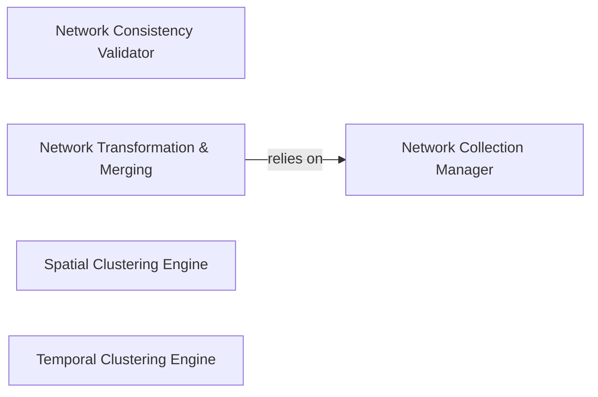

## Details

The `Network Pre-processing & Validation` subsystem is crucial for preparing and ensuring the integrity of network data within PyPSA. It acts as the initial gateway for raw or partially processed network models, transforming, validating, and simplifying them for subsequent simulation and optimization stages.

### Network Consistency Validator
Orchestrates a comprehensive suite of checks to ensure the internal consistency and validity of the PyPSA network data, covering aspects like bus connections, carrier definitions, and data shapes. It acts as a gatekeeper for data integrity.

**Related Classes/Methods**:

- <a href="https://github.com/PyPSA/PyPSA/blob/master/pypsa/consistency.py" target="_blank" rel="noopener noreferrer">`pypsa.consistency`</a>

### Network Transformation & Merging
Provides utilities for transforming network data (e.g., per-unit conversions, though not explicitly detailed in CFG for this component) and merging multiple networks or their components into a single, unified network. This is essential for modular model building and integration.

**Related Classes/Methods**:

- <a href="https://github.com/PyPSA/PyPSA/blob/master/pypsa/network/transform.py" target="_blank" rel="noopener noreferrer">`pypsa.network.transform`</a>

### Network Collection Manager
Initializes and manages a collection of multiple PyPSA networks, including initial checks for network compatibility and performing necessary data conversions. It provides the fundamental logic for concatenating network dataframes or panels, managing the merging of indices and data across networks.

**Related Classes/Methods**:

- <a href="https://github.com/PyPSA/PyPSA/blob/master/pypsa/collection.py" target="_blank" rel="noopener noreferrer">`pypsa.collection`</a>

### Spatial Clustering Engine
Simplifies the network representation by grouping buses and aggregating associated components based on spatial criteria. It encompasses algorithms for determining optimal groupings and functions for performing the actual data aggregation, thereby reducing model complexity.

**Related Classes/Methods**:

- <a href="https://github.com/PyPSA/PyPSA/blob/master/pypsa/clustering/spatial.py" target="_blank" rel="noopener noreferrer">`pypsa.clustering.spatial`</a>

### Temporal Clustering Engine
Simplifies the network representation by grouping time series data based on temporal criteria, reducing the number of snapshots for simulation. This component is crucial for managing the computational load of long-term simulations.

**Related Classes/Methods**:

- <a href="https://github.com/PyPSA/PyPSA/blob/master/pypsa/clustering/temporal.py" target="_blank" rel="noopener noreferrer">`pypsa.clustering.temporal`</a>

### [FAQ](https://github.com/CodeBoarding/GeneratedOnBoardings/tree/main?tab=readme-ov-file#faq)