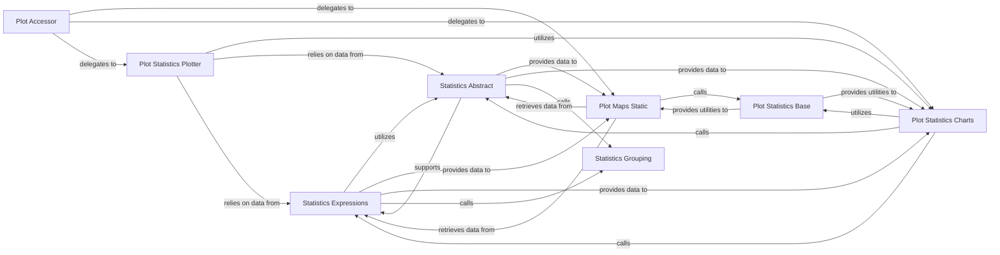

## Details

The `Results & Visualization` subsystem is responsible for processing simulation and optimization outputs into meaningful statistical metrics and visual representations. It acts as the final stage in the data analysis pipeline, transforming raw results into actionable insights through various charts and geographical maps.

### Statistics Expressions
This component is the core engine for calculating statistical metrics and key performance indicators (KPIs) from the network data. It defines and evaluates expressions for various statistical computations.

**Related Classes/Methods**:

- <a href="https://github.com/PyPSA/PyPSA/blob/master/pypsa/statistics/expressions.py" target="_blank" rel="noopener noreferrer">`pypsa.statistics.expressions`</a>

### Statistics Abstract
Serves as a foundational layer for data aggregation, filtering, and general data preparation. It provides abstract methods and structures for handling data before statistical analysis or plotting.

**Related Classes/Methods**:

- <a href="https://github.com/PyPSA/PyPSA/blob/master/pypsa/statistics/abstract.py" target="_blank" rel="noopener noreferrer">`pypsa.statistics.abstract`</a>

### Statistics Grouping
Offers flexible mechanisms for grouping data, which is essential for performing detailed statistical analysis across different dimensions (e.g., by bus, by component type, by time).

**Related Classes/Methods**:

- <a href="https://github.com/PyPSA/PyPSA/blob/master/pypsa/statistics/grouping.py" target="_blank" rel="noopener noreferrer">`pypsa.statistics.grouping`</a>

### Plot Maps Static
Dedicated to generating static geographical maps of the network topology, showing components, connections, and potentially results overlaid on a geographical context.

**Related Classes/Methods**:

- <a href="https://github.com/PyPSA/PyPSA/blob/master/pypsa/plot/maps/static.py" target="_blank" rel="noopener noreferrer">`pypsa.plot.maps.static`</a>

### Plot Statistics Charts
Focuses on creating various statistical charts (e.g., bar charts, line plots, heatmaps) to visualize analysis results, input data, and statistical insights.

**Related Classes/Methods**:

- <a href="https://github.com/PyPSA/PyPSA/blob/master/pypsa/plot/statistics/charts.py" target="_blank" rel="noopener noreferrer">`pypsa.plot.statistics.charts`</a>

### Plot Accessor
Acts as the primary user-facing entry point for accessing plotting functionalities directly from the `Network` object, providing a convenient API for visualization.

**Related Classes/Methods**:

- <a href="https://github.com/PyPSA/PyPSA/blob/master/pypsa/plot/accessor.py" target="_blank" rel="noopener noreferrer">`pypsa.plot.accessor`</a>

### Plot Statistics Plotter
Orchestrates the setup and execution of statistical plotting operations, often acting as an intermediary between the `Plot Accessor` and the specific chart generation components.

**Related Classes/Methods**:

- <a href="https://github.com/PyPSA/PyPSA/blob/master/pypsa/plot/statistics/plotter.py" target="_blank" rel="noopener noreferrer">`pypsa.plot.statistics.plotter`</a>

### Plot Statistics Base
Provides fundamental utilities, common plotting functions, and consistent styling configurations to ensure a uniform look and feel across all generated plots and maps.

**Related Classes/Methods**:

- <a href="https://github.com/PyPSA/PyPSA/blob/master/pypsa/plot/statistics/base.py" target="_blank" rel="noopener noreferrer">`pypsa.plot.statistics.base`</a>

### [FAQ](https://github.com/CodeBoarding/GeneratedOnBoardings/tree/main?tab=readme-ov-file#faq)