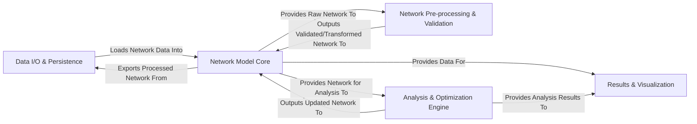

## Details

The PyPSA framework is structured around a central `Network Model Core` that serves as the authoritative data repository for power system networks. Data ingress and egress are managed by the `Data I/O & Persistence` component, which handles various file formats. Raw network data from the `Network Model Core` is channeled to the `Network Pre-processing & Validation` component for cleansing, transformation, and aggregation, with the processed data subsequently returned to the `Network Model Core`. For analytical tasks, the `Network Model Core` provides network data to the `Analysis & Optimization Engine`, which performs power flow calculations and solves optimization problems, then updates the `Network Model Core` with the results. Both the `Network Model Core` and the `Analysis & Optimization Engine` feed data into the `Results & Visualization` component for statistical analysis and graphical representation, enabling comprehensive insights into the power system.

### Data I/O & Persistence [[Expand]](./Data_I_O_Persistence.md)
Manages the import and export of network data from and to various file formats (CSV, Excel, HDF5, NetCDF). It acts as the gateway for external data into the PyPSA environment and for saving results.

**Related Classes/Methods**:

- <a href="https://github.com/PyPSA/PyPSA/blob/master/pypsa/network/io.py" target="_blank" rel="noopener noreferrer">`pypsa.network.io`</a>

### Network Model Core [[Expand]](./Network_Model_Core.md)
The foundational data structure representing the entire power system network, including all its components (buses, lines, generators, storage units, etc.), their attributes, and associated time-series or scenario data. It serves as the central repository for all network-related information.

**Related Classes/Methods**:

- <a href="https://github.com/PyPSA/PyPSA/blob/master/pypsa/networks.py" target="_blank" rel="noopener noreferrer">`pypsa.networks`</a>
- <a href="https://github.com/PyPSA/PyPSA/blob/master/pypsa/components/components.py" target="_blank" rel="noopener noreferrer">`pypsa.components.components`</a>
- <a href="https://github.com/PyPSA/PyPSA/blob/master/pypsa/components/_types/buses.py" target="_blank" rel="noopener noreferrer">`pypsa.components._types.buses`</a>
- <a href="https://github.com/PyPSA/PyPSA/blob/master/pypsa/components/_types/generators.py" target="_blank" rel="noopener noreferrer">`pypsa.components._types.generators`</a>

### Network Pre-processing & Validation [[Expand]](./Network_Pre_processing_Validation.md)
Responsible for preparing and ensuring the integrity of the network data. This includes validating data consistency, performing transformations (e.g., per-unit conversion), merging networks, and applying aggregation or clustering techniques (spatial and temporal) to simplify the model.

**Related Classes/Methods**:

- <a href="https://github.com/PyPSA/PyPSA/blob/master/pypsa/consistency.py" target="_blank" rel="noopener noreferrer">`pypsa.consistency`</a>
- <a href="https://github.com/PyPSA/PyPSA/blob/master/pypsa/network/transform.py" target="_blank" rel="noopener noreferrer">`pypsa.network.transform`</a>
- <a href="https://github.com/PyPSA/PyPSA/blob/master/pypsa/clustering/spatial.py" target="_blank" rel="noopener noreferrer">`pypsa.clustering.spatial`</a>
- <a href="https://github.com/PyPSA/PyPSA/blob/master/pypsa/clustering/temporal.py" target="_blank" rel="noopener noreferrer">`pypsa.clustering.temporal`</a>
- <a href="https://github.com/PyPSA/PyPSA/blob/master/pypsa/collection.py" target="_blank" rel="noopener noreferrer">`pypsa.collection`</a>

### Analysis & Optimization Engine [[Expand]](./Analysis_Optimization_Engine.md)
Encompasses the entire analytical and optimization workflow: implementing algorithms for power flow calculations and formulating/solving mathematical optimization problems (defining objective functions, operational constraints, global constraints), interfacing with external optimization solvers, and processing solver output. It also includes functionalities for advanced optimization analyses like multi-objective optimization.

**Related Classes/Methods**:

- <a href="https://github.com/PyPSA/PyPSA/blob/master/pypsa/network/power_flow.py" target="_blank" rel="noopener noreferrer">`pypsa.network.power_flow`</a>
- <a href="https://github.com/PyPSA/PyPSA/blob/master/pypsa/optimization/optimize.py" target="_blank" rel="noopener noreferrer">`pypsa.optimization.optimize`</a>
- <a href="https://github.com/PyPSA/PyPSA/blob/master/pypsa/optimization/constraints.py" target="_blank" rel="noopener noreferrer">`pypsa.optimization.constraints`</a>
- <a href="https://github.com/PyPSA/PyPSA/blob/master/pypsa/optimization/global_constraints.py" target="_blank" rel="noopener noreferrer">`pypsa.optimization.global_constraints`</a>
- <a href="https://github.com/PyPSA/PyPSA/blob/master/pypsa/optimization/expressions.py" target="_blank" rel="noopener noreferrer">`pypsa.optimization.expressions`</a>
- <a href="https://github.com/PyPSA/PyPSA/blob/master/pypsa/optimization/mga.py" target="_blank" rel="noopener noreferrer">`pypsa.optimization.mga`</a>

### Results & Visualization [[Expand]](./Results_Visualization.md)
Aggregates and calculates various statistical metrics and key performance indicators from the network data and the results of simulations or optimizations. It also generates geographical maps and various statistical charts to visualize network topology, input data, analysis results, and statistical insights, providing graphical representations for better understanding and communication.

**Related Classes/Methods**:

- <a href="https://github.com/PyPSA/PyPSA/blob/master/pypsa/statistics/abstract.py" target="_blank" rel="noopener noreferrer">`pypsa.statistics.abstract`</a>
- <a href="https://github.com/PyPSA/PyPSA/blob/master/pypsa/statistics/expressions.py" target="_blank" rel="noopener noreferrer">`pypsa.statistics.expressions`</a>
- <a href="https://github.com/PyPSA/PyPSA/blob/master/pypsa/statistics/grouping.py" target="_blank" rel="noopener noreferrer">`pypsa.statistics.grouping`</a>
- <a href="https://github.com/PyPSA/PyPSA/blob/master/pypsa/plot/maps/static.py" target="_blank" rel="noopener noreferrer">`pypsa.plot.maps.static`</a>
- <a href="https://github.com/PyPSA/PyPSA/blob/master/pypsa/plot/statistics/charts.py" target="_blank" rel="noopener noreferrer">`pypsa.plot.statistics.charts`</a>
- <a href="https://github.com/PyPSA/PyPSA/blob/master/pypsa/plot/accessor.py" target="_blank" rel="noopener noreferrer">`pypsa.plot.accessor`</a>

### [FAQ](https://github.com/CodeBoarding/GeneratedOnBoardings/tree/main?tab=readme-ov-file#faq)