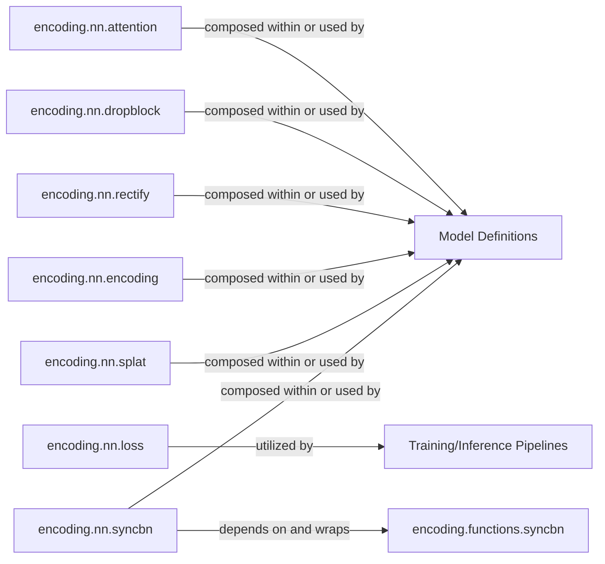

## Details

The `PyTorch-Encoding` project's `encoding.nn` subsystem provides a suite of specialized neural network modules designed to enhance model capabilities, particularly in areas like attention, regularization, and feature encoding. These individual modules, such as `encoding.nn.attention`, `encoding.nn.dropblock`, and `encoding.nn.encoding`, serve as core building blocks that are composed within the conceptual `Model Definitions` component to form complete and complex neural network architectures. A key internal dependency exists where the `encoding.nn.syncbn` module depends on and wraps the lower-level `encoding.functions.syncbn` for distributed batch normalization. Furthermore, the custom loss functions provided by `encoding.nn.loss` are utilized by the `Training/Inference Pipelines`, which orchestrate the overall training and evaluation workflows, demonstrating how these specialized components integrate into the broader machine learning lifecycle.

### Model Definitions
This conceptual component represents the aggregation and composition of various specialized `encoding.nn` modules to construct complete neural network architectures. It serves as the blueprint for models within the `PyTorch-Encoding` framework.

**Related Classes/Methods**: _None_

### Training/Inference Pipelines
This conceptual component encapsulates the high-level processes for training and evaluating neural network models. It orchestrates the use of defined models, applies loss functions, and manages the overall flow of data through the network during both training and inference phases.

**Related Classes/Methods**: _None_

### encoding.nn.attention
Implements various attention mechanisms (e.g., self-attention, cross-attention) that allow neural networks to dynamically weigh the importance of different parts of the input data, enhancing feature representation.

**Related Classes/Methods**: _None_

### encoding.nn.dropblock
Provides the DropBlock regularization technique, a structured form of dropout that drops contiguous regions of features instead of individual pixels, improving model generalization and preventing overfitting.

**Related Classes/Methods**: _None_

### encoding.nn.rectify
Offers rectified convolution or similar operations, potentially involving specialized activation functions or transformations applied to feature maps for non-linear processing.

**Related Classes/Methods**: _None_

### encoding.nn.loss
Implements custom loss functions tailored for specific tasks or model outputs, extending standard PyTorch loss functionalities to guide model optimization.

**Related Classes/Methods**: _None_

### encoding.nn.encoding
Serves as a core encoding module for feature transformation, likely involving complex feature aggregation, projection, or contextual encoding to generate rich representations.

**Related Classes/Methods**: _None_

### encoding.nn.splat
Contains specialized operations related to spatial attention or feature distribution, potentially for advanced pooling, scattering, or feature aggregation across spatial dimensions.

**Related Classes/Methods**: _None_

### encoding.nn.syncbn
Acts as a high-level PyTorch module wrapper, providing an object-oriented interface for synchronous batch normalization, which is crucial for stable training in distributed environments.

**Related Classes/Methods**: _None_

### encoding.functions.syncbn
Implements the low-level, functional logic for Synchronous Batch Normalization, handling the actual computation and communication required for synchronization across multiple devices.

**Related Classes/Methods**: _None_

### [FAQ](https://github.com/CodeBoarding/GeneratedOnBoardings/tree/main?tab=readme-ov-file#faq)