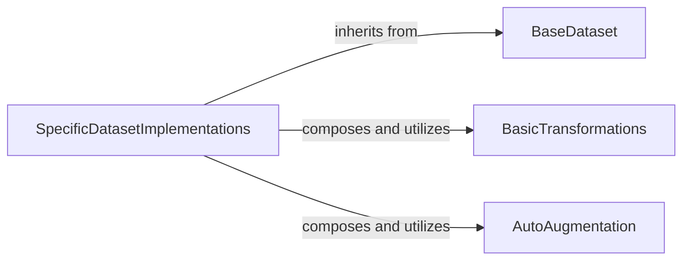

## Details

The `Data Management & Preprocessing` subsystem is responsible for loading, transforming, and augmenting datasets, preparing them for model input. Its boundaries are primarily defined by the `encoding.datasets` and `encoding.transforms` packages.

### BaseDataset
Serves as the abstract base class for all datasets, providing a standardized interface and common functionalities for data loading and initial transformations. This aligns with the "Data Loaders/Pre-processing" pattern by establishing a clear contract for data handling.

**Related Classes/Methods**:

- <a href="https://github.com/zhanghang1989/PyTorch-Encoding/blob/master/encoding/datasets/base.py#L15-L99" target="_blank" rel="noopener noreferrer">`BaseDataset`:15-99</a>

### SpecificDatasetImplementations
Concrete implementations of `BaseDataset` for various datasets (e.g., ADE20K, Cityscapes, COCO). Each handles dataset-specific file parsing, data loading, and initial preprocessing steps, embodying the "Data Loaders/Pre-processing" pattern.

**Related Classes/Methods**:

- <a href="https://github.com/zhanghang1989/PyTorch-Encoding/blob/master/encoding/datasets/ade20k.py" target="_blank" rel="noopener noreferrer">`ADE20K`</a>
- <a href="https://github.com/zhanghang1989/PyTorch-Encoding/blob/master/encoding/datasets/cityscapes.py" target="_blank" rel="noopener noreferrer">`Cityscapes`</a>
- <a href="https://github.com/zhanghang1989/PyTorch-Encoding/blob/master/encoding/datasets/coco.py" target="_blank" rel="noopener noreferrer">`COCO`</a>
- <a href="https://github.com/zhanghang1989/PyTorch-Encoding/blob/master/encoding/datasets/pascal_voc.py" target="_blank" rel="noopener noreferrer">`PascalVOC`</a>
- <a href="https://github.com/zhanghang1989/PyTorch-Encoding/blob/master/encoding/models/sseg/encnet.py#L147-L165" target="_blank" rel="noopener noreferrer">`PContext`:147-165</a>
- <a href="https://github.com/zhanghang1989/PyTorch-Encoding/blob/master/encoding/models/deepten.py#L80-L97" target="_blank" rel="noopener noreferrer">`MINC`:80-97</a>
- <a href="https://github.com/zhanghang1989/PyTorch-Encoding/blob/master/encoding/datasets/ade20k.py" target="_blank" rel="noopener noreferrer">`Folder`</a>

### BasicTransformations
A collection of fundamental image manipulation utilities (e.g., resizing, cropping, normalization) that act as building blocks for data preprocessing pipelines. This component directly supports the "Data Loaders/Pre-processing" pattern by providing essential data transformation capabilities.

**Related Classes/Methods**:

- <a href="https://github.com/zhanghang1989/PyTorch-Encoding/blob/master/encoding/transforms/transforms.py" target="_blank" rel="noopener noreferrer">`BasicTransformations`</a>

### AutoAugmentation
Implements advanced, automated data augmentation policies (e.g., Cutout, RandAugment) to enhance data variability and improve model robustness during training. This component extends the "Data Loaders/Pre-processing" capabilities with sophisticated augmentation strategies.

**Related Classes/Methods**:

- <a href="https://github.com/zhanghang1989/PyTorch-Encoding/blob/master/encoding/transforms/autoaug.py" target="_blank" rel="noopener noreferrer">`AutoAugmentation`</a>

### [FAQ](https://github.com/CodeBoarding/GeneratedOnBoardings/tree/main?tab=readme-ov-file#faq)