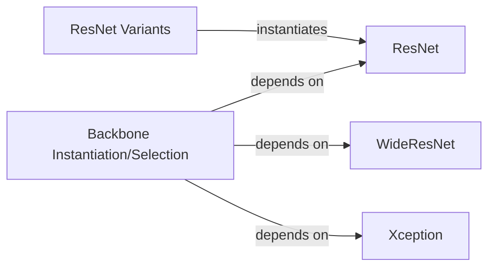

## Details

The Feature Extraction Backbones subsystem is primarily defined by the encoding.models.backbone package. This package encapsulates various deep learning architectures designed for extracting hierarchical features from input data.

### ResNet
Implements the foundational ResNet architecture, including its core building blocks (`_make_layer`) and overall network structure. It serves as a base class for creating deep residual networks.

**Related Classes/Methods**:

- <a href="https://github.com/zhanghang1989/PyTorch-Encoding/blob/master/encoding/models/backbone/resnet.py#L118-L293" target="_blank" rel="noopener noreferrer">`encoding.models.backbone.resnet.ResNet`:118-293</a>

### WideResNet
Implements the Wide ResNet architecture, which modifies the standard ResNet by increasing the width (number of filters) of layers to enhance performance while maintaining a relatively shallow depth.

**Related Classes/Methods**:

- <a href="https://github.com/zhanghang1989/PyTorch-Encoding/blob/master/encoding/models/backbone/wideresnet.py#L94-L195" target="_blank" rel="noopener noreferrer">`encoding.models.backbone.wideresnet.WideResNet`:94-195</a>

### Xception
Implements the Xception architecture, which efficiently extracts features using depthwise separable convolutions. It includes unique building blocks like `SeparableConv2d` and `Block`.

**Related Classes/Methods**:

- <a href="https://github.com/zhanghang1989/PyTorch-Encoding/blob/master/encoding/models/backbone/xception.py" target="_blank" rel="noopener noreferrer">`encoding.models.backbone.xception.Xception`</a>

### ResNet Variants
Provides pre-configured and optimized instances of the ResNet architecture. These functions simplify the instantiation of common ResNet models tailored for specific performance or accuracy requirements.

**Related Classes/Methods**:

- <a href="https://github.com/zhanghang1989/PyTorch-Encoding/blob/master/encoding/models/backbone/resnet_variants.py" target="_blank" rel="noopener noreferrer">`encoding.models.backbone.resnet_variants`</a>

### Backbone Instantiation/Selection
A higher-level module responsible for instantiating and retrieving a chosen backbone (ResNet, WideResNet, or Xception) based on configuration. It acts as an interface for consumers to obtain a specific feature extraction backbone.

**Related Classes/Methods**:

- <a href="https://github.com/zhanghang1989/PyTorch-Encoding/blob/master/encoding/models/sseg/base.py" target="_blank" rel="noopener noreferrer">`encoding.models.sseg.base`</a>

### [FAQ](https://github.com/CodeBoarding/GeneratedOnBoardings/tree/main?tab=readme-ov-file#faq)