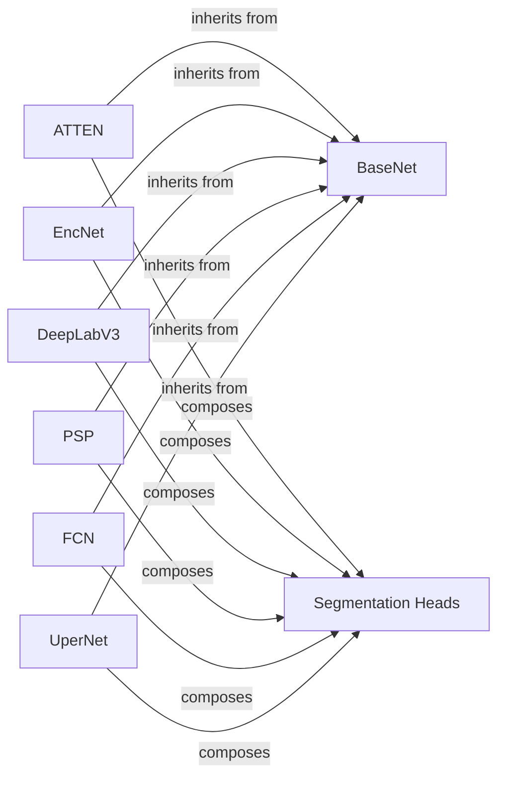

## Details

The `Semantic Segmentation Models` subsystem (`encoding.models.sseg`) is responsible for implementing various advanced semantic segmentation architectures that build upon extracted features for pixel-level classification.

### BaseNet
Serves as the foundational abstract class for all semantic segmentation models. It encapsulates common functionalities such as initializing the backbone network and orchestrating the generic inference pipeline, including image transformations and delegating to `module_inference`.

**Related Classes/Methods**:

- <a href="https://github.com/zhanghang1989/PyTorch-Encoding/blob/master/encoding/models/sseg/base.py#L54-L108" target="_blank" rel="noopener noreferrer">`encoding.models.sseg.base.BaseNet`:54-108</a>

### ATTEN
Implements the ATTEN semantic segmentation architecture, inheriting from `BaseNet`. It is responsible for composing its unique `ATTENHead` and defining any architecture-specific layers or connections beyond the backbone.

**Related Classes/Methods**:

- <a href="https://github.com/zhanghang1989/PyTorch-Encoding/blob/master/encoding/models/sseg/atten.py" target="_blank" rel="noopener noreferrer">`encoding.models.sseg.atten.ATTEN`</a>

### EncNet
Implements the EncNet semantic segmentation architecture, inheriting from `BaseNet`. It is responsible for composing its unique `EncHead` and defining any architecture-specific layers or connections beyond the backbone.

**Related Classes/Methods**:

- <a href="https://github.com/zhanghang1989/PyTorch-Encoding/blob/master/encoding/models/sseg/encnet.py#L20-L41" target="_blank" rel="noopener noreferrer">`encoding.models.sseg.encnet.EncNet`:20-41</a>

### DeepLabV3
Implements the DeepLabV3 semantic segmentation architecture, inheriting from `BaseNet`. It is responsible for composing its unique `DeepLabV3Head` and integrating specific modules like Atrous Spatial Pyramid Pooling (ASPP).

**Related Classes/Methods**:

- <a href="https://github.com/zhanghang1989/PyTorch-Encoding/blob/master/encoding/models/sseg/deeplab.py#L16-L57" target="_blank" rel="noopener noreferrer">`encoding.models.sseg.deeplab.DeepLabV3`:16-57</a>

### PSP
Implements the PSP (Pyramid Scene Parsing Network) semantic segmentation architecture, inheriting from `BaseNet`. It reuses the `FCNHead` for its final predictions.

**Related Classes/Methods**:

- <a href="https://github.com/zhanghang1989/PyTorch-Encoding/blob/master/encoding/models/sseg/psp.py#L17-L36" target="_blank" rel="noopener noreferrer">`encoding.models.sseg.psp.PSP`:17-36</a>

### FCN
Implements the FCN (Fully Convolutional Network) semantic segmentation architecture, inheriting from `BaseNet`. It is responsible for composing its specific `FCNHead` for predictions.

**Related Classes/Methods**:

- <a href="https://github.com/zhanghang1989/PyTorch-Encoding/blob/master/encoding/models/sseg/fcn.py#L19-L62" target="_blank" rel="noopener noreferrer">`encoding.models.sseg.fcn.FCN`:19-62</a>

### UperNet
Implements the UperNet (Unified Perceptual Parsing Network) semantic segmentation architecture, inheriting from `BaseNet`. It is responsible for composing its specific `UperNetHead` for predictions.

**Related Classes/Methods**:

- <a href="https://github.com/zhanghang1989/PyTorch-Encoding/blob/master/encoding/models/sseg/upernet.py#L21-L56" target="_blank" rel="noopener noreferrer">`encoding.models.sseg.upernet.UperNet`:21-56</a>

### Segmentation Heads
This component represents a collection of specialized modules (e.g., `ATTENHead`, `EncHead`, `DeepLabV3Head`, `FCFPNHead`, `PSPHead`, `FCNHead`, `UperNetHead`) that process features extracted by the backbone network to produce the final pixel-level predictions specific to their respective segmentation architectures.

**Related Classes/Methods**:

- <a href="https://github.com/zhanghang1989/PyTorch-Encoding/blob/master/encoding/models/sseg/atten.py#L67-L135" target="_blank" rel="noopener noreferrer">`encoding.models.sseg.atten.ATTENHead`:67-135</a>
- <a href="https://github.com/zhanghang1989/PyTorch-Encoding/blob/master/encoding/models/sseg/encnet.py#L73-L112" target="_blank" rel="noopener noreferrer">`encoding.models.sseg.encnet.EncHead`:73-112</a>
- <a href="https://github.com/zhanghang1989/PyTorch-Encoding/blob/master/encoding/models/sseg/deeplab.py#L60-L75" target="_blank" rel="noopener noreferrer">`encoding.models.sseg.deeplab.DeepLabV3Head`:60-75</a>
- <a href="https://github.com/zhanghang1989/PyTorch-Encoding/blob/master/encoding/models/sseg/fcfpn.py#L57-L114" target="_blank" rel="noopener noreferrer">`encoding.models.sseg.fcfpn.FCFPNHead`:57-114</a>
- <a href="https://github.com/zhanghang1989/PyTorch-Encoding/blob/master/encoding/models/sseg/psp.py#L39-L51" target="_blank" rel="noopener noreferrer">`encoding.models.sseg.psp.PSPHead`:39-51</a>
- <a href="https://github.com/zhanghang1989/PyTorch-Encoding/blob/master/encoding/models/sseg/fcn.py#L87-L111" target="_blank" rel="noopener noreferrer">`encoding.models.sseg.fcn.FCNHead`:87-111</a>
- <a href="https://github.com/zhanghang1989/PyTorch-Encoding/blob/master/encoding/models/sseg/upernet.py#L59-L65" target="_blank" rel="noopener noreferrer">`encoding.models.sseg.upernet.UperNetHead`:59-65</a>

### [FAQ](https://github.com/CodeBoarding/GeneratedOnBoardings/tree/main?tab=readme-ov-file#faq)