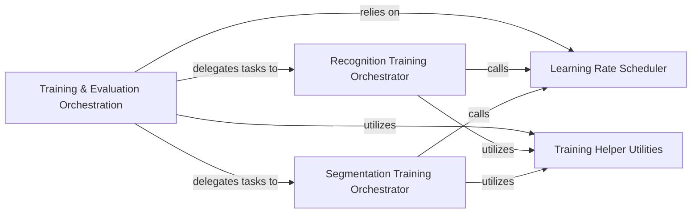

## Details

The `Training & Evaluation Orchestration` subsystem encompasses the core logic for managing the entire machine learning model training and evaluation lifecycle. Its boundaries are defined by the high-level coordination of distributed training, data flow, model execution, optimization, and logging, delegating specific tasks to specialized orchestrators and utility components.

### Training & Evaluation Orchestration [[Expand]](./Training_Evaluation_Orchestration.md)
The primary coordinator overseeing the entire training and evaluation pipeline. It sets up distributed training, manages data flow, orchestrates model execution, optimization, and logging. It acts as a high-level dispatcher for specific training tasks.

**Related Classes/Methods**:

- <a href="https://github.com/zhanghang1989/PyTorch-Encoding/blob/master/experiments/recognition/train_dist.py" target="_blank" rel="noopener noreferrer">`experiments/recognition/train_dist.py`</a>
- <a href="https://github.com/zhanghang1989/PyTorch-Encoding/blob/master/experiments/segmentation/train_dist.py" target="_blank" rel="noopener noreferrer">`experiments/segmentation/train_dist.py`</a>

### Recognition Training Orchestrator
Manages the distributed training and validation lifecycle specifically for recognition models. This includes setting up the environment, running training epochs, and coordinating validation steps tailored for recognition tasks.

**Related Classes/Methods**:

- <a href="https://github.com/zhanghang1989/PyTorch-Encoding/blob/master/experiments/recognition/train_dist.py" target="_blank" rel="noopener noreferrer">`experiments/recognition/train_dist.py`</a>

### Segmentation Training Orchestrator
Orchestrates distributed training and evaluation specifically for segmentation models. It handles the setup and execution of training and validation phases, adapting to the unique requirements of segmentation tasks.

**Related Classes/Methods**:

- <a href="https://github.com/zhanghang1989/PyTorch-Encoding/blob/master/experiments/segmentation/train_dist.py" target="_blank" rel="noopener noreferrer">`experiments/segmentation/train_dist.py`</a>

### Learning Rate Scheduler
Dynamically adjusts the learning rate of the optimizer during training based on a predefined schedule or adaptive strategy. This is crucial for achieving stable and efficient model convergence.

**Related Classes/Methods**:

- <a href="https://github.com/zhanghang1989/PyTorch-Encoding/blob/master/encoding/utils/lr_scheduler.py" target="_blank" rel="noopener noreferrer">`encoding/utils/lr_scheduler.py`</a>

### Training Helper Utilities
Provides auxiliary functions and utilities that support various aspects of the training process, particularly in data preparation, augmentation (e.g., `mixup_loader`), and other common training operations.

**Related Classes/Methods**:

- <a href="https://github.com/zhanghang1989/PyTorch-Encoding/blob/master/encoding/utils/train_helper.py" target="_blank" rel="noopener noreferrer">`encoding/utils/train_helper.py`</a>

### [FAQ](https://github.com/CodeBoarding/GeneratedOnBoardings/tree/main?tab=readme-ov-file#faq)