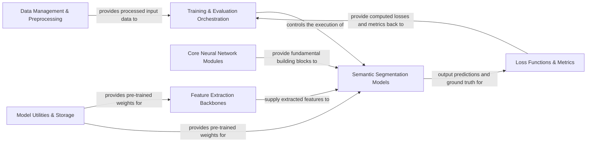

## Details

The PyTorch-Encoding project implements a robust deep learning pipeline primarily focused on semantic segmentation. At its core, `Data Management & Preprocessing` prepares input data, which is then fed into the `Training & Evaluation Orchestration` component. This orchestration layer manages the entire lifecycle, from controlling the execution of `Semantic Segmentation Models`—which are built upon `Feature Extraction Backbones` and fundamental `Core Neural Network Modules`—to integrating `Loss Functions & Metrics` for optimization. `Model Utilities & Storage` provides essential pre-trained weights, enabling efficient model initialization. This structured approach ensures a clear data flow and modularity, facilitating both development and deployment of advanced deep learning models.

### Data Management & Preprocessing [[Expand]](./Data_Management_Preprocessing.md)
Responsible for loading, transforming, and augmenting datasets, preparing them for model input.

**Related Classes/Methods**:

- <a href="https://github.com/zhanghang1989/PyTorch-Encoding/blob/master/encoding/datasets" target="_blank" rel="noopener noreferrer">`encoding.datasets`</a>
- <a href="https://github.com/zhanghang1989/PyTorch-Encoding/blob/master/encoding/transforms" target="_blank" rel="noopener noreferrer">`encoding.transforms`</a>

### Feature Extraction Backbones [[Expand]](./Feature_Extraction_Backbones.md)
Provides foundational deep learning architectures for extracting hierarchical features from input data.

**Related Classes/Methods**:

- <a href="https://github.com/zhanghang1989/PyTorch-Encoding/blob/master/encoding/models/backbone" target="_blank" rel="noopener noreferrer">`encoding.models.backbone`</a>

### Semantic Segmentation Models [[Expand]](./Semantic_Segmentation_Models.md)
Implements various advanced semantic segmentation architectures that build upon extracted features for pixel-level classification.

**Related Classes/Methods**:

- <a href="https://github.com/zhanghang1989/PyTorch-Encoding/blob/master/encoding/models/sseg" target="_blank" rel="noopener noreferrer">`encoding.models.sseg`</a>

### Core Neural Network Modules [[Expand]](./Core_Neural_Network_Modules.md)
Contains specialized PyTorch modules and functions serving as fundamental building blocks for models, including custom layers and synchronization mechanisms.

**Related Classes/Methods**:

- <a href="https://github.com/zhanghang1989/PyTorch-Encoding/blob/master/encoding/nn" target="_blank" rel="noopener noreferrer">`encoding.nn`</a>
- <a href="https://github.com/zhanghang1989/PyTorch-Encoding/blob/master/encoding/functions/syncbn.py" target="_blank" rel="noopener noreferrer">`encoding.functions.syncbn`</a>

### Loss Functions & Metrics
Provides implementations for various loss functions used during training and utilities for calculating performance metrics during evaluation.

**Related Classes/Methods**:

- <a href="https://github.com/zhanghang1989/PyTorch-Encoding/blob/master/encoding/nn/loss.py" target="_blank" rel="noopener noreferrer">`encoding.nn.loss`</a>
- <a href="https://github.com/zhanghang1989/PyTorch-Encoding/blob/master/encoding/utils/metrics.py" target="_blank" rel="noopener noreferrer">`encoding.utils.metrics`</a>

### Model Utilities & Storage
Manages the downloading, caching, and loading of pre-trained model weights and other model-related files.

**Related Classes/Methods**:

- <a href="https://github.com/zhanghang1989/PyTorch-Encoding/blob/master/encoding/models/model_store.py" target="_blank" rel="noopener noreferrer">`encoding.models.model_store`</a>
- <a href="https://github.com/zhanghang1989/PyTorch-Encoding/blob/master/encoding/utils/files.py" target="_blank" rel="noopener noreferrer">`encoding.utils.files`</a>

### Training & Evaluation Orchestration [[Expand]](./Training_Evaluation_Orchestration.md)
Oversees the entire training and evaluation pipeline, including distributed training setup, data flow management, model execution, optimization, and logging.

**Related Classes/Methods**:

- <a href="https://github.com/zhanghang1989/PyTorch-Encoding/blob/master/experiments/recognition/train_dist.py" target="_blank" rel="noopener noreferrer">`experiments.recognition.train_dist`</a>
- <a href="https://github.com/zhanghang1989/PyTorch-Encoding/blob/master/experiments/segmentation/train_dist.py" target="_blank" rel="noopener noreferrer">`experiments.segmentation.train_dist`</a>
- <a href="https://github.com/zhanghang1989/PyTorch-Encoding/blob/master/encoding/utils/lr_scheduler.py" target="_blank" rel="noopener noreferrer">`encoding.utils.lr_scheduler`</a>
- <a href="https://github.com/zhanghang1989/PyTorch-Encoding/blob/master/encoding/utils/train_helper.py" target="_blank" rel="noopener noreferrer">`encoding.utils.train_helper`</a>

### [FAQ](https://github.com/CodeBoarding/GeneratedOnBoardings/tree/main?tab=readme-ov-file#faq)