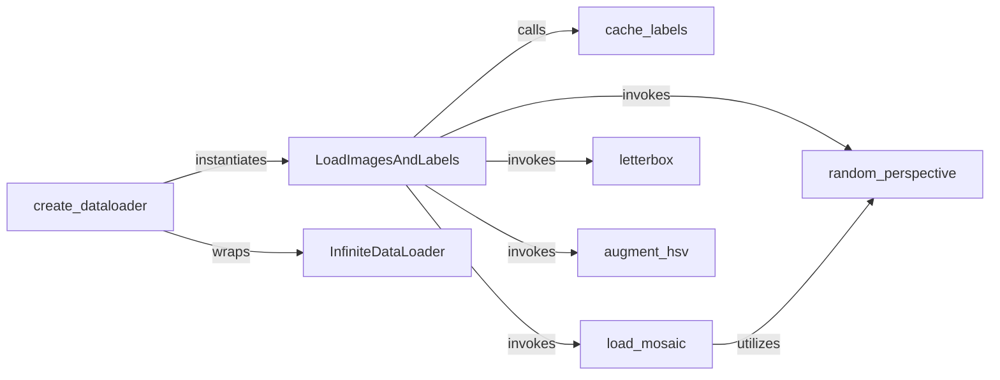

## Details

The `Data Management & Augmentation` subsystem is primarily defined by the `utils.datasets` module, specifically the `datasets.py` file. It encompasses all functionalities related to loading, preprocessing, and augmenting image datasets for the PyTorch YOLOv4 model.

### LoadImagesAndLabels
The core dataset class responsible for loading image paths and corresponding label data. It encapsulates the `__getitem__` method, which retrieves individual data samples and applies various on-the-fly augmentations and preprocessing steps.

**Related Classes/Methods**:

- <a href="https://github.com/WongKinYiu/PyTorch_YOLOv4/blob/master/utils/datasets.py#L355-L635" target="_blank" rel="noopener noreferrer">`LoadImagesAndLabels`:355-635</a>

### InfiniteDataLoader
Provides an iterable interface for continuous data loading, essential for efficient training loops by ensuring a steady supply of batches without interruption.

**Related Classes/Methods**:

- <a href="https://github.com/WongKinYiu/PyTorch_YOLOv4/blob/master/utils/datasets.py#L112-L127" target="_blank" rel="noopener noreferrer">`InfiniteDataLoader`:112-127</a>

### create_dataloader
Orchestrates the setup of the complete data loading pipeline. It instantiates the `LoadImagesAndLabels` dataset and wraps it with the `InfiniteDataLoader` to prepare data for consumption by the model.

**Related Classes/Methods**:

- <a href="https://github.com/WongKinYiu/PyTorch_YOLOv4/blob/master/utils/datasets.py#L60-L83" target="_blank" rel="noopener noreferrer">`create_dataloader`:60-83</a>

### cache_labels
Optimizes data loading by processing and caching label information to disk. This reduces redundant computations and speeds up subsequent data loading operations.

**Related Classes/Methods**:

- <a href="https://github.com/WongKinYiu/PyTorch_YOLOv4/blob/master/utils/datasets.py#L794-L816" target="_blank" rel="noopener noreferrer">`cache_labels`:794-816</a>

### load_mosaic
Implements the mosaic data augmentation technique, which combines multiple images into a single training sample. This technique significantly enhances model robustness and generalization.

**Related Classes/Methods**:

- <a href="https://github.com/WongKinYiu/PyTorch_YOLOv4/blob/master/utils/datasets.py#L958-L1013" target="_blank" rel="noopener noreferrer">`load_mosaic`:958-1013</a>

### random_perspective
Applies random perspective transformations to images and their associated bounding boxes. This introduces geometric variations, making the model more robust to different viewing angles.

**Related Classes/Methods**:

- <a href="https://github.com/WongKinYiu/PyTorch_YOLOv4/blob/master/utils/datasets.py#L1140-L1224" target="_blank" rel="noopener noreferrer">`random_perspective`:1140-1224</a>

### letterbox
Resizes images to a target dimension while maintaining their aspect ratio and padding. This ensures consistent input size for the neural network, which is critical for batch processing.

**Related Classes/Methods**:

- <a href="https://github.com/WongKinYiu/PyTorch_YOLOv4/blob/master/utils/datasets.py#L1107-L1137" target="_blank" rel="noopener noreferrer">`letterbox`:1107-1137</a>

### augment_hsv
Performs augmentation in the HSV (Hue, Saturation, Value) color space. This introduces variations in image colors, improving the model's ability to generalize across different lighting conditions.

**Related Classes/Methods**:

- <a href="https://github.com/WongKinYiu/PyTorch_YOLOv4/blob/master/utils/datasets.py#L939-L950" target="_blank" rel="noopener noreferrer">`augment_hsv`:939-950</a>

### [FAQ](https://github.com/CodeBoarding/GeneratedOnBoardings/tree/main?tab=readme-ov-file#faq)