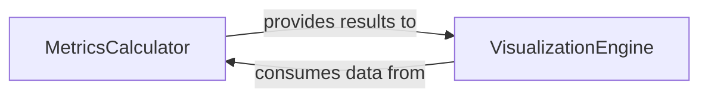

## Details

The `Evaluation & Visualization` subsystem is responsible for quantitatively assessing the performance of object detection models through standard metrics and providing qualitative insights via various visual outputs. It acts as the analytical and reporting arm of the object detection pipeline, ensuring model performance can be thoroughly understood and communicated.

### MetricsCalculator
This component is dedicated to the precise computation of standard object detection evaluation metrics. It processes raw detection and ground truth data to derive quantitative performance indicators such as Average Precision (AP), precision, and recall, which are crucial for benchmarking model effectiveness.

**Related Classes/Methods**:

- <a href="https://github.com/WongKinYiu/PyTorch_YOLOv4/blob/master/utils/metrics.py#L43-L111" target="_blank" rel="noopener noreferrer">`utils.metrics.ap_per_class`:43-111</a>
- <a href="https://github.com/WongKinYiu/PyTorch_YOLOv4/blob/master/utils/metrics.py#L114-L140" target="_blank" rel="noopener noreferrer">`utils.metrics.compute_ap`:114-140</a>

### VisualizationEngine
The VisualizationEngine is responsible for generating a diverse range of visual outputs. This includes annotating images with detected bounding boxes and labels, plotting training progress (e.g., loss curves, metric evolution over epochs), and visualizing data distributions (e.g., label histograms). These visual aids are essential for qualitative analysis, debugging, and presenting model performance.

**Related Classes/Methods**:

- <a href="https://github.com/WongKinYiu/PyTorch_YOLOv4/blob/master/utils/plots.py#L111-L183" target="_blank" rel="noopener noreferrer">`utils.plots.plot_images`:111-183</a>
- <a href="https://github.com/WongKinYiu/PyTorch_YOLOv4/blob/master/utils/plots.py#L54-L65" target="_blank" rel="noopener noreferrer">`utils.plots.plot_one_box`:54-65</a>
- <a href="https://github.com/WongKinYiu/PyTorch_YOLOv4/blob/master/utils/plots.py#L265-L294" target="_blank" rel="noopener noreferrer">`utils.plots.plot_labels`:265-294</a>
- <a href="https://github.com/WongKinYiu/PyTorch_YOLOv4/blob/master/utils/plots.py#L297-L318" target="_blank" rel="noopener noreferrer">`utils.plots.plot_evolution`:297-318</a>

### [FAQ](https://github.com/CodeBoarding/GeneratedOnBoardings/tree/main?tab=readme-ov-file#faq)