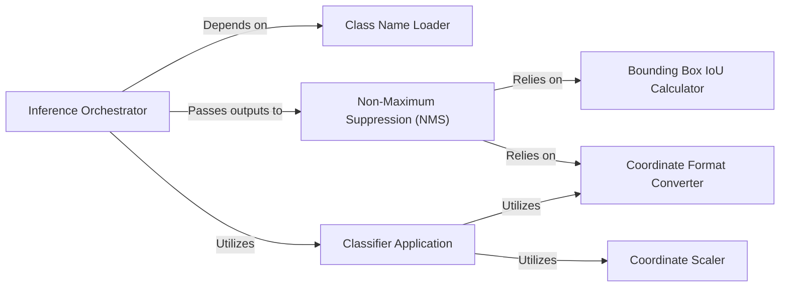

## Details

The `Inference & Post-processing` subsystem is central to the `PyTorch_YOLOv4` project, orchestrating the object detection process from raw model outputs to refined, actionable detections. It embodies the "Inference Module" and "Utilities/Helper Functions" patterns, focusing on the final stages of the deep learning pipeline. The subsystem is primarily defined by the `detect.py` module, which serves as the main inference orchestrator, and key utility functions within `utils/general.py` that handle post-processing logic and coordinate transformations.

### Inference Orchestrator
The primary entry point for executing the object detection inference pipeline. It manages the overall flow, from loading necessary configurations (like class names) to initiating model predictions and coordinating post-processing steps.

**Related Classes/Methods**:

- <a href="https://github.com/WongKinYiu/PyTorch_YOLOv4/blob/master/detect.py#L30-L160" target="_blank" rel="noopener noreferrer">`detect.detect`:30-160</a>

### Class Name Loader
Responsible for loading and preparing the human-readable class names that correspond to the model's output categories. This is crucial for interpreting the model's numerical predictions into meaningful object labels.

**Related Classes/Methods**:

- <a href="https://github.com/WongKinYiu/PyTorch_YOLOv4/blob/master/detect.py#L24-L28" target="_blank" rel="noopener noreferrer">`detect.load_classes`:24-28</a>

### Non-Maximum Suppression (NMS)
Implements the Non-Maximum Suppression algorithm, a critical post-processing step that filters out redundant or overlapping bounding box detections, ensuring only the most confident and distinct detections are retained for each object.

**Related Classes/Methods**:

- <a href="https://github.com/WongKinYiu/PyTorch_YOLOv4/blob/master/utils/general.py#L280-L355" target="_blank" rel="noopener noreferrer">`utils.general.non_max_suppression`:280-355</a>

### Bounding Box IoU Calculator
Calculates the Intersection over Union (IoU) metric between pairs of bounding boxes. This metric is fundamental for determining the overlap between boxes, which is a key operation within the NMS algorithm.

**Related Classes/Methods**:

- <a href="https://github.com/WongKinYiu/PyTorch_YOLOv4/blob/master/utils/general.py#L247-L269" target="_blank" rel="noopener noreferrer">`utils.general.box_iou`:247-269</a>

### Coordinate Format Converter
Converts bounding box coordinates from the (center_x, center_y, width, height) format to the (top_left_x, top_left_y, bottom_right_x, bottom_right_y) format. This conversion is often required for various post-processing steps and visualization.

**Related Classes/Methods**:

- <a href="https://github.com/WongKinYiu/PyTorch_YOLOv4/blob/master/utils/general.py#L153-L160" target="_blank" rel="noopener noreferrer">`utils.general.xywh2xyxy`:153-160</a>

### Coordinate Scaler
Adjusts bounding box coordinates from the model's internal input resolution back to the original dimensions of the input image. This ensures that the detected bounding boxes are correctly positioned and sized on the source image.

**Related Classes/Methods**:

- <a href="https://github.com/WongKinYiu/PyTorch_YOLOv4/blob/master/utils/general.py#L163-L176" target="_blank" rel="noopener noreferrer">`utils.general.scale_coords`:163-176</a>

### Classifier Application
Applies an optional secondary classifier to further refine the labels or confidence scores of detected objects. This can enhance the accuracy and specificity of the detection results.

**Related Classes/Methods**:

- <a href="https://github.com/WongKinYiu/PyTorch_YOLOv4/blob/master/utils/general.py#L403-L435" target="_blank" rel="noopener noreferrer">`utils.general.apply_classifier`:403-435</a>

### [FAQ](https://github.com/CodeBoarding/GeneratedOnBoardings/tree/main?tab=readme-ov-file#faq)