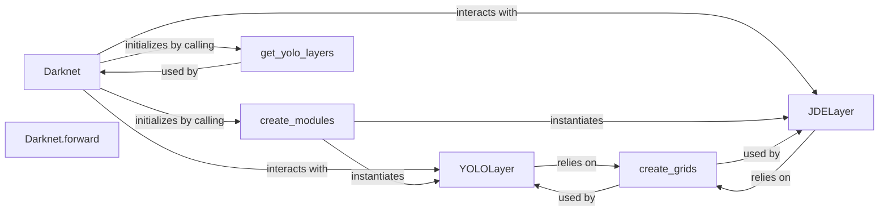

## Details

The `Model Core & Definition` subsystem is primarily defined by the `models/models.py` file. It encapsulates the core YOLOv4 neural network architecture, including its backbone and detection layers, and the logic for its forward pass.

### Darknet
The primary class encapsulating the entire YOLOv4 neural network architecture. It manages the model's construction, layer orchestration, and the forward pass.

**Related Classes/Methods**:

- <a href="https://github.com/WongKinYiu/PyTorch_YOLOv4/blob/master/models/models.py" target="_blank" rel="noopener noreferrer">`models.models.py:Darknet`</a>

### YOLOLayer
Implements the core YOLO detection head logic. It processes feature maps from the backbone to predict bounding boxes, objectness scores, and class probabilities at a specific scale.

**Related Classes/Methods**:

- <a href="https://github.com/WongKinYiu/PyTorch_YOLOv4/blob/master/models/models.py" target="_blank" rel="noopener noreferrer">`models.models.py:YOLOLayer`</a>

### JDELayer
A specialized detection layer, likely an optimized or variant version of `YOLOLayer` for specific tasks (e.g., Joint Detection Embedding). It performs similar detection logic to `YOLOLayer`.

**Related Classes/Methods**:

- <a href="https://github.com/WongKinYiu/PyTorch_YOLOv4/blob/master/models/models.py" target="_blank" rel="noopener noreferrer">`models.models.py:JDELayer`</a>

### create_modules
A factory function responsible for dynamically building the neural network's layers (`nn.ModuleList`) based on a parsed model configuration. It instantiates various layer types, including `YOLOLayer` and `JDELayer`.

**Related Classes/Methods**:

- <a href="https://github.com/WongKinYiu/PyTorch_YOLOv4/blob/master/models/models.py" target="_blank" rel="noopener noreferrer">`models.models.py:create_modules`</a>

### Darknet.forward
Defines the main forward pass logic for the `Darknet` model. It handles input processing, including augmentation, and orchestrates the flow of data through the network.

**Related Classes/Methods**:

- <a href="https://github.com/WongKinYiu/PyTorch_YOLOv4/blob/master/models/models.py" target="_blank" rel="noopener noreferrer">`models.models.py:Darknet.forward`</a>

### get_yolo_layers
A utility function that identifies and returns the indices of the `YOLOLayer` and `JDELayer` instances within the `Darknet` model's module list. This is crucial for post-processing detection outputs.

**Related Classes/Methods**:

- <a href="https://github.com/WongKinYiu/PyTorch_YOLOv4/blob/master/models/models.py" target="_blank" rel="noopener noreferrer">`models.models.py:get_yolo_layers`</a>

### create_grids
A utility function that generates the grid structures and anchor box offsets required by the YOLO detection layers (`YOLOLayer`, `JDELayer`) for mapping predictions to the input image space.

**Related Classes/Methods**:

- <a href="https://github.com/WongKinYiu/PyTorch_YOLOv4/blob/master/models/models.py" target="_blank" rel="noopener noreferrer">`models.models.py:create_grids`</a>

### [FAQ](https://github.com/CodeBoarding/GeneratedOnBoardings/tree/main?tab=readme-ov-file#faq)