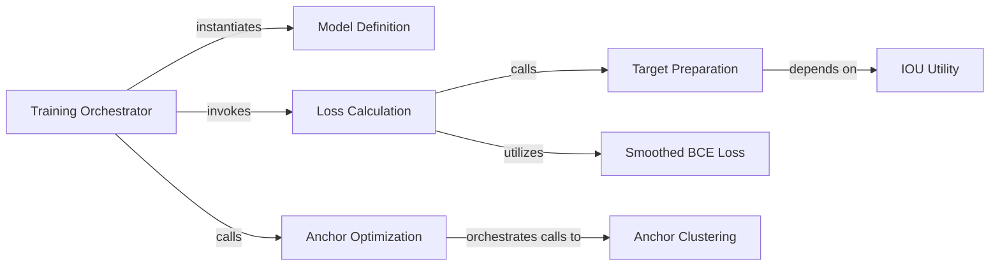

## Details

The Training & Optimization Orchestration subsystem is central to the YOLOv4 model's learning process, managing the entire training lifecycle from data processing to model updates and performance evaluation.

### Training Orchestrator
The primary component responsible for managing the end-to-end training lifecycle. It initializes the model, sets up data loaders, executes the iterative training loop (forward pass, backward pass, optimization step), performs periodic evaluation, and handles model checkpointing. It orchestrates the flow between the model, data, loss calculation, and optimization.

**Related Classes/Methods**:

- <a href="https://github.com/WongKinYiu/PyTorch_YOLOv4/blob/master/train.py#L44-L454" target="_blank" rel="noopener noreferrer">`train.train`:44-454</a>

### Model Definition
Represents the core neural network architecture (YOLOv4) that is being trained. It defines the layers and forward pass logic of the object detection model.

**Related Classes/Methods**:

- <a href="https://github.com/WongKinYiu/PyTorch_YOLOv4/blob/master/models/models.py#L445-L564" target="_blank" rel="noopener noreferrer">`models.models.Darknet`:445-564</a>

### Loss Calculation
Calculates the comprehensive loss for a given prediction, combining bounding box regression loss, objectness loss, and classification loss. It acts as a central point for various loss function implementations used during training.

**Related Classes/Methods**:

- <a href="https://github.com/WongKinYiu/PyTorch_YOLOv4/blob/master/utils/loss.py#L62-L124" target="_blank" rel="noopener noreferrer">`utils.loss.compute_loss`:62-124</a>

### Anchor Optimization
Manages the process of verifying and, if necessary, optimizing the anchor box dimensions to better fit the dataset's object characteristics, thereby improving detection performance. This is a crucial step in preparing the model for effective training.

**Related Classes/Methods**:

- <a href="https://github.com/WongKinYiu/PyTorch_YOLOv4/blob/master/utils/autoanchor.py#L21-L52" target="_blank" rel="noopener noreferrer">`utils.autoanchor.check_anchors`:21-52</a>

### Target Preparation
Prepares ground truth targets for loss calculation. This involves matching ground truth boxes with predicted anchors and assigning classes, which is essential for the compute_loss function.

**Related Classes/Methods**:

- <a href="https://github.com/WongKinYiu/PyTorch_YOLOv4/blob/master/utils/loss.py#L127-L172" target="_blank" rel="noopener noreferrer">`utils.loss.build_targets`:127-172</a>

### Anchor Clustering
Performs K-means clustering on the dataset's bounding box dimensions to generate optimal anchor box sizes. This is a key sub-process within the anchor optimization routine.

**Related Classes/Methods**:

- <a href="https://github.com/WongKinYiu/PyTorch_YOLOv4/blob/master/utils/autoanchor.py#L55-L149" target="_blank" rel="noopener noreferrer">`utils.autoanchor.kmean_anchors`:55-149</a>

### Smoothed BCE Loss
Implements the smoothed Binary Cross-Entropy loss function, which is used as part of the overall loss calculation for objectness and classification.

**Related Classes/Methods**:

- <a href="https://github.com/WongKinYiu/PyTorch_YOLOv4/blob/master/utils/loss.py#L10-L12" target="_blank" rel="noopener noreferrer">`utils.loss.smooth_BCE`:10-12</a>

### IOU Utility
Calculates the Intersection Over Union (IOU) for width and height dimensions. This utility is fundamental for various tasks within the training process, including matching ground truth boxes to predictions and evaluating bounding box overlap.

**Related Classes/Methods**:

- <a href="https://github.com/WongKinYiu/PyTorch_YOLOv4/blob/master/utils/utils.py#L330-L335" target="_blank" rel="noopener noreferrer">`utils.utils.wh_iou`:330-335</a>

### [FAQ](https://github.com/CodeBoarding/GeneratedOnBoardings/tree/main?tab=readme-ov-file#faq)