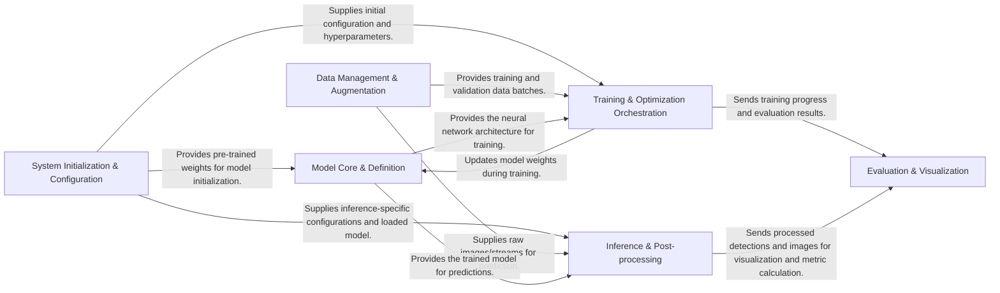

## Details

The `PyTorch_YOLOv4` architecture is designed as a modular deep learning toolkit for object detection, centered around a `Model Core & Definition` that encapsulates the YOLOv4 neural network. The system initiates through `System Initialization & Configuration`, which sets up the environment and loads necessary pre-trained weights. Data is prepared and augmented by the `Data Management & Augmentation` pipeline, feeding into either the `Training & Optimization Orchestration` for model learning or the `Inference & Post-processing` module for real-time predictions. Both training and inference workflows are supported by the `Evaluation & Visualization` component, which provides performance metrics and visual outputs, ensuring a comprehensive lifecycle for object detection model development and deployment.

### System Initialization & Configuration
Manages global project settings, hyperparameters, and initial model weight loading. It acts as an initial entry point for setting up the environment and loading necessary resources.

**Related Classes/Methods**:

- <a href="https://github.com/WongKinYiu/PyTorch_YOLOv4/blob/master/utils/google_utils.py" target="_blank" rel="noopener noreferrer">`utils.google_utils`</a>

### Data Management & Augmentation [[Expand]](./Data_Management_Augmentation.md)
Responsible for loading, preprocessing, and augmenting image datasets for both training and inference. It ensures data is in the correct format and ready for consumption by the model.

**Related Classes/Methods**:

- <a href="https://github.com/WongKinYiu/PyTorch_YOLOv4/blob/master/utils/datasets.py" target="_blank" rel="noopener noreferrer">`utils.datasets`</a>

### Model Core & Definition [[Expand]](./Model_Core_Definition.md)
Defines the YOLOv4 neural network architecture, including the Darknet backbone and detection layers. It encapsulates the forward pass logic of the model.

**Related Classes/Methods**:

- <a href="https://github.com/WongKinYiu/PyTorch_YOLOv4/blob/master/models/models.py" target="_blank" rel="noopener noreferrer">`models.models`</a>

### Training & Optimization Orchestration [[Expand]](./Training_Optimization_Orchestration.md)
Manages the end-to-end training lifecycle of the YOLOv4 model, including optimization, loss calculation, periodic evaluation, and checkpointing. It orchestrates the learning process.

**Related Classes/Methods**:

- <a href="https://github.com/WongKinYiu/PyTorch_YOLOv4/blob/master/train.py#L44-L454" target="_blank" rel="noopener noreferrer">`train`:44-454</a>
- <a href="https://github.com/WongKinYiu/PyTorch_YOLOv4/blob/master/utils/utils.py" target="_blank" rel="noopener noreferrer">`utils.loss`</a>
- <a href="https://github.com/WongKinYiu/PyTorch_YOLOv4/blob/master/utils/autoanchor.py" target="_blank" rel="noopener noreferrer">`utils.autoanchor`</a>

### Inference & Post-processing [[Expand]](./Inference_Post_processing.md)
Orchestrates the object detection process on new images or video streams. It handles loading the model, performing predictions, and applying post-processing techniques like Non-Maximum Suppression (NMS) to refine raw outputs.

**Related Classes/Methods**:

- <a href="https://github.com/WongKinYiu/PyTorch_YOLOv4/blob/master/detect.py#L30-L160" target="_blank" rel="noopener noreferrer">`detect`:30-160</a>
- <a href="https://github.com/WongKinYiu/PyTorch_YOLOv4/blob/master/utils/general.py" target="_blank" rel="noopener noreferrer">`utils.general`</a>

### Evaluation & Visualization [[Expand]](./Evaluation_Visualization.md)
Calculates standard object detection evaluation metrics (e.g., AP, precision, recall) and generates visual outputs such as annotated images with detections and training progress plots for analysis and reporting.

**Related Classes/Methods**:

- <a href="https://github.com/WongKinYiu/PyTorch_YOLOv4/blob/master/utils/metrics.py" target="_blank" rel="noopener noreferrer">`utils.metrics`</a>
- <a href="https://github.com/WongKinYiu/PyTorch_YOLOv4/blob/master/utils/plots.py" target="_blank" rel="noopener noreferrer">`utils.plots`</a>

### [FAQ](https://github.com/CodeBoarding/GeneratedOnBoardings/tree/main?tab=readme-ov-file#faq)