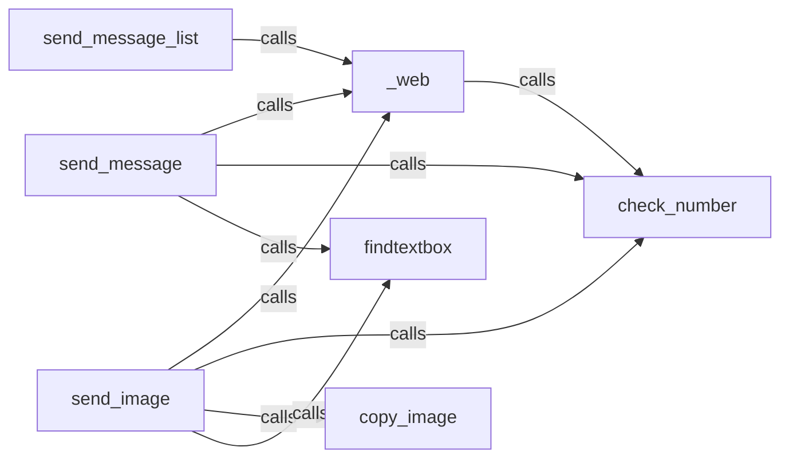

## Details

This subsystem provides the foundational capabilities for interacting with web browsers and performing general utility operations, serving as a core dependency for higher-level automation modules.

### _web
Initializes and manages the web browser instance, providing fundamental capabilities for opening web pages and interacting with the browser. It acts as the primary interface for browser automation.

**Related Classes/Methods**:

- <a href="https://github.com/Ankit404butfound/PyWhatKit/blob/master/pywhatkit/core/core.py#L90-L100" target="_blank" rel="noopener noreferrer">`_web`:90-100</a>

### check_number
A utility component responsible for validating and processing numerical inputs, ensuring they conform to required formats or ranges before being used in web interactions or other operations.

**Related Classes/Methods**:

- <a href="https://github.com/Ankit404butfound/PyWhatKit/blob/master/pywhatkit/core/core.py#L16-L19" target="_blank" rel="noopener noreferrer">`check_number`:16-19</a>

### send_message
Orchestrates the process of sending a single text message through web interfaces, coordinating browser interaction, input validation, and text input.

**Related Classes/Methods**:

- <a href="https://github.com/Ankit404butfound/PyWhatKit/blob/master/pywhatkit/core/core.py#L103-L133" target="_blank" rel="noopener noreferrer">`send_message`:103-133</a>

### send_message_list
Manages the process of sending text messages to multiple recipients or in a batch through web interfaces, leveraging the core browser management capabilities.

**Related Classes/Methods**:

- <a href="https://github.com/Ankit404butfound/PyWhatKit/blob/master/pywhatkit/core/core.py#L136-L145" target="_blank" rel="noopener noreferrer">`send_message_list`:136-145</a>

### send_image
Facilitates the transmission of images through web-based platforms, handling image preparation, browser interaction, and element finding for image uploads.

**Related Classes/Methods**:

- <a href="https://github.com/Ankit404butfound/PyWhatKit/blob/master/pywhatkit/core/core.py#L189-L211" target="_blank" rel="noopener noreferrer">`send_image`:189-211</a>

### findtextbox
A specialized utility for locating and interacting with text input fields or other similar UI elements on a web page, crucial for automating data entry.

**Related Classes/Methods**:

- <a href="https://github.com/Ankit404butfound/PyWhatKit/blob/master/pywhatkit/core/core.py#L36-L46" target="_blank" rel="noopener noreferrer">`findtextbox`:36-46</a>

### copy_image
Handles the copying or preparation of image data, likely for pasting or uploading into web interfaces, supporting the image sending functionality.

**Related Classes/Methods**:

- <a href="https://github.com/Ankit404butfound/PyWhatKit/blob/master/pywhatkit/core/core.py#L148-L186" target="_blank" rel="noopener noreferrer">`copy_image`:148-186</a>

### [FAQ](https://github.com/CodeBoarding/GeneratedOnBoardings/tree/main?tab=readme-ov-file#faq)