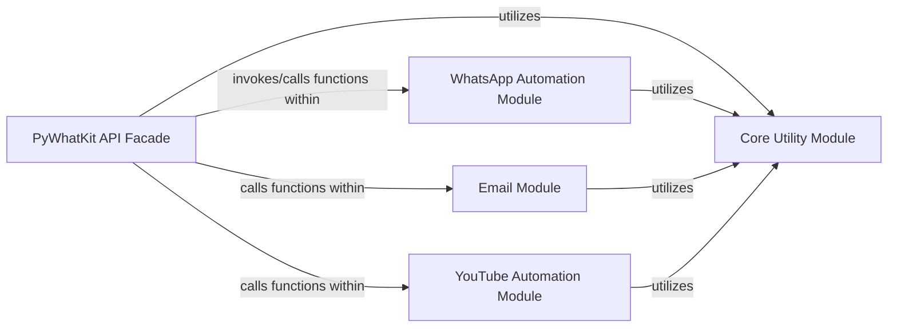

## Details

The PyWhatKit library is structured around a central PyWhatKit API Facade that simplifies access to various automation functionalities. This facade acts as the primary interface, abstracting the complexities of underlying modules. Key functional areas are encapsulated within dedicated modules: WhatsApp Automation Module for WhatsApp interactions, Email Module for email sending, and YouTube Automation Module for YouTube-related tasks. All these specialized modules, including the Facade, rely on a Core Utility Module for common helper functions and reusable utilities, ensuring a cohesive and efficient architecture. This design promotes modularity and ease of use, making the library's diverse capabilities accessible through a unified interface.

### PyWhatKit API Facade [[Expand]](./PyWhatKit_API_Facade.md)
The central entry point and orchestrator of the library. It provides a simplified, high-level interface to all underlying functionalities, abstracting their complexities. This component embodies the Facade pattern, offering a unified interface to a set of subsystems.

**Related Classes/Methods**:

- <a href="https://github.com/Ankit404butfound/PyWhatKit/blob/master/pywhatkit#L1-L1000" target="_blank" rel="noopener noreferrer">`pywhatkit`:1-1000</a>

### WhatsApp Automation Module
Encapsulates all functionalities related to automating interactions with WhatsApp, such as sending messages.

**Related Classes/Methods**:

- <a href="https://github.com/Ankit404butfound/PyWhatKit/blob/master/pywhatkit/whats.py#L1-L1000" target="_blank" rel="noopener noreferrer">`pywhatkit.whats`:1-1000</a>

### Email Module
Manages the functionalities for sending emails programmatically.

**Related Classes/Methods**:

- <a href="https://github.com/Ankit404butfound/PyWhatKit/blob/master/pywhatkit/mail.py#L1-L1000" target="_blank" rel="noopener noreferrer">`pywhatkit.mail`:1-1000</a>

### YouTube Automation Module
Handles automation tasks specifically for YouTube, such as playing videos.

**Related Classes/Methods**:

- <a href="https://github.com/Ankit404butfound/PyWhatKit/blob/master/pywhatkit/misc.py#L1-L1000" target="_blank" rel="noopener noreferrer">`pywhatkit.misc`:1-1000</a>
- <a href="https://github.com/Ankit404butfound/PyWhatKit/blob/master/pywhatkit/playonyt_stream.py#L1-L1000" target="_blank" rel="noopener noreferrer">`pywhatkit.playonyt_stream`:1-1000</a>

### Core Utility Module
Provides common, reusable utility functions and helper methods that support various functionalities across the library.

**Related Classes/Methods**:

- <a href="https://github.com/Ankit404butfound/PyWhatKit/blob/master/pywhatkit/core/core.py#L1-L1000" target="_blank" rel="noopener noreferrer">`pywhatkit.core.core`:1-1000</a>

### [FAQ](https://github.com/CodeBoarding/GeneratedOnBoardings/tree/main?tab=readme-ov-file#faq)