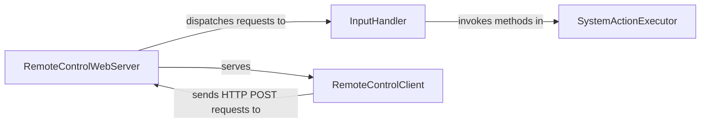

## Details

The `remotekit` subsystem in `pywhatkit` enables remote control functionality through a web-based interface. The `RemoteControlWebServer` acts as the core server, handling incoming requests from the `RemoteControlClient`, which is an external HTML/JavaScript application. The `InputHandler` processes these requests, translating them into specific system actions, which are then executed by the `SystemActionExecutor` using the `pyautogui` library to interact with the operating system. This architecture clearly separates the concerns of web serving, input handling, and system-level execution, with the `RemoteControlClient` serving as the user's remote interface.

### RemoteControlWebServer
This component, built with Flask, acts as the central server for the remote control feature. It initializes the web application, listens for incoming HTTP requests from clients, and serves the static web interface (RemoteControlClient). It's the primary entry point for all remote commands.

**Related Classes/Methods**:

- <a href="https://github.com/Ankit404butfound/PyWhatKit/blob/master/pywhatkit/remotekit.py" target="_blank" rel="noopener noreferrer">`pywhatkit.remotekit`</a>

### InputHandler
Comprising various Flask route handlers, this component is responsible for receiving, interpreting, and validating specific remote commands sent by the RemoteControlClient. Each handler maps to a distinct user action (e.g., mouse movement, clicks, text input, scrolling).

**Related Classes/Methods**:

- <a href="https://github.com/Ankit404butfound/PyWhatKit/blob/master/pywhatkit/remotekit.py" target="_blank" rel="noopener noreferrer">`pywhatkit.remotekit`</a>

### SystemActionExecutor
This component leverages the `pyautogui` library to translate interpreted commands into actual system-level interactions. It simulates user actions such as moving the mouse, performing clicks, typing text, and scrolling, directly interacting with the operating system.

**Related Classes/Methods**:

- <a href="https://github.com/Ankit404butfound/PyWhatKit/blob/master/pywhatkit/remotekit.py" target="_blank" rel="noopener noreferrer">`pywhatkit.remotekit`</a>

### RemoteControlClient
This is the client-side web interface (HTML/JavaScript) that runs in a web browser on an external device (e.g., a phone). It provides the user interface for remote control and sends HTTP POST requests containing commands to the RemoteControlWebServer. While not part of the Python codebase, it's a crucial external component for the subsystem's functionality.

**Related Classes/Methods**: _None_

### [FAQ](https://github.com/CodeBoarding/GeneratedOnBoardings/tree/main?tab=readme-ov-file#faq)