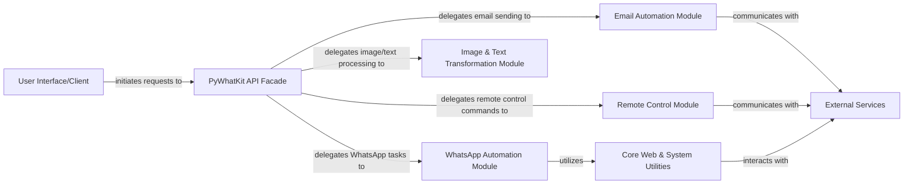

## Details

The PyWhatKit library is designed with a clear separation of concerns, centered around a `PyWhatKit API Facade` that serves as the primary interaction point for external `User Interface/Client` applications. This facade orchestrates requests by delegating specific tasks to specialized internal modules: `WhatsApp Automation Module`, `Email Automation Module`, `Remote Control Module`, and `Image & Text Transformation Module`. These modules encapsulate the logic for their respective domains. A foundational `Core Web & System Utilities` module provides low-level browser and system interaction capabilities, serving as a dependency for web-based automation. All modules requiring external communication interact with `External Services` such as WhatsApp Web, YouTube, SMTP servers, or remote phone clients, ensuring a clear boundary between the library's internal logic and external dependencies. This architecture promotes modularity, maintainability, and clear data flow, making it well-suited for both documentation and visual diagram generation.

### User Interface/Client
Represents the external user or application initiating commands and data to the PyWhatKit library. This component is external to the PyWhatKit codebase and thus has no internal source code references.

**Related Classes/Methods**: _None_

### PyWhatKit API Facade [[Expand]](./PyWhatKit_API_Facade.md)
The central entry point and orchestrator of the library. It provides a simplified, high-level interface to all underlying functionalities, abstracting their complexities.

**Related Classes/Methods**:

- <a href="https://github.com/Ankit404butfound/PyWhatKit/blob/master/pywhatkit/__init__.py" target="_blank" rel="noopener noreferrer">`pywhatkit/__init__.py`</a>

### WhatsApp Automation Module
Dedicated to automating interactions with WhatsApp Web, including sending messages, images, and managing contacts. It leverages core web utilities for browser control.

**Related Classes/Methods**:

- <a href="https://github.com/Ankit404butfound/PyWhatKit/blob/master/pywhatkit/whats.py" target="_blank" rel="noopener noreferrer">`pywhatkit/whats.py`</a>

### Email Automation Module
Manages the functionality for sending emails, supporting both plain text and HTML formats, by communicating with external SMTP servers.

**Related Classes/Methods**:

- <a href="https://github.com/Ankit404butfound/PyWhatKit/blob/master/pywhatkit/mail.py" target="_blank" rel="noopener noreferrer">`pywhatkit/mail.py`</a>

### Remote Control Module [[Expand]](./Remote_Control_Module.md)
Implements the server-side logic for remote control features, enabling external clients (e.g., a phone) to interact with and control the system running PyWhatKit.

**Related Classes/Methods**:

- <a href="https://github.com/Ankit404butfound/PyWhatKit/blob/master/pywhatkit/remotekit.py" target="_blank" rel="noopener noreferrer">`pywhatkit/remotekit.py`</a>

### Image & Text Transformation Module
Provides utilities for creative text and image manipulations, specifically converting images/text into ASCII art and generating handwriting-style text.

**Related Classes/Methods**:

- <a href="https://github.com/Ankit404butfound/PyWhatKit/blob/master/pywhatkit/ascii_art.py" target="_blank" rel="noopener noreferrer">`pywhatkit/ascii_art.py`</a>
- <a href="https://github.com/Ankit404butfound/PyWhatKit/blob/master/pywhatkit/handwriting.py" target="_blank" rel="noopener noreferrer">`pywhatkit/handwriting.py`</a>

### Core Web & System Utilities [[Expand]](./Core_Web_System_Utilities.md)
A foundational module providing low-level utilities for web browser interaction (e.g., opening pages, finding elements, handling images) and general system-level operations (e.g., screenshots, process management). It serves as a dependency for web-based automation modules.

**Related Classes/Methods**:

- <a href="https://github.com/Ankit404butfound/PyWhatKit/blob/master/pywhatkit/core/core.py" target="_blank" rel="noopener noreferrer">`pywhatkit/core/core.py`</a>
- <a href="https://github.com/Ankit404butfound/PyWhatKit/blob/master/pywhatkit/misc.py" target="_blank" rel="noopener noreferrer">`pywhatkit/misc.py`</a>
- <a href="https://github.com/Ankit404butfound/PyWhatKit/blob/master/pywhatkit/sc.py" target="_blank" rel="noopener noreferrer">`pywhatkit/sc.py`</a>

### External Services
Represents all external systems PyWhatKit interacts with, including WhatsApp Web, YouTube, SMTP servers for email, and phone clients for remote control. This component is external to the PyWhatKit codebase and thus has no internal source code references.

**Related Classes/Methods**: _None_

### [FAQ](https://github.com/CodeBoarding/GeneratedOnBoardings/tree/main?tab=readme-ov-file#faq)