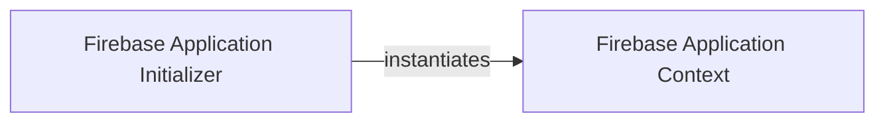

## Details

The `Firebase Application Core` subsystem is defined by the `pyrebase.pyrebase` module. It encapsulates the fundamental logic for initializing the Firebase application and providing access to its core services. This subsystem acts as the foundational layer upon which all other Pyrebase functionalities are built.

### Firebase Application Initializer
This component, represented by the `initialize_app` function, serves as the primary public entry point for the Pyrebase library. Its core responsibility is to accept Firebase configuration credentials and use them to instantiate and initialize the `Firebase` application object. It abstracts the initial setup process, providing a clean interface for users to begin using the library. This aligns with the "Configuration-Driven" and "Abstraction Layer" architectural biases.

**Related Classes/Methods**:

- <a href="https://github.com/thisbejim/Pyrebase/blob/master/pyrebase/pyrebase.py#L27-L28" target="_blank" rel="noopener noreferrer">`pyrebase.pyrebase.initialize_app`:27-28</a>

### Firebase Application Context
This component, embodied by the `Firebase` class, is the central hub of the Pyrebase library. It holds the application's configuration and acts as a factory, providing methods to obtain instances of specific Firebase service clients (e.g., `Auth`, `Database`, `Storage`). It also manages internal application setup and state. This aligns with the "API Wrapper/Facade" and "Service-Oriented Client" architectural patterns, providing a unified interface to various Firebase services.

**Related Classes/Methods**:

- <a href="https://github.com/thisbejim/Pyrebase/blob/master/pyrebase/pyrebase.py#L31-L69" target="_blank" rel="noopener noreferrer">`pyrebase.pyrebase.Firebase`:31-69</a>

### [FAQ](https://github.com/CodeBoarding/GeneratedOnBoardings/tree/main?tab=readme-ov-file#faq)