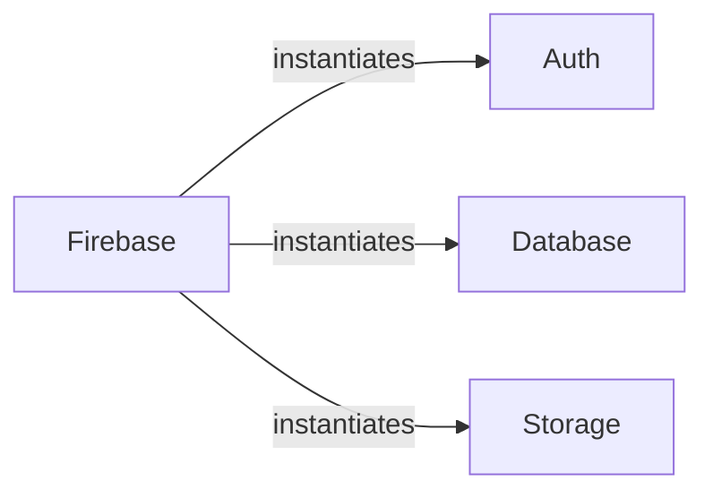

## Details

The Pyrebase library's core architecture revolves around the `Firebase` component, which acts as a central orchestrator. Upon initialization, `Firebase` provides access to specialized client instances for `Auth`, `Database`, and `Storage` services. This design establishes clear component boundaries, where `Firebase` serves as a factory, instantiating and managing the lifecycle of its dependent service clients. The `Auth` component handles all user authentication flows, `Database` manages real-time data operations, and `Storage` facilitates file management. This structure ensures a modular and extensible system, allowing for independent development and maintenance of each Firebase service interaction while maintaining a unified entry point through the `Firebase` facade.

### Firebase
This component serves as the primary facade for the Pyrebase library. It is responsible for initializing and providing access to the Auth, Database, and Storage client instances, acting as the central entry point and factory for interacting with Firebase services.

**Related Classes/Methods**:

- <a href="https://github.com/thisbejim/Pyrebase/blob/master/pyrebase/pyrebase.py#L31-L69" target="_blank" rel="noopener noreferrer">`pyrebase.pyrebase.Firebase`:31-69</a>

### Auth
This component manages all Firebase Authentication operations, including user sign-up, sign-in, token management, and account-related actions. It abstracts the underlying Firebase Authentication API.

**Related Classes/Methods**:

- <a href="https://github.com/thisbejim/Pyrebase/blob/master/pyrebase/pyrebase.py#L72-L164" target="_blank" rel="noopener noreferrer">`pyrebase.pyrebase.Auth`:72-164</a>

### Database
This component handles all interactions with the Firebase Realtime Database. It provides methods for Create, Read, Update, and Delete (CRUD) operations and manages real-time data streams, abstracting the database API.

**Related Classes/Methods**:

- <a href="https://github.com/thisbejim/Pyrebase/blob/master/pyrebase/pyrebase.py#L167-L360" target="_blank" rel="noopener noreferrer">`pyrebase.pyrebase.Database`:167-360</a>

### Storage
This component manages file upload and download operations with Firebase Cloud Storage. It provides an interface for interacting with the storage service, abstracting the underlying API.

**Related Classes/Methods**:

- <a href="https://github.com/thisbejim/Pyrebase/blob/master/pyrebase/pyrebase.py#L363-L439" target="_blank" rel="noopener noreferrer">`pyrebase.pyrebase.Storage`:363-439</a>

### [FAQ](https://github.com/CodeBoarding/GeneratedOnBoardings/tree/main?tab=readme-ov-file#faq)