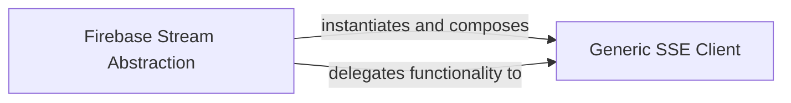

## Details

The `Firebase Stream Abstraction` serves as the high-level interface for managing Firebase Realtime Database streams. It achieves this by **instantiating and composing** the `Generic SSE Client`. This composition allows the `Firebase Stream Abstraction` to **delegate functionality to** the `Generic SSE Client` for the actual low-level handling of Server-Sent Events (SSE) protocol, including connection management, event parsing, and stream maintenance. Essentially, the abstraction layer translates Firebase-specific streaming needs into generic SSE operations, relying on the `Generic SSE Client` to perform the underlying network communication and event processing.

The core of the Pyrebase streaming subsystem is built around a clear separation of concerns. The `Firebase Stream Abstraction` acts as a user-facing facade, simplifying interactions with Firebase Realtime Database streams. It achieves its functionality by leveraging the `Generic SSE Client`, which is responsible for the intricate details of the Server-Sent Events protocol. This architectural pattern ensures that Firebase-specific logic is decoupled from the generic SSE communication, promoting modularity and maintainability. The abstraction layer instantiates and delegates to the generic client, effectively hiding the low-level streaming mechanics from the Pyrebase user.

### Firebase Stream Abstraction
This component acts as the primary abstraction layer and facade for Firebase Realtime Database streams within the Pyrebase library. It offers a high-level, user-friendly interface for initiating, managing, and closing real-time data connections tailored specifically for Firebase's streaming API. Its core responsibility is to translate Firebase-specific streaming requests into generic SSE operations and to process incoming SSE events into a format consumable by Pyrebase users, effectively hiding the underlying SSE implementation details.

**Related Classes/Methods**:

- <a href="https://github.com/thisbejim/Pyrebase/blob/master/pyrebase/pyrebase.py#L533-L571" target="_blank" rel="noopener noreferrer">`pyrebase.pyrebase.Stream`:533-571</a>

### Generic SSE Client
This component is a generic Server-Sent Events (SSE) client library that Pyrebase leverages. It handles the fundamental SSE protocol, including establishing and maintaining the HTTP connection, continuously receiving and parsing individual events from the stream, and managing the connection's lifecycle (e.g., reconnections). It serves as the low-level "wrapped library" providing the core SSE capabilities upon which the Firebase Stream Abstraction builds.

**Related Classes/Methods**:

- <a href="https://github.com/thisbejim/Pyrebase/blob/master/sseclient/sseclient.py" target="_blank" rel="noopener noreferrer">`sseclient.sseclient.ClosableSSEClient`</a>

### [FAQ](https://github.com/CodeBoarding/GeneratedOnBoardings/tree/main?tab=readme-ov-file#faq)