```mermaid
graph LR
    User_Application["User Application"]
    Firebase_Application_Core["Firebase Application Core"]
    Firebase_Service_Clients["Firebase Service Clients"]
    HTTP_Communication_Layer["HTTP Communication Layer"]
    Realtime_Stream_Handler["Realtime Stream Handler"]
    Pyrebase_Data_Transformer["Pyrebase Data Transformer"]
    External_Firebase_API["External Firebase API"]
    User_Application -- "Initializes with config" --> Firebase_Application_Core
    Firebase_Application_Core -- "Provides service instances" --> Firebase_Service_Clients
    Firebase_Service_Clients -- "Sends API Request" --> HTTP_Communication_Layer
    HTTP_Communication_Layer -- "Facilitates API Communication" --> External_Firebase_API
    External_Firebase_API -- "Streams Data via SSE" --> HTTP_Communication_Layer
    HTTP_Communication_Layer -- "Returns Raw Response" --> Firebase_Service_Clients
    Firebase_Service_Clients -- "Passes Raw Data" --> Pyrebase_Data_Transformer
    Pyrebase_Data_Transformer -- "Returns Pyre Objects" --> Firebase_Service_Clients
    Firebase_Service_Clients -- "Initiates Stream" --> Realtime_Stream_Handler
    Realtime_Stream_Handler -- "Establishes SSE Connection" --> HTTP_Communication_Layer
    Realtime_Stream_Handler -- "Receives Stream Events" --> Pyrebase_Data_Transformer
    Pyrebase_Data_Transformer -- "Returns Pyre Objects" --> Realtime_Stream_Handler
    Realtime_Stream_Handler -- "Delivers Processed Events" --> User_Application
    click Firebase_Application_Core href "https://github.com/CodeBoarding/GeneratedOnBoardings/blob/main/Pyrebase/Firebase_Application_Core.md" "Details"
    click Firebase_Service_Clients href "https://github.com/CodeBoarding/GeneratedOnBoardings/blob/main/Pyrebase/Firebase_Service_Clients.md" "Details"
    click Realtime_Stream_Handler href "https://github.com/CodeBoarding/GeneratedOnBoardings/blob/main/Pyrebase/Realtime_Stream_Handler.md" "Details"
```

## Details

The Pyrebase library acts as an intermediary between a `User Application` and the `External Firebase API`. The `User Application` initializes the `Firebase Application Core`, which then provides various `Firebase Service Clients` (e.g., for Authentication, Database, Storage). These clients interact with the `HTTP Communication Layer` to send and receive data from the `External Firebase API`. For real-time data, the `Realtime Stream Handler` establishes Server-Sent Events (SSE) connections via the `HTTP Communication Layer` to the `External Firebase API`. All raw data exchanged is processed by the `Pyrebase Data Transformer` to convert it into structured Python objects, which are then consumed by the `Firebase Service Clients` or directly delivered to the `User Application` in the case of real-time events.

### User Application
Represents the end-user application or script that consumes the Pyrebase library's functionalities. It initiates the Pyrebase setup and interacts with its exposed service clients. This component is external to the Pyrebase library and thus does not have direct source code references within the project.

**Related Classes/Methods**: _None_

### Firebase Application Core [[Expand]](./Firebase_Application_Core.md)
The central entry point for Pyrebase, responsible for initializing the Firebase application with credentials and acting as a factory to provide instances of various Firebase service clients.

**Related Classes/Methods**:

- <a href="https://github.com/thisbejim/Pyrebase/blob/master/pyrebase/pyrebase.py#L27-L28" target="_blank" rel="noopener noreferrer">`pyrebase.pyrebase.initialize_app`:27-28</a>
- <a href="https://github.com/thisbejim/Pyrebase/blob/master/pyrebase/pyrebase.py#L31-L69" target="_blank" rel="noopener noreferrer">`pyrebase.pyrebase.Firebase`:31-69</a>

### Firebase Service Clients [[Expand]](./Firebase_Service_Clients.md)
A logical grouping of specialized clients (Authentication, Realtime Database, Cloud Storage) that provide high-level interfaces for interacting with specific Firebase services. They encapsulate service-specific logic and data handling.

**Related Classes/Methods**:

- <a href="https://github.com/thisbejim/Pyrebase/blob/master/pyrebase/pyrebase.py#L72-L164" target="_blank" rel="noopener noreferrer">`pyrebase.pyrebase.Auth`:72-164</a>
- <a href="https://github.com/thisbejim/Pyrebase/blob/master/pyrebase/pyrebase.py#L167-L360" target="_blank" rel="noopener noreferrer">`pyrebase.pyrebase.Database`:167-360</a>
- <a href="https://github.com/thisbejim/Pyrebase/blob/master/pyrebase/pyrebase.py#L363-L439" target="_blank" rel="noopener noreferrer">`pyrebase.pyrebase.Storage`:363-439</a>

### HTTP Communication Layer
An underlying component responsible for handling all outbound HTTP requests to Firebase API endpoints and receiving raw responses. It abstracts the network communication details, typically using the `requests` library.

**Related Classes/Methods**:

- <a href="https://github.com/thisbejim/Pyrebase/blob/master/pyrebase/pyrebase.py" target="_blank" rel="noopener noreferrer">`requests.post`</a>
- <a href="https://github.com/thisbejim/Pyrebase/blob/master/pyrebase/pyrebase.py" target="_blank" rel="noopener noreferrer">`requests.get`</a>

### Realtime Stream Handler [[Expand]](./Realtime_Stream_Handler.md)
Manages Server-Sent Events (SSE) connections for real-time data streaming from the Firebase Realtime Database. It establishes, maintains, and processes incoming stream events.

**Related Classes/Methods**:

- <a href="https://github.com/thisbejim/Pyrebase/blob/master/pyrebase/pyrebase.py#L533-L571" target="_blank" rel="noopener noreferrer">`pyrebase.pyrebase.Stream`:533-571</a>
- <a href="https://github.com/thisbejim/Pyrebase/blob/master/sseclient/sseclient.py" target="_blank" rel="noopener noreferrer">`sseclient.sseclient.ClosableSSEClient`</a>

### Pyrebase Data Transformer
A utility component that converts raw JSON responses from Firebase APIs into structured and convenient Pyrebase-specific Python objects, providing an abstraction over raw data for easier manipulation.

**Related Classes/Methods**:

- <a href="https://github.com/thisbejim/Pyrebase/blob/master/pyrebase/pyrebase.py#L451-L455" target="_blank" rel="noopener noreferrer">`pyrebase.pyrebase.convert_to_pyre`:451-455</a>
- <a href="https://github.com/thisbejim/Pyrebase/blob/master/pyrebase/pyrebase.py#L495-L503" target="_blank" rel="noopener noreferrer">`pyrebase.pyrebase.Pyre`:495-503</a>

### External Firebase API
Represents the actual Firebase backend services and their REST API endpoints that Pyrebase communicates with. This is an external dependency and does not have direct source code references within the project.

**Related Classes/Methods**: _None_

### [FAQ](https://github.com/CodeBoarding/GeneratedOnBoardings/tree/main?tab=readme-ov-file#faq)