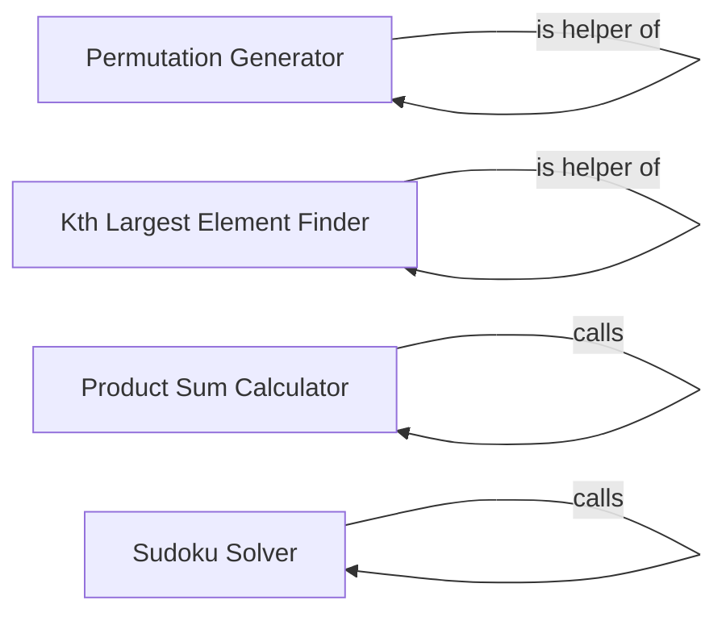

## Component Details

### Permutation Generator
This component provides functionalities for generating permutations of a given list. It includes both recursive and backtracking approaches to achieve this. The recursive approach offers a straightforward implementation, while the backtracking approach provides a more controlled exploration of possible permutations.
- **Related Classes/Methods**: `repos.Python.data_structures.arrays.permutations:permute_recursive`, `repos.Python.data_structures.arrays.permutations:permute_backtrack`, `repos.Python.data_structures.arrays.permutations:permute_backtrack.backtrack`

### Kth Largest Element Finder
This component focuses on efficiently finding the kth largest element within an array. It employs a partitioning algorithm, similar to that used in quicksort, to locate the desired element without fully sorting the array. This approach provides a time-efficient solution for this specific task.
- **Related Classes/Methods**: `repos.Python.data_structures.arrays.kth_largest_element:kth_largest_element`, `repos.Python.data_structures.arrays.kth_largest_element:partition`

### Product Sum Calculator
This component calculates the product sum of a nested list, also known as a 'special' array. The product sum is determined by summing the elements of the list, with each element multiplied by its depth within the nested structure. The calculation is performed recursively to handle nested lists of arbitrary depth.
- **Related Classes/Methods**: `repos.Python.data_structures.arrays.product_sum:product_sum`, `repos.Python.data_structures.arrays.product_sum:product_sum_array`

### Sudoku Solver
This component provides functionalities for solving Sudoku puzzles. It uses constraint propagation and search algorithms to find a valid solution to a given Sudoku grid. The component includes functions for parsing the grid, assigning values, eliminating possibilities, and searching for a solution.
- **Related Classes/Methods**: `repos.Python.data_structures.arrays.sudoku_solver:solve`, `repos.Python.data_structures.arrays.sudoku_solver:parse_grid`, `repos.Python.data_structures.arrays.sudoku_solver:grid_values`, `repos.Python.data_structures.arrays.sudoku_solver:assign`, `repos.Python.data_structures.arrays.sudoku_solver:eliminate`, `repos.Python.data_structures.arrays.sudoku_solver:search`, `repos.Python.data_structures.arrays.sudoku_solver:some`, `repos.Python.data_structures.arrays.sudoku_solver:solve_all`, `repos.Python.data_structures.arrays.sudoku_solver:solved`, `repos.Python.data_structures.arrays.sudoku_solver:random_puzzle`, `repos.Python.data_structures.arrays.sudoku_solver:shuffled`
