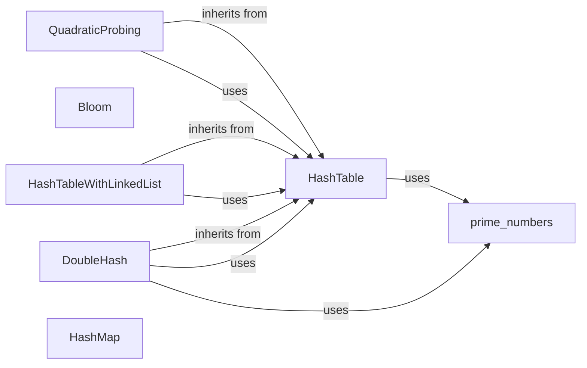

## Component Details

### HashTable
The HashTable class serves as an abstract base class for various hash table implementations. It defines the core interface and common functionalities such as hashing keys, handling collisions, and resizing the table when necessary. Different collision resolution strategies are implemented in derived classes.
- **Related Classes/Methods**: `repos.Python.data_structures.hashing.hash_table.HashTable`

### QuadraticProbing
QuadraticProbing is a concrete hash table implementation that resolves collisions using quadratic probing. When a collision occurs, it calculates the next possible index by adding the square of the probe number to the original hash index. This approach helps to avoid clustering and improve performance.
- **Related Classes/Methods**: `repos.Python.data_structures.hashing.quadratic_probing.QuadraticProbing`

### Bloom
The Bloom filter is a probabilistic data structure used to test whether an element is a member of a set. It uses multiple hash functions to map elements to bit positions in a bit array. While it can have false positives, it guarantees that false negatives will never occur, making it suitable for applications where high certainty of non-membership is required.
- **Related Classes/Methods**: `repos.Python.data_structures.hashing.bloom_filter.Bloom`

### HashTableWithLinkedList
HashTableWithLinkedList is a hash table implementation that resolves collisions by using linked lists. When multiple elements hash to the same index, they are stored in a linked list at that index. This approach allows for a simple and effective way to handle collisions, especially when the number of collisions is relatively low.
- **Related Classes/Methods**: `repos.Python.data_structures.hashing.hash_table_with_linked_list.HashTableWithLinkedList`

### DoubleHash
DoubleHash is a hash table implementation that uses double hashing for collision resolution. It employs a secondary hash function to determine the probe sequence when a collision occurs. This technique helps to distribute elements more evenly across the hash table, reducing the likelihood of clustering and improving performance.
- **Related Classes/Methods**: `repos.Python.data_structures.hashing.double_hash.DoubleHash`

### HashMap
The HashMap class provides a high-level interface for storing and retrieving key-value pairs. It uses a hash table internally to provide efficient access to elements. The HashMap supports dynamic resizing, automatically increasing the capacity of the hash table when the load factor exceeds a certain threshold.
- **Related Classes/Methods**: `repos.Python.data_structures.hashing.hash_map.HashMap`

### prime_numbers
The prime_numbers module provides utility functions for prime number calculations, such as checking if a number is prime and finding the next prime number. These functions are used in resizing the hash table and in collision resolution strategies like double hashing, where prime numbers help to ensure a more uniform distribution of elements.
- **Related Classes/Methods**: `repos.Python.data_structures.hashing.number_theory.prime_numbers`
