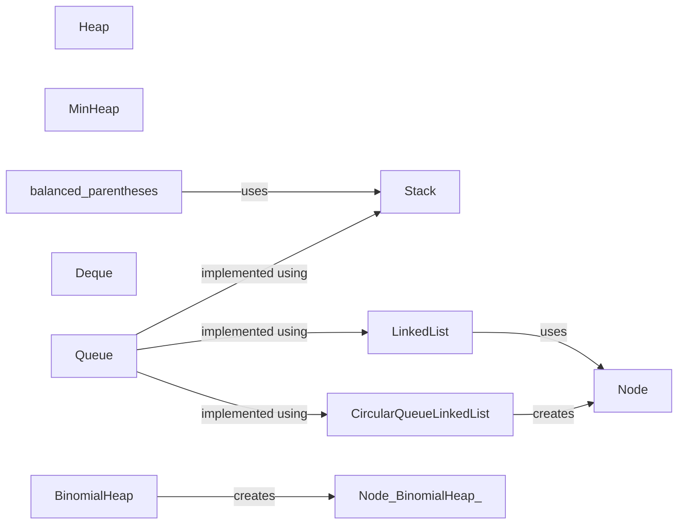

## Component Details

### Stack
Represents a stack data structure with LIFO (Last-In, First-Out) behavior. It provides methods for pushing, popping, peeking, checking if it's empty or full, and getting its size. It's a fundamental data structure used in various algorithms and applications.
- **Related Classes/Methods**: `repos.Python.data_structures.stacks.stack.Stack`

### Heap
Represents a heap data structure, specifically a max heap. It provides methods for building a max heap, heapifying, extracting the maximum element, inserting elements, and sorting. Heaps are useful for priority queues and sorting algorithms.
- **Related Classes/Methods**: `repos.Python.data_structures.heap.heap.Heap`

### MinHeap
Represents a min heap data structure. It provides methods for building a min heap, sifting down, sifting up, removing elements, inserting elements, and decreasing the key of an element. Min heaps are commonly used in priority queues and graph algorithms.
- **Related Classes/Methods**: `repos.Python.data_structures.heap.min_heap.MinHeap`

### LinkedList
Represents a linked list data structure, with implementations for singly, doubly, and circular linked lists. It provides methods for inserting and deleting elements at various positions. Linked lists are versatile data structures used in various applications where dynamic memory allocation is needed.
- **Related Classes/Methods**: `repos.Python.data_structures.linked_list.singly_linked_list.LinkedList`, `repos.Python.data_structures.linked_list.circular_linked_list.CircularLinkedList`, `repos.Python.data_structures.linked_list.doubly_linked_list.DoublyLinkedList`

### Queue
Represents a queue data structure, with implementations using pseudo stacks, linked lists, and circular linked lists. It provides methods for enqueuing and dequeuing elements. Queues are used in various applications such as task scheduling and breadth-first search.
- **Related Classes/Methods**: `repos.Python.data_structures.queues.queue_on_pseudo_stack.Queue`, `repos.Python.data_structures.queues.linked_queue.LinkedQueue`, `repos.Python.data_structures.queues.circular_queue_linked_list.CircularQueueLinkedList`, `repos.Python.data_structures.queues.circular_queue.CircularQueue`

### Deque
Represents a double-ended queue data structure. It provides methods for appending and popping elements from both ends, extending the queue, and iterating over the elements. Deques are useful for implementing stacks and queues, and are used in various algorithms such as sliding window problems.
- **Related Classes/Methods**: `repos.Python.data_structures.queues.double_ended_queue.Deque`

### Node
Represents a node in various linked list implementations (singly, doubly, circular) and the circular queue linked list. It stores data and a reference to the next node (and previous node in doubly linked lists). Nodes are the building blocks of linked lists.
- **Related Classes/Methods**: `repos.Python.data_structures.linked_list.singly_linked_list.Node`, `repos.Python.data_structures.linked_list.circular_linked_list.Node`, `repos.Python.data_structures.linked_list.doubly_linked_list.Node`, `repos.Python.data_structures.queues.circular_queue_linked_list.Node`
