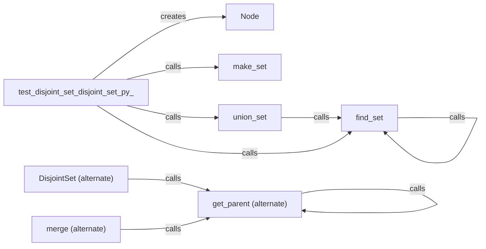

## Component Details

### Node
Represents a node in the disjoint set data structure. Each node has a data value, a parent node, and a rank. The rank is used to optimize the union operation.
- **Related Classes/Methods**: `repos.Python.data_structures.disjoint_set.disjoint_set.Node`

### make_set
Creates a new set with a single element. The element is the parent of itself, and the rank is initialized to 0. It initializes the rank and parent of the node.
- **Related Classes/Methods**: `repos.Python.data_structures.disjoint_set.disjoint_set.make_set`

### find_set
Finds the representative (root) of the set that an element belongs to, using path compression. It recursively finds the parent and updates the parent of the element to the root parent.
- **Related Classes/Methods**: `repos.Python.data_structures.disjoint_set.disjoint_set.find_set`

### union_set
Merges the sets containing elements x and y by attaching the root of one set to the root of the other, using rank to optimize the structure. It finds the sets of x and y, and attaches the set with the smaller rank to the set with the larger rank.
- **Related Classes/Methods**: `repos.Python.data_structures.disjoint_set.disjoint_set.union_set`

### DisjointSet (alternate)
Represents a disjoint-set data structure using an alternate implementation. It provides methods for merging sets and finding the parent of an element. It uses rank and parent lists to keep track of the sets.
- **Related Classes/Methods**: `repos.Python.data_structures.disjoint_set.alternate_disjoint_set.DisjointSet`

### merge (alternate)
Merges two sets represented by elements src and dst. It finds the parents of src and dst and attaches the set with the smaller rank to the set with the larger rank. It updates the set_counts, parents and ranks accordingly.
- **Related Classes/Methods**: `repos.Python.data_structures.disjoint_set.alternate_disjoint_set.DisjointSet:merge`

### get_parent (alternate)
Finds the representative (parent) of the set that an element belongs to, using path compression. It recursively finds the parent and updates the parent of the element to the root parent.
- **Related Classes/Methods**: `repos.Python.data_structures.disjoint_set.alternate_disjoint_set.DisjointSet:get_parent`
