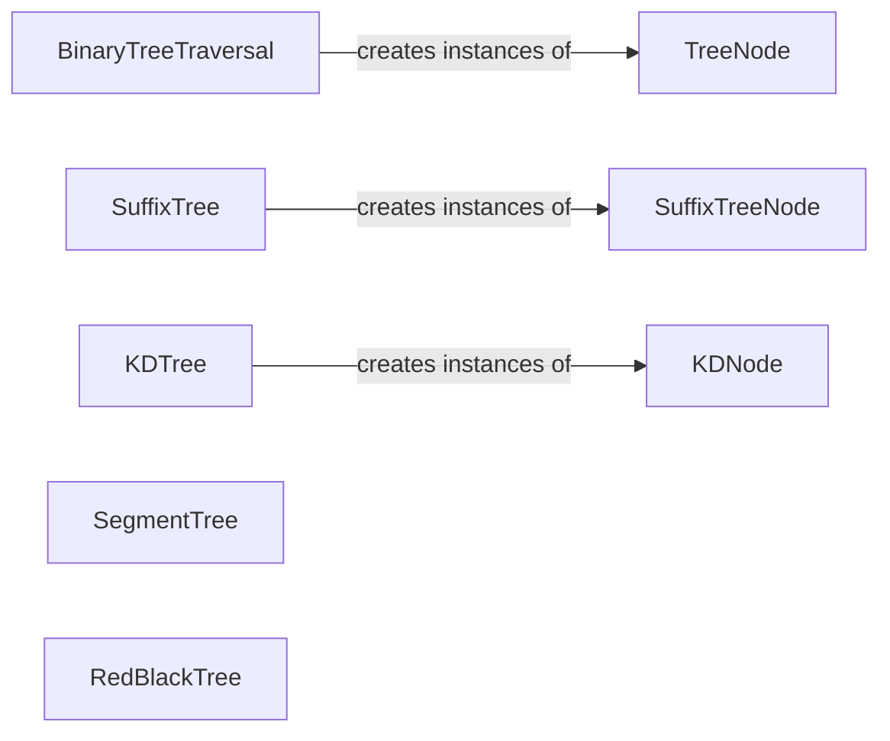

## Component Details

### TreeNode
Represents a node in a binary tree. It contains a value and references to its left and right children, forming the fundamental building block for various tree-based data structures.
- **Related Classes/Methods**: `repos.Python.searches.binary_tree_traversal.TreeNode`

### BinaryTreeTraversal
Provides methods for traversing a binary tree in pre-order, in-order, and post-order sequences. These traversals are essential for visiting each node in the tree and performing operations based on the order of visitation.
- **Related Classes/Methods**: `repos.Python.searches.binary_tree_traversal:pre_order`, `repos.Python.searches.binary_tree_traversal:in_order`, `repos.Python.searches.binary_tree_traversal:post_order`

### SuffixTree
Represents a suffix tree data structure, which is a tree-like representation of all suffixes of a given string. It enables efficient string searching and pattern matching operations.
- **Related Classes/Methods**: `repos.Python.data_structures.suffix_tree.suffix_tree.SuffixTree`

### SuffixTreeNode
Represents a node in the suffix tree, storing information about a portion of the string and its children. Each node corresponds to a suffix or a part of a suffix in the original string.
- **Related Classes/Methods**: `data_structures.suffix_tree.suffix_tree_node.SuffixTreeNode`

### KDTree
Represents a KD-tree, a space-partitioning data structure used for organizing points in a multi-dimensional space. It facilitates efficient nearest neighbor searches and range queries.
- **Related Classes/Methods**: `repos.Python.data_structures.kd_tree.build_kdtree:build_kdtree`, `repos.Python.data_structures.kd_tree.nearest_neighbour_search:nearest_neighbour_search`

### KDNode
Represents a node in the KD-tree, storing a point and references to its children. Each node corresponds to a region in the multi-dimensional space.
- **Related Classes/Methods**: `data_structures.kd_tree.kd_node.KDNode`

### SegmentTree
Represents a segment tree data structure for efficient range queries and updates on an array. It allows for quickly computing aggregate functions (e.g., sum, min, max) over specified ranges.
- **Related Classes/Methods**: `repos.Python.data_structures.binary_tree.segment_tree.SegmentTree`, `repos.Python.data_structures.binary_tree.lazy_segment_tree.SegmentTree`

### RedBlackTree
Represents a red-black tree, a self-balancing binary search tree that guarantees logarithmic time complexity for insertion, deletion, and search operations. It maintains balance by coloring nodes red or black and enforcing specific rules.
- **Related Classes/Methods**: `repos.Python.data_structures.binary_tree.red_black_tree.RedBlackTree`
