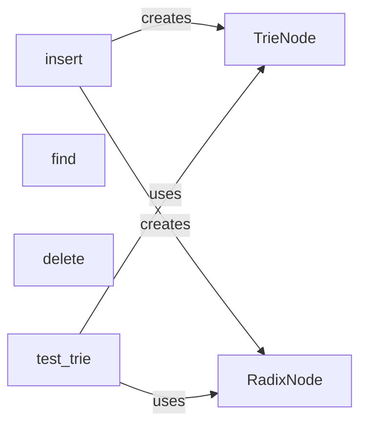

## Component Details

### TrieNode
Represents a node in the Trie data structure. Each node stores a dictionary of child nodes, where each child corresponds to a character. It also contains a boolean flag to indicate if the node marks the end of a valid word. The TrieNode facilitates efficient prefix-based searching and insertion of words.
- **Related Classes/Methods**: `repos.Python.data_structures.trie.trie`

### RadixNode
Represents a node in the Radix Tree data structure. Unlike TrieNode, RadixNode stores a prefix string, which represents a common sequence of characters shared by multiple words. It also contains a dictionary of child nodes and a boolean flag to indicate the end of a word. RadixNode optimizes space by compressing common prefixes into a single node.
- **Related Classes/Methods**: `repos.Python.data_structures.trie.radix_tree`

### insert
Inserts a word into the Trie or Radix Tree. For Trie, it iterates through the word's characters, adding new TrieNodes as needed. For Radix Tree, it handles prefix matching and node splitting to maintain the tree's structure. This function is crucial for building the Trie/Radix Tree and enabling efficient search operations.
- **Related Classes/Methods**: `repos.Python.data_structures.trie.trie`, `repos.Python.data_structures.trie.radix_tree`

### find
Searches for a word within the Trie or Radix Tree. In Trie, it traverses the tree based on the characters of the word. In Radix Tree, it uses prefix matching to efficiently locate the word. This function is fundamental for determining the presence of a word in the data structure.
- **Related Classes/Methods**: `repos.Python.data_structures.trie.trie`, `repos.Python.data_structures.trie.radix_tree`

### delete
Deletes a word from the Trie or Radix Tree. The Trie implementation uses a recursive helper function `_delete` to traverse the tree and remove nodes if they are no longer part of any other word. The Radix Tree version also handles merging nodes to maintain the tree's structure. This function ensures that the data structure remains consistent after removing words.
- **Related Classes/Methods**: `repos.Python.data_structures.trie.trie`, `repos.Python.data_structures.trie.radix_tree`

### test_trie
A test function that creates a Trie or Radix Tree, inserts a list of words, and then tests the find and delete methods. It asserts that the find method returns True for inserted words and False for non-existent words, and that the delete method correctly removes words from the tree. This function is essential for verifying the correctness of the Trie and Radix Tree implementations.
- **Related Classes/Methods**: `repos.Python.data_structures.trie.trie`, `repos.Python.data_structures.trie.radix_tree`
