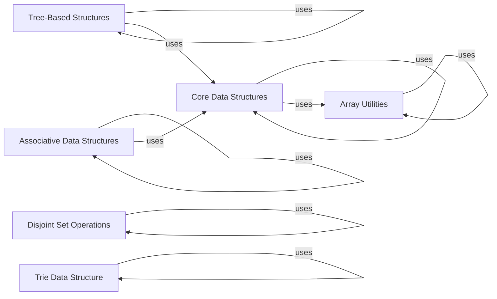

## Component Details

### Core Data Structures
This component encompasses fundamental data structures like linked lists, stacks, queues, and heaps. These structures provide the building blocks for organizing and managing data efficiently, offering various implementations and functionalities to suit different application needs. They serve as the foundation for more complex algorithms and data management strategies within the system.
- **Related Classes/Methods**: `repos.Python.data_structures.linked_list`, `repos.Python.data_structures.stacks`, `repos.Python.data_structures.queues`, `repos.Python.data_structures.heap`

### Tree-Based Structures
This component focuses on tree-based data structures, including binary trees, binary search trees, AVL trees, red-black trees, segment trees, KD Trees and Suffix Trees. These structures are designed for efficient searching, sorting, and hierarchical data representation. They provide specialized functionalities for various applications, such as spatial indexing and pattern matching.
- **Related Classes/Methods**: `repos.Python.data_structures.binary_tree`, `repos.Python.data_structures.kd_tree`, `repos.Python.data_structures.suffix_tree`

### Associative Data Structures
This component provides associative data structures, specifically focusing on hashing techniques and hash maps. These structures enable efficient storage and retrieval of data based on key-value pairs. They offer functionalities for inserting, deleting, and searching data in hash tables, making them suitable for applications requiring fast data access.
- **Related Classes/Methods**: `repos.Python.data_structures.hashing`

### Array Utilities
This component offers a collection of utility functions for performing array-related operations. It includes algorithms for searching, sorting, and manipulating arrays, providing convenient tools for common array tasks. It serves as a support library for other components that rely on array processing.
- **Related Classes/Methods**: `repos.Python.data_structures.arrays`

### Disjoint Set Operations
This component implements the disjoint set data structure, also known as the union-find data structure. It supports operations such as making a set, finding the set of an element, and uniting two sets. It serves as a tool for tracking connected components in a graph or network.
- **Related Classes/Methods**: `repos.Python.data_structures.disjoint_set`

### Trie Data Structure
This component provides implementations of the trie data structure, including standard tries and radix trees. It supports operations such as insertion, deletion, and searching for words. It serves as an efficient data structure for prefix-based string searching.
- **Related Classes/Methods**: `repos.Python.data_structures.trie`