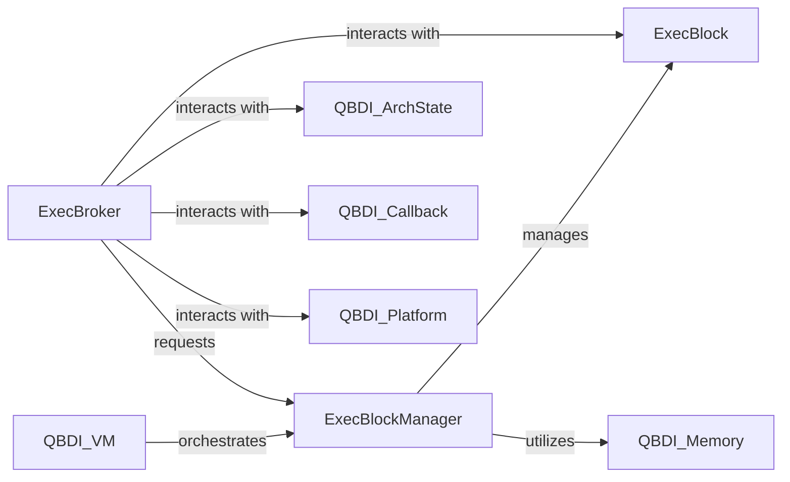

## Details

One paragraph explaining the functionality which is represented by this graph. What the main flow is and what is its purpose.

### ExecBlockManager
This component is the central orchestrator for managing `ExecBlock` instances. It is responsible for allocating, tracking, and recycling executable memory regions (execution blocks). It ensures efficient use of memory and provides mechanisms for invalidating or freeing blocks when they are no longer needed. It acts as a high-level interface for the VM to request and manage executable memory.

**Related Classes/Methods**: _None_

### ExecBlock
Represents a single, contiguous region of executable memory where instrumented code is placed. Each `ExecBlock` encapsulates the actual rewritten instructions and associated metadata. It manages the lifecycle of the code within its boundaries and might handle aspects like code generation and patching within its allocated space.

**Related Classes/Methods**: _None_

### ExecBroker
This component is responsible for handling the seamless transition of control flow between the original application's code and the instrumented code residing in `ExecBlock`s. It manages execution contexts, handles exceptions, and ensures that the DBI framework can intercept and redirect execution as needed. It acts as the bridge for entering and exiting the instrumented environment.

**Related Classes/Methods**: _None_

### [FAQ](https://github.com/CodeBoarding/GeneratedOnBoardings/tree/main?tab=readme-ov-file#faq)