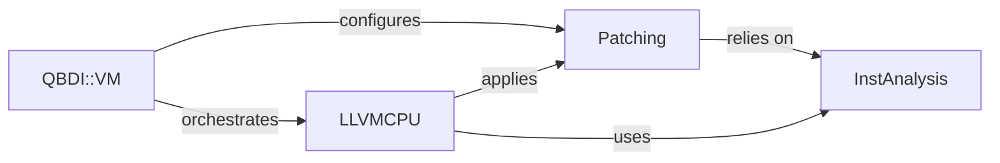

## Details

One paragraph explaining the functionality which is represented by this graph. What the main flow is and what is its purpose.

### InstAnalysis
This component is responsible for dissecting native machine instructions to extract semantic information crucial for instrumentation. It identifies instruction types, operand details, memory access patterns, and control flow characteristics. This detailed analysis informs where and how instrumentation can be effectively applied. It is fundamental because understanding the code being instrumented is essential for intelligent and targeted instrumentation; without it, instrumentation would be blind or overly broad.

**Related Classes/Methods**:

- `InstAnalysis`
- `InstAnalysis`

### LLVMCPU
This component acts as the bridge between native machine code and LLVM's Intermediate Representation (IR). It handles the "lifting" of native instructions into LLVM IR, applies various instrumentation passes (which modify or inject code into the IR), and then "lowers" the modified IR back into executable machine code for the target architecture (e.g., X86, ARM). It leverages LLVM's powerful optimization and code generation capabilities. This is the core of the code modification process, as LLVM provides a robust and architecture-agnostic framework for transforming code, critical for a cross-platform DBI.

**Related Classes/Methods**:

- `LLVMCPU`
- `LLVMCPU`

### Patching
This component manages the definition, generation, and application of instrumentation "patches." It encompasses: `InstrRule` for defining conditions that trigger instrumentation; `PatchGenerator` for creating the actual code snippets or modifications to be inserted; and `Patch` for representing a specific unit of instrumentation or a code modification. This component provides the mechanism for *what* and *how* instrumentation is applied, allowing for flexible and rule-based injection of custom logic into the target program.

**Related Classes/Methods**:

- `Patch`
- `PatchGenerator`
- `InstrRule`

### QBDI::VM
This component represents the core virtual machine that orchestrates the dynamic binary instrumentation process. It manages the execution environment, handles instruction dispatch, integrates with the instruction analysis and LLVM transformation components, and applies the defined instrumentation patches. It is the central control unit that ties all other components together to achieve the desired instrumentation goals.

**Related Classes/Methods**:

- `VM`
- `VM`

### [FAQ](https://github.com/CodeBoarding/GeneratedOnBoardings/tree/main?tab=readme-ov-file#faq)