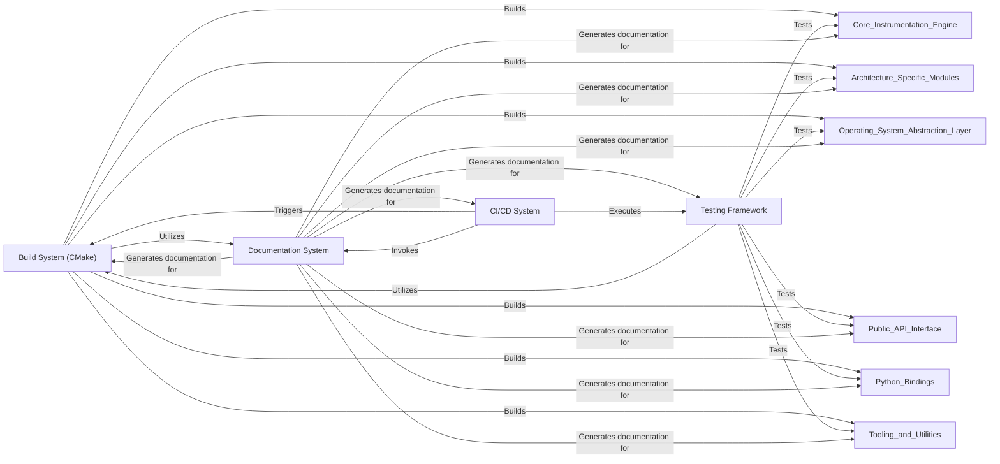

## Details

One paragraph explaining the functionality which is represented by this graph. What the main flow is and what is its purpose.

### Build System (CMake)
This component is responsible for orchestrating the compilation, linking, and packaging of the entire QBDI framework. It handles cross-platform compatibility and architecture-specific configurations, ensuring that the core engine, architecture-specific modules, and tooling are correctly assembled.

**Related Classes/Methods**:

- `CMakeLists.txt`
- `cmake/QBDIConfig.cmake`
- `cmake/QBDIDependencies.cmake`
- `cmake/QBDIOptions.cmake`
- `src/CMakeLists.txt`
- `include/CMakeLists.txt`
- `test/CMakeLists.txt`
- `examples/CMakeLists.txt`
- `tools/CMakeLists.txt`
- `package/CMakeLists.txt`

### Testing Framework
This component provides a comprehensive suite for validating the correctness and performance of the QBDI framework across various architectures (X86, X86_64, ARM, AARCH64) and operating systems. It includes unit tests for individual modules, integration tests for component interactions, and benchmarks for performance measurement.

**Related Classes/Methods**:

- `test/APITest.cpp`
- `test/VMTest.cpp`
- `test/ExecBlock/CMakeLists.txt`
- `test/Patch/CMakeLists.txt`
- `test/Benchmark/CMakeLists.txt`
- `test/TestSetup/CMakeLists.txt`
- `test/API/AARCH64/`
- `test/API/ARM/`
- `test/API/X86/`
- `test/API/X86_64/`
- `test/ExecBlock/AARCH64/`
- `test/ExecBlock/ARM/`
- `test/ExecBlock/X86/`
- `test/ExecBlock/X86_64/`
- `test/Patch/AARCH64/`
- `test/Patch/ARM/`
- `test/Patch/X86/`
- `test/Patch/X86_64/`

### Documentation System
This component is responsible for generating and maintaining user and developer documentation for QBDI. It leverages tools like Doxygen and Sphinx to create comprehensive and accessible documentation, covering the API, internal architecture, and usage examples.

**Related Classes/Methods**:

- `docs/CMakeLists.txt`
- `docs/qbdi_c.doxygen.in`
- `docs/qbdi_cpp.doxygen.in`
- `docs/qbdipreload.doxygen.in`
- <a href="https://github.com/QBDI/QBDI/blob/dev-next/docs/source/conf.py" target="_blank" rel="noopener noreferrer">`docs/source/conf.py`</a>

### CI/CD System
This component automates the build, test, and deployment processes of the QBDI framework. It ensures code quality, identifies regressions early, and facilitates continuous delivery across different operating systems and architectures.

**Related Classes/Methods**:

- `.github/workflows/linux.yml`
- `.github/workflows/windows.yml`
- `.github/workflows/osx.yml`
- `.github/workflows/python.yml`
- `.github/workflows/clang_format.yml`

### [FAQ](https://github.com/CodeBoarding/GeneratedOnBoardings/tree/main?tab=readme-ov-file#faq)