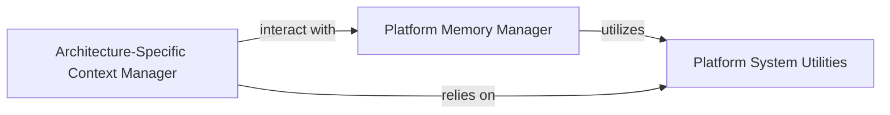

## Details

One paragraph explaining the functionality which is represented by this graph. What the main flow is and what is its purpose.

### Platform Memory Manager
This component provides a consistent interface for managing memory operations, abstracting away the complexities of OS-specific memory allocation, deallocation, protection (read, write, execute), and mapping. It ensures that QBDI can reliably allocate and manipulate memory regions for instrumentation, trampolines, and other internal data structures regardless of the underlying operating system.

**Related Classes/Methods**:

- `include/QBDI/Memory.h`
- `src/Utility/Memory.cpp`
- `src/Utility/Memory_android.cpp`
- `src/Utility/Memory_linux.cpp`
- `src/Utility/Memory_osx.cpp`
- `src/Utility/Memory_windows.cpp`

### Platform System Utilities
This component encapsulates generic, platform-dependent system functionalities that are not directly related to memory or stack management. This includes functionalities like signal handling, querying system properties (e.g., page size), and other low-level OS interactions that ensure QBDI's robust operation across different environments.

**Related Classes/Methods**:

- `src/Utility/System.h`
- `src/Utility/System_generic.cpp`
- `src/Utility/AARCH64/System_OSX.cpp`
- `src/Utility/AARCH64/System_darwin.cpp`
- `src/Utility/AARCH64/System_iOS.cpp`
- `src/Utility/ARM/System_darwin.cpp`
- `src/Utility/ARM/System_iOS.cpp`

### Architecture-Specific Context Manager
This component is responsible for managing and manipulating CPU architecture-specific states, including the representation of register sets and the mechanics of stack switching. It provides the necessary abstractions to save, restore, and modify the execution context of a thread, which is crucial for redirecting control flow during instrumentation and for handling callbacks.

**Related Classes/Methods**:

- `src/Utility/StackSwitch.cpp`
- `src/Utility/StackSwitch.h`
- `src/Patch/Register.cpp`
- `src/Patch/Register.h`
- `src/Patch/AARCH64/Register_AARCH64.cpp`
- `src/Patch/ARM/Register_ARM.cpp`
- `src/Patch/X86_64/Register_X86_64.cpp`

### [FAQ](https://github.com/CodeBoarding/GeneratedOnBoardings/tree/main?tab=readme-ov-file#faq)