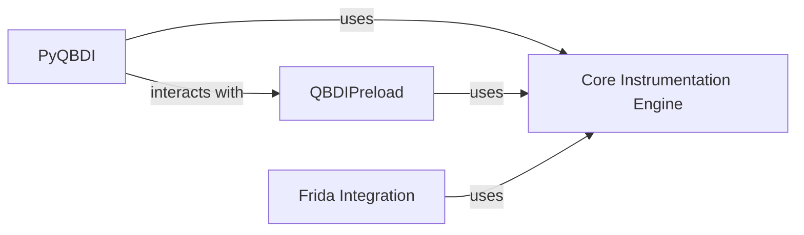

## Details

One paragraph explaining the functionality which is represented by this graph. What the main flow is and what is its purpose.

### PyQBDI
PyQBDI serves as the official Python binding for the QBDI core engine. It translates QBDI's C++ API into a Pythonic interface, allowing developers and security researchers to leverage QBDI's instruction-level instrumentation, memory analysis, and callback mechanisms directly within Python scripts. This enables rapid prototyping, scripting of complex analysis workflows, and seamless integration with the vast Python ecosystem of security tools.

**Related Classes/Methods**:

- `VM.cpp`
- `Callback.cpp`
- `InstAnalysis.cpp`
- `Memory.cpp`
- `Errors.cpp`
- `Logs.cpp`
- `Range.cpp`
- `State.cpp`
- `Options.cpp`
- `pyqbdi_module.cpp`
- <a href="https://github.com/QBDI/QBDI/blob/dev-next/tools/pyqbdi/pyqbdipreload.py" target="_blank" rel="noopener noreferrer">`pyqbdipreload.py`</a>

### QBDIPreload
QBDIPreload is a utility designed to inject the QBDI library into a target process at startup. It achieves this by leveraging dynamic library preloading mechanisms specific to different operating systems (e.g., LD_PRELOAD on Linux, DYLD_INSERT_LIBRARIES on macOS, or DLL injection on Windows). This eliminates the need to modify the target application's source code or attach a debugger, simplifying the process of instrumenting black-box binaries for dynamic analysis, fuzzing, or malware research.

**Related Classes/Methods**:

- `linux_X86_64.c`
- `osx_AARCH64.c`
- `win_preload.c`
- `QBDIPreload.h`
- `linux_AARCH64.c`
- `osx_AARCH64.c`
- `linux_ARM.c`
- `linux_X86.c`
- `osx_X86.c`
- `linux_X86_64.c`
- `osx_X86_64.c`

### Frida Integration
This component provides a JavaScript-based integration with the Frida dynamic instrumentation toolkit. It allows users to combine Frida's high-level hooking and introspection capabilities with QBDI's fine-grained, instruction-level instrumentation. This synergy enables more sophisticated and flexible dynamic analysis scenarios, leveraging the strengths of both frameworks for tasks like API monitoring, function hooking, and deep code analysis.

**Related Classes/Methods**:

- `frida-qbdi.js`

### Core Instrumentation Engine
The Core Instrumentation Engine represents the fundamental C++ functionalities of QBDI, including the Virtual Machine (QBDI::VM), callback mechanisms (QBDI::Callback), and platform-specific functionalities (QBDI::Platform). It provides the low-level instruction-level instrumentation capabilities that other components leverage.

**Related Classes/Methods**:

- `VM.cpp`
- `VM_C.cpp`
- `Engine.cpp`
- `Engine.h`
- `InstAnalysis.cpp`
- `System_generic.cpp`
- `VM.h`
- `Callback.h`
- `Platform.h`

### [FAQ](https://github.com/CodeBoarding/GeneratedOnBoardings/tree/main?tab=readme-ov-file#faq)