```mermaid
graph LR
    Virtual_Machine_VM_Core["Virtual Machine (VM) Core"]
    Instrumentation_Engine["Instrumentation Engine"]
    Execution_Manager["Execution Manager"]
    System_Abstraction_Layer["System Abstraction Layer"]
    Tooling_API_Bindings["Tooling & API Bindings"]
    Project_Infrastructure["Project Infrastructure"]
    Virtual_Machine_VM_Core -- "Orchestrates" --> Instrumentation_Engine
    Virtual_Machine_VM_Core -- "Controls" --> Execution_Manager
    Virtual_Machine_VM_Core -- "Relies on" --> System_Abstraction_Layer
    Tooling_API_Bindings -- "Consumes API from" --> Virtual_Machine_VM_Core
    Instrumentation_Engine -- "Utilizes" --> System_Abstraction_Layer
    Execution_Manager -- "Manages via" --> System_Abstraction_Layer
    System_Abstraction_Layer -- "Provides services to" --> Virtual_Machine_VM_Core
    System_Abstraction_Layer -- "Provides services to" --> Instrumentation_Engine
    System_Abstraction_Layer -- "Provides services to" --> Execution_Manager
    Project_Infrastructure -- "Supports" --> Virtual_Machine_VM_Core
    Project_Infrastructure -- "Supports" --> Instrumentation_Engine
    Project_Infrastructure -- "Supports" --> Execution_Manager
    Project_Infrastructure -- "Supports" --> System_Abstraction_Layer
    Project_Infrastructure -- "Supports" --> Tooling_API_Bindings
    click Instrumentation_Engine href "https://github.com/CodeBoarding/GeneratedOnBoardings/blob/main/QBDI/Instrumentation_Engine.md" "Details"
    click Execution_Manager href "https://github.com/CodeBoarding/GeneratedOnBoardings/blob/main/QBDI/Execution_Manager.md" "Details"
    click System_Abstraction_Layer href "https://github.com/CodeBoarding/GeneratedOnBoardings/blob/main/QBDI/System_Abstraction_Layer.md" "Details"
    click Tooling_API_Bindings href "https://github.com/CodeBoarding/GeneratedOnBoardings/blob/main/QBDI/Tooling_API_Bindings.md" "Details"
    click Project_Infrastructure href "https://github.com/CodeBoarding/GeneratedOnBoardings/blob/main/QBDI/Project_Infrastructure.md" "Details"
```

## Details

QBDI is a Dynamic Binary Instrumentation (DBI) framework designed for security research, reverse engineering, and dynamic analysis. At its core, the Virtual Machine (VM) Core orchestrates the entire instrumentation process, managing the target program's state and dispatching user-defined callbacks. It interacts with the Instrumentation Engine to dynamically analyze and transform native machine code into instrumented code, leveraging LLVM for advanced code generation. The Execution Manager handles the seamless execution of this instrumented code, managing memory blocks and controlling the program's flow. All these core functionalities rely on the System Abstraction Layer, which provides a unified interface to operating system and CPU architecture-specific services like memory management, context switching, and register state manipulation, ensuring portability. Higher-level Tooling & API Bindings (like Python bindings and preload injectors) are built on top of the VM Core's public API, extending QBDI's utility. Finally, Project Infrastructure components manage the build, testing, and documentation processes, supporting the framework's development and maintenance.

### Virtual Machine (VM) Core
The central orchestrator of QBDI. It initializes the instrumentation process, manages the target program's execution state, registers and dispatches user-defined callbacks, and coordinates the dynamic re-compilation and execution of code. It serves as the primary API interface for users.

**Related Classes/Methods**:

- `VM.cpp`
- `Engine.cpp`
- `VM.h`
- `VM_C.h`

### Instrumentation Engine [[Expand]](./Instrumentation_Engine.md)
Responsible for the core logic of analyzing, transforming, and generating instrumented code. It leverages LLVM for lifting native instructions to IR, applying instrumentation passes, and lowering the IR back to machine code. It also provides detailed instruction analysis.

**Related Classes/Methods**:

- `Patch.cpp`
- `PatchGenerator.cpp`
- `InstrRule.cpp`
- `LLVMCPU.cpp`
- `LLVMCPU.h`
- `InstAnalysis.cpp`
- `InstAnalysis.h`

### Execution Manager [[Expand]](./Execution_Manager.md)
Manages the dynamic execution environment, including the allocation and management of executable memory regions (execution blocks) where instrumented code resides. It also handles the seamless transition of control flow between the original application and the instrumented code, managing execution contexts and exceptions.

**Related Classes/Methods**:

- `ExecBlockManager.cpp`
- `ExecBlockManager.h`
- `ExecBlock.cpp`
- `ExecBlock.h`
- `ExecBroker.cpp`
- `ExecBroker.h`

### System Abstraction Layer [[Expand]](./System_Abstraction_Layer.md)
Provides a unified, platform-agnostic interface for interacting with underlying operating system functionalities (e.g., memory allocation, protection, thread context manipulation, signal handling) and CPU architecture-specific details (e.g., register state representation, stack switching).

**Related Classes/Methods**:

- `Memory.cpp`
- `Memory.h`
- `Memory_android.cpp`
- `Memory_linux.cpp`
- `Memory_osx.cpp`
- `Memory_windows.cpp`
- `System.h`
- `System_generic.cpp`
- `StackSwitch.cpp`
- `Callback.h`
- `Register.cpp`
- `Register.h`

### Tooling & API Bindings [[Expand]](./Tooling_API_Bindings.md)
A collection of higher-level tools and language bindings that extend QBDI's functionality and make it accessible to different user groups and environments. This includes Python bindings (PyQBDI), a preload injector for easy library injection, and integration with frameworks like Frida.

**Related Classes/Methods**:

- `frida-qbdi.js`

### Project Infrastructure [[Expand]](./Project_Infrastructure.md)
Encompasses the essential supporting systems for the development, testing, and documentation of the QBDI framework. This includes the build system (CMake), the comprehensive testing framework, and the documentation generation system.

**Related Classes/Methods**:

- `CMakeLists.txt`

### [FAQ](https://github.com/CodeBoarding/GeneratedOnBoardings/tree/main?tab=readme-ov-file#faq)