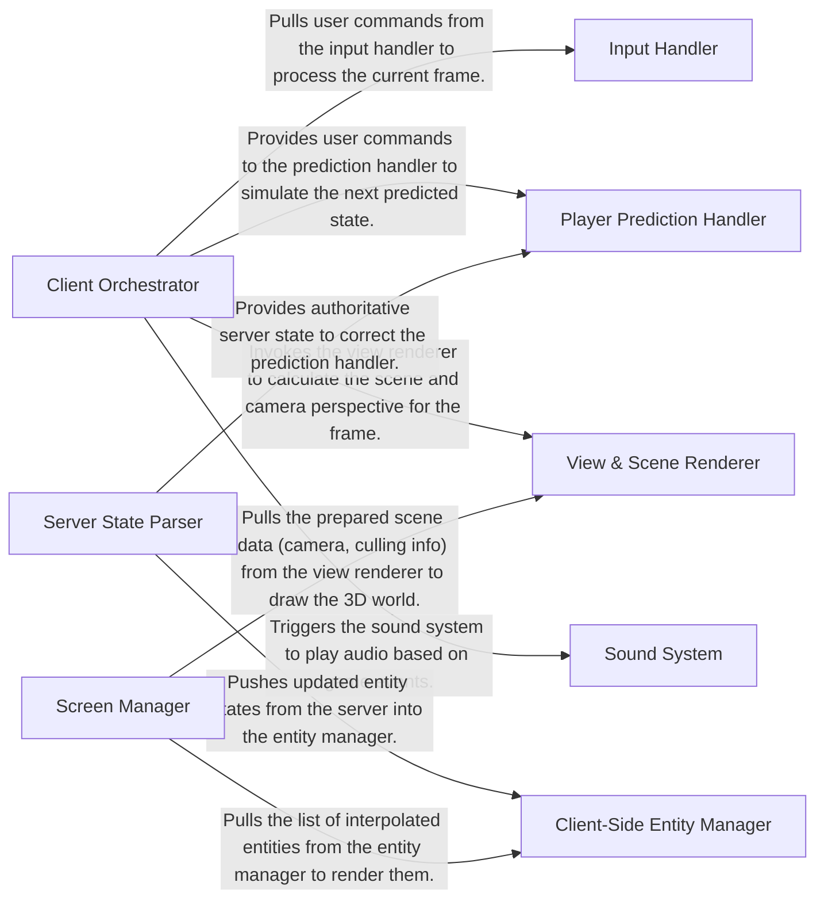

## Details

One paragraph explaining the functionality which is represented by this graph. What the main flow is and what is its purpose.

### Client Orchestrator
The central hub of the client. It initializes all client systems, runs the main frame loop, and coordinates the flow of data between input, prediction, and rendering components.

**Related Classes/Methods**:

- `cl_main.c`

### Input Handler
Manages all raw input from the keyboard, mouse, and joystick. It translates these hardware events into game-specific commands (e.g., `+forward`, `+attack`) for the orchestrator.

**Related Classes/Methods**:

- `cl_input.c`

### Server State Parser
Decodes and interprets all messages sent from the server. It is responsible for updating the client's view of the game world, including entity states, game events, and player scores.

**Related Classes/Methods**:

- `cl_parse.c`

### Client-Side Entity Manager
Manages the local representation of all game entities (players, items, projectiles). It performs interpolation to smooth entity movement between infrequent server updates.

**Related Classes/Methods**:

- `cl_ents.c`

### Player Prediction Handler
Reduces input latency by predicting the local player's movement on the client side without waiting for server confirmation. This provides immediate visual feedback to the player.

**Related Classes/Methods**:

- `cl_pred.c`

### View & Scene Renderer
Calculates the camera's position and orientation based on the player's state. It prepares the 3D scene for rendering by performing culling and setting up the view matrices.

**Related Classes/Methods**:

- `cl_view.c`

### Screen Manager
The final presentation layer. It orchestrates the drawing of all visual elements, including the 3D world, the 2D HUD, menus, and the console, calling the low-level renderer to execute the draw calls.

**Related Classes/Methods**:

- `cl_scrn.c`

### Sound System
Manages all audio playback. This includes loading sound assets, mixing multiple sound sources, and interacting with the platform's audio hardware to produce the final audio output.

**Related Classes/Methods**:

- `snd_dma.c`
- `snd_mix.c`

### [FAQ](https://github.com/CodeBoarding/GeneratedOnBoardings/tree/main?tab=readme-ov-file#faq)