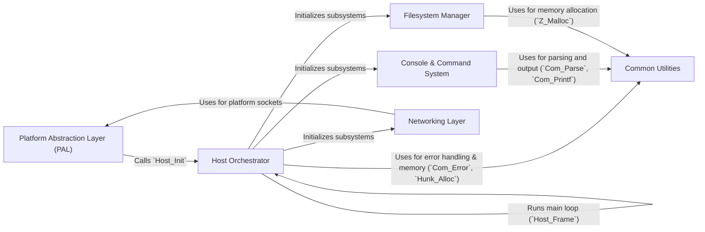

## Details

One paragraph explaining the functionality which is represented by this graph. What the main flow is and what is its purpose.

### Platform Abstraction Layer (PAL)
The lowest-level component that serves as the entry point and isolates the engine from the underlying operating system. It handles window creation, system-level input, and the main message loop.

**Related Classes/Methods**:

- `WinMain`
- `Sys_Init`
- `Sys_Error`

### Host Orchestrator
The heart of the engine, responsible for initializing all major subsystems and running the main game loop. It manages the overall application state and timing, acting as the central coordinator.

**Related Classes/Methods**:

- `Host_Init`
- `Host_Frame`
- `Host_Shutdown`

### Common Utilities
A foundational library providing shared data structures, memory management, and core routines used by all other engine components. It includes Zone and Hunk allocators for memory, as well as parsing and formatted printing functions.

**Related Classes/Methods**:

- `Com_Printf`
- `Com_Error`
- `Com_Parse`
- `Z_Malloc`
- `Hunk_Alloc`

### Filesystem Manager
Manages all file I/O through a virtual filesystem. It abstracts file access and handles the "searchpath" system, which is critical for loading game assets, mods, and platform-specific libraries.

**Related Classes/Methods**:

- `FS_Init`
- `FS_ReadFile`
- `FS_AddGameDirectory`

### Console & Command System
Implements the in-game console, a powerful interface for developers and players. It manages console variables (`cvars`) and executes commands that control engine and game behavior.

**Related Classes/Methods**:

- `Cmd_ExecuteString`
- `Cvar_Get`

### Networking Layer
Provides the core client-server communication primitives. It abstracts platform-specific networking APIs (e.g., Winsock) and manages message sequencing and delivery for game state synchronization.

**Related Classes/Methods**:

- `NET_Init`
- `NET_SendMessage`

### [FAQ](https://github.com/CodeBoarding/GeneratedOnBoardings/tree/main?tab=readme-ov-file#faq)