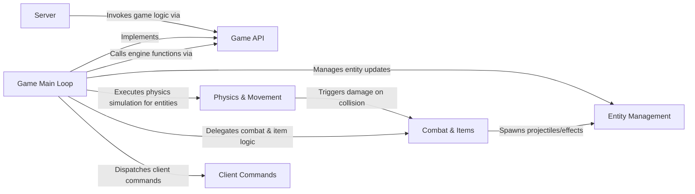

## Details

One paragraph explaining the functionality which is represented by this graph. What the main flow is and what is its purpose.

### Server
The main engine's Server component that loads and interacts with the Game Logic module.

**Related Classes/Methods**:

- `sv_game.c`

### Game Main Loop
The central entry point and orchestrator for the game logic module. It contains the `G_RunFrame` function, which is called by the server for every frame of the simulation. It manages the game state and delegates tasks to other components.

**Related Classes/Methods**:

- `g_main.c`

### Entity Management
Responsible for the lifecycle of all game entities. This includes spawning new entities (players, monsters, items) based on the map and game state, as well as freeing them when they are no longer needed.

**Related Classes/Methods**:

- `g_spawn.c`
- `g_utils.c`

### Physics & Movement
Manages all physical simulations within the game world. It handles entity movement, collision detection between entities and the world, gravity, and the effects of environmental hazards like lava or slime.

**Related Classes/Methods**:

- `g_phys.c`

### Combat & Items
Implements the rules for all combat interactions and item behaviors. This includes weapon firing mechanics, damage calculation, health and armor systems, and the logic for power-ups and inventory items.

**Related Classes/Methods**:

- `g_combat.c`
- `g_weapon.c`
- `g_items.c`

### Client Commands
Processes and executes game-specific commands sent from the client. This includes player actions like using items, changing weapons, or activating objectives, which are then validated and run on the server.

**Related Classes/Methods**:

- `g_cmds.c`

### Game API
Defines the bidirectional contract between the game logic module and the main engine. It consists of functions exported by the game logic (`game_export_t`) for the server to call (e.g., `G_RunFrame`), and a table of functions imported from the engine (`game_import_t`) that the game logic uses to call back into the engine for services like console commands or filesystem access.

**Related Classes/Methods**:

- `g_public.h`

### [FAQ](https://github.com/CodeBoarding/GeneratedOnBoardings/tree/main?tab=readme-ov-file#faq)