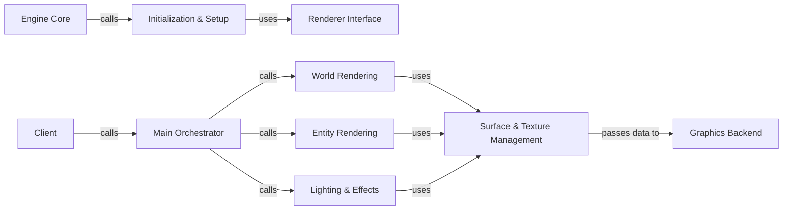

## Details

One paragraph explaining the functionality which is represented by this graph. What the main flow is and what is its purpose.

### Renderer Interface
Defines the public API for the rendering subsystem. It's the abstraction layer that decouples the engine from specific rendering backends.

**Related Classes/Methods**:

- `ref.h`

### Main Orchestrator
The central entry point for rendering a frame (`R_RenderFrame`). It coordinates the different rendering passes and calls other internal components in sequence.

**Related Classes/Methods**:

- `r_main.c`

### Initialization & Setup
Manages the lifecycle of the renderer, including initializing the graphics context (e.g., OpenGL window), loading resources, and shutting down cleanly.

**Related Classes/Methods**:

- `r_init.c`

### World Rendering
Responsible for processing and rendering the static game world geometry, which is typically stored in a Binary Space Partitioning (BSP) tree.

**Related Classes/Methods**:

- `r_world.c`
- `r_bsp.c`

### Entity Rendering
Handles the drawing of dynamic objects within the game world, such as players, monsters, and items. This includes animated models.

**Related Classes/Methods**:

- `r_entity.c`
- `r_alias.c`

### Surface & Texture Management
Manages the drawing of individual surfaces (polygons) and the application of textures. It processes images and prepares them for the backend.

**Related Classes/Methods**:

- `r_surf.c`
- `r_image.c`

### Lighting & Effects
Calculates dynamic lighting, shadows, and other visual effects (e.g., particle effects) that contribute to the final scene's appearance.

**Related Classes/Methods**:

- `r_light.c`
- `r_part.c`

### Graphics Backend
The concrete implementation that translates high-level rendering commands into low-level graphics API calls (e.g., OpenGL). The engine can load different backends.

**Related Classes/Methods**:

- `ref_gl/`
- `ref_soft/`

### Client [[Expand]](./Client.md)
The client of the renderer subsystem. It initiates the frame rendering process by calling the public rendering API.

**Related Classes/Methods**:

- `cl_scrn.c`
- `cl_view.c`

### Engine Core [[Expand]](./Engine_Core.md)
The engine core, responsible for initializing the renderer subsystem at startup.

**Related Classes/Methods**:

- `cl_main.c`

### [FAQ](https://github.com/CodeBoarding/GeneratedOnBoardings/tree/main?tab=readme-ov-file#faq)