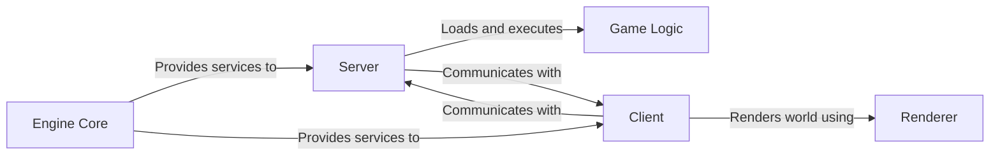

## Details

One paragraph explaining the functionality which is represented by this graph. What the main flow is and what is its purpose.

### Engine Core [[Expand]](./Engine_Core.md)
A foundational layer that combines platform-specific code (`System`) and shared utilities (`Common`). It provides core services like memory management, file I/O, and networking to all other components.

**Related Classes/Methods**:

- `qcommon.h`
- `sys_main.c`

### Server
The authoritative component that manages the entire game state and simulation. It processes client commands, runs the game logic, and broadcasts the world state back to the clients.

**Related Classes/Methods**:

- `sv_main.c`
- `sv_game.c`

### Game Logic [[Expand]](./Game_Logic.md)
A self-contained, swappable module that defines the actual rules of the game. It is responsible for entity management, physics, and game-specific rules (e.g., scoring, win conditions). It is loaded by the Server.

**Related Classes/Methods**:

- `g_main.c`
- `g_public.h`

### Client [[Expand]](./Client.md)
The player-facing component responsible for predicting player movement, handling user input, and managing the local game state. It communicates with the server to receive updates and sends user commands.

**Related Classes/Methods**:

- `cl_main.c`
- `cl_input.c`

### Renderer [[Expand]](./Renderer.md)
An abstracted and modular graphics backend responsible for all visual output. It is called by the Client to draw the 3D world, user interface, and other visual elements.

**Related Classes/Methods**:

- `ref.h`
- `r_main.c`

### [FAQ](https://github.com/CodeBoarding/GeneratedOnBoardings/tree/main?tab=readme-ov-file#faq)