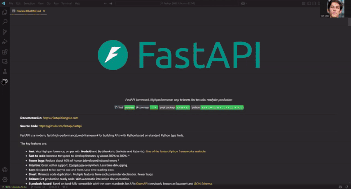

# Generated Diagrams for python projects

  
  
  **All diagrams in this repository are generated with [CodeBoarding](https://github.com/CodeBoarding/CodeBoarding) — our open-source tool for creating interactive visual documentation.**
  
  

---

These onboarding diagrams were automatically generated using [CodeBoarding.org](https://codeboarding.org) — a tool that helps developers explore unfamiliar codebases through interactive and visual documentation.

We've generated documentation for over 800+ Python projects to help developers understand and contribute to open-source projects more efficiently.

Got feedback? We'd love to hear it! Open an issue or drop us an email at [codeboarding@gmail.com](mailto:codeboarding@gmail.com) to help us improve.

Interested in onboarding diagrams for your own project? You can run locally [CodeBoarding](https://github.com/CodeBoarding/CodeBoarding) or try our online demo: [CodeBoarding.org/demo](https://codeboarding.org/demo)!

## 🚀 CodeBoarding Apps

Supercharge your development workflow with CodeBoarding's integrations:

- 🧩 [**VSCode Extension**](https://marketplace.visualstudio.com/items?itemName=Codeboarding.codeboarding) – Instantly visualize and explore your codebase without leaving VSCode.

- 🔄 [**GitHub Action**](https://github.com/marketplace/actions/codeboarding-diagram-first-documentation) – Keep your documentation in sync with every commit, effortlessly.

---

### 🎥 See It in Action

Here’s how the VSCode Extension looks in action:

## Generated Project Documentation

<table>
<tr>
<td>📚 <a href="30-Days-Of-Python/on_boarding.md">30-Days-Of-Python</a></td>
<td>⚡️ <a href="gpf_flash/on_boarding.md">gpf_flash</a></td>
<td>📊 <a href="pyreadstat/on_boarding.md">pyreadstat</a></td>
</tr>
<tr>
<td>🔧 <a href="abu/on_boarding.md">abu</a></td>
<td>📂 <a href="gpf_old/on_boarding.md">gpf_old</a></td>
<td>🔬 <a href="pysam/on_boarding.md">pysam</a></td>
</tr>
<tr>
<td>🔑 <a href="academic-keyword-occurrence/on_boarding.md">academic-keyword-occurrence</a></td>
<td>📦 <a href="gpf_small/on_boarding.md">gpf_small</a></td>
<td>🔌 <a href="pyserial/on_boarding.md">pyserial</a></td>
</tr>
<tr>
<td>🌊 <a href="AdalFlow/on_boarding.md">AdalFlow</a></td>
<td>💻 <a href="gpfjs/on_boarding.md">gpfjs</a></td>
<td>🎨 <a href="PySimpleGUI/on_boarding.md">PySimpleGUI</a></td>
</tr>
<tr>
<td>🎨 <a href="aestetik/on_boarding.md">aestetik</a></td>
<td>🤖 <a href="gpt_engineer/on_boarding.md">gpt_engineer</a></td>
<td>✅ <a href="pytest/on_boarding.md">pytest</a></td>
</tr>
<tr>
<td>🧪 <a href="AfterQC/on_boarding.md">AfterQC</a></td>
<td>🤖 <a href="gpt-engineer/on_boarding.md">gpt-engineer</a></td>
<td>🐍 <a href="Python/on_boarding.md">Python</a></td>
</tr>
<tr>
<td>🧬 <a href="agno/on_boarding.md">agno</a></td>
<td>🔍 <a href="gpt-researcher/on_boarding.md">gpt-researcher</a></td>
<td>📝 <a href="python_code_generator/on_boarding.md">python_code_generator</a></td>
</tr>
<tr>
<td>💡 <a href="aideml/on_boarding.md">aideml</a></td>
<td>🖼️ <a href="gradio/on_boarding.md">gradio</a></td>
<td>🧪 <a href="python_testbench/on_boarding.md">python_testbench</a></td>
</tr>
<tr>
<td>💨 <a href="airflow/on_boarding.md">airflow</a></td>
<td>🕸️ <a href="graphrag/on_boarding.md">graphrag</a></td>
<td>🔗 <a href="python-asana/on_boarding.md">python-asana</a></td>
</tr>
<tr>
<td>⚗️ <a href="aizynthfinder/on_boarding.md">aizynthfinder</a></td>
<td>📈 <a href="gReLU/on_boarding.md">gReLU</a></td>
<td>🔌 <a href="python-connector-api/on_boarding.md">python-connector-api</a></td>
</tr>
<tr>
<td>💹 <a href="akshare/on_boarding.md">akshare</a></td>
<td>🗺️ <a href="gydnc/on_boarding.md">gydnc</a></td>
<td>💧 <a href="python-digitalocean/on_boarding.md">python-digitalocean</a></td>
</tr>
<tr>
<td>🖼️ <a href="albumentations/on_boarding.md">albumentations</a></td>
<td>🌐 <a href="h3-py/on_boarding.md">h3-py</a></td>
<td>🚗 <a href="python-driver/on_boarding.md">python-driver</a></td>
</tr>
<tr>
<td>🧮 <a href="algo/on_boarding.md">algo</a></td>
<td>⏱️ <a href="h5bench/on_boarding.md">h5bench</a></td>
<td>📘 <a href="python-facebook/on_boarding.md">python-facebook</a></td>
</tr>
<tr>
<td>📚 <a href="algorithms/on_boarding.md">algorithms</a></td>
<td>🌾 <a href="haystack/on_boarding.md">haystack</a></td>
<td>🔥 <a href="python-fire/on_boarding.md">python-fire</a></td>
</tr>
<tr>
<td>👧 <a href="AliceLG/on_boarding.md">AliceLG</a></td>
<td>👋 <a href="Hello-Python/on_boarding.md">Hello-Python</a></td>
<td>🦊 <a href="python-gitlab/on_boarding.md">python-gitlab</a></td>
</tr>
<tr>
<td>👽 <a href="Alien/on_boarding.md">Alien</a></td>
<td>⚕️ <a href="HLAIIPred/on_boarding.md">HLAIIPred</a></td>
<td>📖 <a href="python-guide/on_boarding.md">python-guide</a></td>
</tr>
<tr>
<td>🧠 <a href="AllenSDK/on_boarding.md">AllenSDK</a></td>
<td>🎩 <a href="honcho/on_boarding.md">honcho</a></td>
<td>☁️ <a href="python-linode-api/on_boarding.md">python-linode-api</a></td>
</tr>
<tr>
<td>🧬 <a href="alphafold/on_boarding.md">alphafold</a></td>
<td>🔑 <a href="hpn-ssh/on_boarding.md">hpn-ssh</a></td>
<td>🏆 <a href="python-mastery/on_boarding.md">python-mastery</a></td>
</tr>
<tr>
<td>🧬 <a href="alphagenome/on_boarding.md">alphagenome</a></td>
<td>🧑‍💼 <a href="hrms/on_boarding.md">hrms</a></td>
<td>🏗️ <a href="python-mini-projects/on_boarding.md">python-mini-projects</a></td>
</tr>
<tr>
<td>🖼️ <a href="amazing-qr/on_boarding.md">amazing-qr</a></td>
<td>🤖 <a href="hummingbot/on_boarding.md">hummingbot</a></td>
<td>🧭 <a href="python-nomad/on_boarding.md">python-nomad</a></td>
</tr>
<tr>
<td>🧡 <a href="AmberLG/on_boarding.md">AmberLG</a></td>
<td>🔬 <a href="hypothesis-torch/on_boarding.md">hypothesis-torch</a></td>
<td>🔧 <a href="python-oracledb/on_boarding.md">python-oracledb</a></td>
</tr>
<tr>
<td>📊 <a href="analytics-python/on_boarding.md">analytics-python</a></td>
<td>📄 <a href="ijson/on_boarding.md">ijson</a></td>
<td>📦 <a href="python-sdk-core/on_boarding.md">python-sdk-core</a></td>
</tr>
<tr>
<td>🅰️ <a href="angular/on_boarding.md">angular</a></td>
<td>💡 <a href="insights-core/on_boarding.md">insights-core</a></td>
<td>💬 <a href="python-slack-sdk/on_boarding.md">python-slack-sdk</a></td>
</tr>
<tr>
<td>📈 <a href="anndata/on_boarding.md">anndata</a></td>
<td>🔬 <a href="insitro-research/on_boarding.md">insitro-research</a></td>
<td>📝 <a href="python-template-repository/on_boarding.md">python-template-repository</a></td>
</tr>
<tr>
<td>🧬 <a href="annofilter-junctions/on_boarding.md">annofilter-junctions</a></td>
<td>🔍 <a href="inspect_ai/on_boarding.md">inspect_ai</a></td>
<td>🐦 <a href="python-twitch-client/on_boarding.md">python-twitch-client</a></td>
</tr>
<tr>
<td>⚙️ <a href="ansible/on_boarding.md">ansible</a></td>
<td>👨‍🏫 <a href="instructor/on_boarding.md">instructor</a></td>
<td>📅 <a href="python-weekly/on_boarding.md">python-weekly</a></td>
</tr>
<tr>
<td>🐜 <a href="ant-design/on_boarding.md">ant-design</a></td>
<td>🔒 <a href="invariant/on_boarding.md">invariant</a></td>
<td>🔥 <a href="pytorch/on_boarding.md">pytorch</a></td>
</tr>
<tr>
<td>📱 <a href="appium/on_boarding.md">appium</a></td>
<td>🚪 <a href="invariant-gateway/on_boarding.md">invariant-gateway</a></td>
<td>📐 <a href="pytorch_geometric/on_boarding.md">pytorch_geometric</a></td>
</tr>
<tr>
<td>🛠️ <a href="appsmith/on_boarding.md">appsmith</a></td>
<td>📦 <a href="invariant-sdk/on_boarding.md">invariant-sdk</a></td>
<td>⚡️ <a href="pytorch-lightning/on_boarding.md">pytorch-lightning</a></td>
</tr>
<tr>
<td>👾 <a href="arcade-ai/on_boarding.md">arcade-ai</a></td>
<td>🐍 <a href="ipython/on_boarding.md">ipython</a></td>
<td>📖 <a href="pytorch-tutorial/on_boarding.md">pytorch-tutorial</a></td>
</tr>
<tr>
<td>💻 <a href="archinstall/on_boarding.md">archinstall</a></td>
<td>🌺 <a href="iris/on_boarding.md">iris</a></td>
<td>📦 <a href="pytorch3d/on_boarding.md">pytorch3d</a></td>
</tr>
<tr>
<td>🏛️ <a href="Archon/on_boarding.md">Archon</a></td>
<td>🎬 <a href="jellyfin/on_boarding.md">jellyfin</a></td>
<td>🤝 <a href="pyunity/on_boarding.md">pyunity</a></td>
</tr>
<tr>
<td>📁 <a href="assets/on_boarding.md">assets</a></td>
<td>📝 <a href="jira/on_boarding.md">jira</a></td>
<td>🔥 <a href="QBDI/on_boarding.md">QBDI</a></td>
</tr>
<tr>
<td>⚡️ <a href="async_rlhf/on_boarding.md">async_rlhf</a></td>
<td>💼 <a href="jovvix/on_boarding.md">jovvix</a></td>
<td>🕹️ <a href="Quake-2/on_boarding.md">Quake-2</a></td>
</tr>
<tr>
<td>🔗 <a href="atlassian-connect-example-app-node/on_boarding.md">atlassian-connect-example-app-node</a></td>
<td> hubs <a href="jump_hub/on_boarding.md">jump_hub</a></td>
<td>🗒️ <a href="quick-notes-extension/on_boarding.md">quick-notes-extension</a></td>
</tr>
<tr>
<td>🐍 <a href="atlassian-python-api/on_boarding.md">atlassian-python-api</a></td>
<td>🦘 <a href="jumpserver/on_boarding.md">jumpserver</a></td>
<td>🤖 <a href="RagaAI-Catalyst/on_boarding.md">RagaAI-Catalyst</a></td>
</tr>
<tr>
<td>🔮 <a href="augur/on_boarding.md">augur</a></td>
<td>📓 <a href="jupyterlab/on_boarding.md">jupyterlab</a></td>
<td>🧩 <a href="ragbits/on_boarding.md">ragbits</a></td>
</tr>
<tr>
<td>🤖 <a href="autogen/on_boarding.md">autogen</a></td>
<td>🐾 <a href="kalico/on_boarding.md">kalico</a></td>
<td>🚂 <a href="railroadtracks/on_boarding.md">railroadtracks</a></td>
</tr>
<tr>
<td>🚗 <a href="AutoGPT/on_boarding.md">AutoGPT</a></td>
<td>🔬 <a href="KAZU/on_boarding.md">KAZU</a></td>
<td>⚗️ <a href="rdkit/on_boarding.md">rdkit</a></td>
</tr>
<tr>
<td>🌟 <a href="awesome-llm-apps/on_boarding.md">awesome-llm-apps</a></td>
<td>🧬 <a href="kipoiseq/on_boarding.md">kipoiseq</a></td>
<td>⚛️ <a href="react/on_boarding.md">react</a></td>
</tr>
<tr>
<td>😎 <a href="awesome-python/on_boarding.md">awesome-python</a></td>
<td>🥝 <a href="kivy/on_boarding.md">kivy</a></td>
<td>📄 <a href="README.md/on_boarding.md">README.md</a></td>
</tr>
<tr>
<td>💹 <a href="backtrader/on_boarding.md">backtrader</a></td>
<td>🏷️ <a href="labelme/on_boarding.md">labelme</a></td>
<td>🖼️ <a href="Real-ESRGAN/on_boarding.md">Real-ESRGAN</a></td>
</tr>
<tr>
<td>🥯 <a href="bagel-cli/on_boarding.md">bagel-cli</a></td>
<td>🔗 <a href="langchain/on_boarding.md">langchain</a></td>
<td>🗣️ <a href="Real-Time-Voice-Cloning/on_boarding.md">Real-Time-Voice-Cloning</a></td>
</tr>
<tr>
<td>🚨 <a href="bandit/on_boarding.md">bandit</a></td>
<td>🌊 <a href="langflow/on_boarding.md">langflow</a></td>
<td>❤️ <a href="redbeat/on_boarding.md">redbeat</a></td>
</tr>
<tr>
<td>🔬 <a href="baxbench/on_boarding.md">baxbench</a></td>
<td>🕸️ <a href="langgraph/on_boarding.md">langgraph</a></td>
<td>🔻 <a href="redis-py/on_boarding.md">redis-py</a></td>
</tr>
<tr>
<td>🔬 <a href="BayerCLAW/on_boarding.md">BayerCLAW</a></td>
<td>✍️ <a href="LaTeX-OCR/on_boarding.md">LaTeX-OCR</a></td>
<td>💾 <a href="redis-vl-python/on_boarding.md">redis-vl-python</a></td>
</tr>
<tr>
<td>📚 <a href="BayesERbook/on_boarding.md">BayesERbook</a></td>
<td>📢 <a href="laudspeaker/on_boarding.md">laudspeaker</a></td>
<td>🔄 <a href="redun/on_boarding.md">redun</a></td>
</tr>
<tr>
<td>🧬 <a href="BeadArrayFiles/on_boarding.md">BeadArrayFiles</a></td>
<td>🍃 <a href="lea/on_boarding.md">lea</a></td>
<td>✨ <a href="reflex/on_boarding.md">reflex</a></td>
</tr>
<tr>
<td>🎭 <a href="behave/on_boarding.md">behave</a></td>
<td>🎓 <a href="learn-python/on_boarding.md">learn-python</a></td>
<td>🖼️ <a href="rembg/on_boarding.md">rembg</a></td>
</tr>
<tr>
<td>🍩 <a href="beignet/on_boarding.md">beignet</a></td>
<td>📓 <a href="Learning-Journal/on_boarding.md">Learning-Journal</a></td>
<td>🙏 <a href="requests/on_boarding.md">requests</a></td>
</tr>
<tr>
<td>📝 <a href="BERTopic/on_boarding.md">BERTopic</a></td>
<td>🍋 <a href="lemur/on_boarding.md">lemur</a></td>
<td>✅ <a href="rexmex/on_boarding.md">rexmex</a></td>
</tr>
<tr>
<td>🔗 <a href="besu/on_boarding.md">besu</a></td>
<td>⚡️ <a href="lightning/on_boarding.md">lightning</a></td>
<td>📻 <a href="rf-detr/on_boarding.md">rf-detr</a></td>
</tr>
<tr>
<td>📊 <a href="BIC-megaplots/on_boarding.md">BIC-megaplots</a></td>
<td>📋 <a href="LISTT/on_boarding.md">LISTT</a></td>
<td>🎨 <a href="rich/on_boarding.md">rich</a></td>
</tr>
<tr>
<td>📂 <a href="bigwig-loader/on_boarding.md">bigwig-loader</a></td>
<td>💡 <a href="litellm/on_boarding.md">litellm</a></td>
<td>🚲 <a href="RIDE/on_boarding.md">RIDE</a></td>
</tr>
<tr>
<td>🧬 <a href="bioblend/on_boarding.md">bioblend</a></td>
<td>📹 <a href="livekit/on_boarding.md">livekit</a></td>
<td>🎮 <a href="Riot-Watcher/on_boarding.md">Riot-Watcher</a></td>
</tr>
<tr>
<td>🌱 <a href="BioPhi/on_boarding.md">BioPhi</a></td>
<td>🦙 <a href="llama/on_boarding.md">llama</a></td>
<td>🤖 <a href="robotframework/on_boarding.md">robotframework</a></td>
</tr>
<tr>
<td>🐍 <a href="biopython/on_boarding.md">biopython</a></td>
<td>🕸️ <a href="llm-graph-builder/on_boarding.md">llm-graph-builder</a></td>
<td>🛡️ <a href="safety/on_boarding.md">safety</a></td>
</tr>
<tr>
<td>🖤 <a href="Black/on_boarding.md">Black</a></td>
<td>🗣️ <a href="lmql/on_boarding.md">lmql</a></td>
<td>⛵ <a href="saga/on_boarding.md">saga</a></td>
</tr>
<tr>
<td>🔩 <a href="boltz/on_boarding.md">boltz</a></td>
<td>☁️ <a href="localstack/on_boarding.md">localstack</a></td>
<td>🛒 <a href="saleor/on_boarding.md">saleor</a></td>
</tr>
<tr>
<td>🐛 <a href="BookWorm/on_boarding.md">BookWorm</a></td>
<td>🦗 <a href="locust/on_boarding.md">locust</a></td>
<td>💬 <a href="sample-app-aoai-chatGPT/on_boarding.md">sample-app-aoai-chatGPT</a></td>
</tr>
<tr>
<td>🤖 <a href="boto3/on_boarding.md">boto3</a></td>
<td>🪵 <a href="loguru/on_boarding.md">loguru</a></td>
<td>💨 <a href="sanic/on_boarding.md">sanic</a></td>
</tr>
<tr>
<td>🌐 <a href="browser-use/on_boarding.md">browser-use</a></td>
<td>🔬 <a href="lyse/on_boarding.md">lyse</a></td>
<td>🧠 <a href="Sapiens/on_boarding.md">Sapiens</a></td>
</tr>
<tr>
<td>📈 <a href="bt/on_boarding.md">bt</a></td>
<td>🤖 <a href="MaiBot/on_boarding.md">MaiBot</a></td>
<td>🧬 <a href="scanpy/on_boarding.md">scanpy</a></td>
</tr>
<tr>
<td>⚫ <a href="carbon/on_boarding.md">carbon</a></td>
<td>🎬 <a href="manim/on_boarding.md">manim</a></td>
<td>📡 <a href="scapy/on_boarding.md">scapy</a></td>
</tr>
<tr>
<td> celery <a href="celery/on_boarding.md">celery</a></td>
<td>📝 <a href="markitdown/on_boarding.md">markitdown</a></td>
<td>🧬 <a href="scikit-bio/on_boarding.md">scikit-bio</a></td>
</tr>
<tr>
<td>⛓️ <a href="chainguard/on_boarding.md">chainguard</a></td>
<td>🧮 <a href="matharena/on_boarding.md">matharena</a></td>
<td>🖼️ <a href="scikit-image/on_boarding.md">scikit-image</a></td>
</tr>
<tr>
<td>💬 <a href="ChatterBot/on_boarding.md">ChatterBot</a></td>
<td>📊 <a href="matplotlib/on_boarding.md">matplotlib</a></td>
<td>🤖 <a href="scikit-learn/on_boarding.md">scikit-learn</a></td>
</tr>
<tr>
<td>🗣️ <a href="chatterbox/on_boarding.md">chatterbox</a></td>
<td>🤖 <a href="mcp-agent/on_boarding.md">mcp-agent</a></td>
<td>🔬 <a href="scimilarity/on_boarding.md">scimilarity</a></td>
</tr>
<tr>
<td>🔊 <a href="ChatTTS/on_boarding.md">ChatTTS</a></td>
<td>💬 <a href="mcp-agent-discussion/on_boarding.md">mcp-agent-discussion</a></td>
<td>🧪 <a href="scipy/on_boarding.md">scipy</a></td>
</tr>
<tr>
<td>📧 <a href="check-if-email-exists/on_boarding.md">check-if-email-exists</a></td>
<td>🛠️ <a href="mcp-context-forge/on_boarding.md">mcp-context-forge</a></td>
<td>🧬 <a href="scirpy/on_boarding.md">scirpy</a></td>
</tr>
<tr>
<td>⚗️ <a href="ChEMBL_Structure_Pipeline/on_boarding.md">ChEMBL_Structure_Pipeline</a></td>
<td>🔍 <a href="mcp-scan/on_boarding.md">mcp-scan</a></td>
<td>🔬 <a href="scispacy/on_boarding.md">scispacy</a></td>
</tr>
<tr>
<td>🧪 <a href="chembl_webresource_client/on_boarding.md">chembl_webresource_client</a></td>
<td>🔧 <a href="mcp-use/on_boarding.md">mcp-use</a></td>
<td>🕷️ <a href="scrapy/on_boarding.md">scrapy</a></td>
</tr>
<tr>
<td>💊 <a href="chemicalx/on_boarding.md">chemicalx</a></td>
<td>🔬 <a href="MEA-NAP/on_boarding.md">MEA-NAP</a></td>
<td>💻 <a href="ScreenCoder/on_boarding.md">ScreenCoder</a></td>
</tr>
<tr>
<td>🌐 <a href="chromeless/on_boarding.md">chromeless</a></td>
<td>💊 <a href="medconb/on_boarding.md">medconb</a></td>
<td>🔬 <a href="scvi-tools/on_boarding.md">scvi-tools</a></td>
</tr>
<tr>
<td>🏛️ <a href="CleanArchitecture/on_boarding.md">CleanArchitecture</a></td>
<td>🧠 <a href="mem0/on_boarding.md">mem0</a></td>
<td>🌊 <a href="seaborn/on_boarding.md">seaborn</a></td>
</tr>
<tr>
<td>💻 <a href="cli/on_boarding.md">cli</a></td>
<td>🌊 <a href="metaflow/on_boarding.md">metaflow</a></td>
<td>📫 <a href="sendgrid-python/on_boarding.md">sendgrid-python</a></td>
</tr>
<tr>
<td>📎 <a href="clip-rt/on_boarding.md">clip-rt</a></td>
<td>🤖 <a href="MetaGPT/on_boarding.md">MetaGPT</a></td>
<td>🔒 <a href="sentry-python/on_boarding.md">sentry-python</a></td>
</tr>
<tr>
<td>☁️ <a href="cloudant-python-sdk/on_boarding.md">cloudant-python-sdk</a></td>
<td>💥 <a href="MHDDoS/on_boarding.md">MHDDoS</a></td>
<td>🧬 <a href="seqlike/on_boarding.md">seqlike</a></td>
</tr>
<tr>
<td>👾 <a href="CobaltStrikeBeaconCppSource/on_boarding.md">CobaltStrikeBeaconCppSource</a></td>
<td>🔬 <a href="micrograd/on_boarding.md">micrograd</a></td>
<td>🛒 <a href="shopify_django_app/on_boarding.md">shopify_django_app</a></td>
</tr>
<tr>
<td>🤝 <a href="cocode/on_boarding.md">cocode</a></td>
<td>🐍 <a href="microsoft-authentication-library-for-python/on_boarding.md">microsoft-authentication-library-for-python</a></td>
<td>🛍️ <a href="shopify_python/on_boarding.md">shopify_python</a></td>
</tr>
<tr>
<td>👨‍💻 <a href="CodeBoarding/on_boarding.md">CodeBoarding</a></td>
<td>⛏️ <a href="MinerU/on_boarding.md">MinerU</a></td>
<td>📦 <a href="shopify_python_api/on_boarding.md">shopify_python_api</a></td>
</tr>
<tr>
<td>🖼️ <a href="codeboarding_logo.png/on_boarding.md">codeboarding_logo.png</a></td>
<td>📊 <a href="mixpanel-python/on_boarding.md">mixpanel-python</a></td>
<td>💰 <a href="simple-salesforce/on_boarding.md">simple-salesforce</a></td>
</tr>
<tr>
<td>🚀 <a href="codeforlife-portal/on_boarding.md">codeforlife-portal</a></td>
<td>🧠 <a href="mlcourse.ai/on_boarding.md">mlcourse.ai</a></td>
<td>🖥️ <a href="simplemonitor/on_boarding.md">simplemonitor</a></td>
</tr>
<tr>
<td>🧬 <a href="codon/on_boarding.md">codon</a></td>
<td>🤖 <a href="mlr-xai-selfies/on_boarding.md">mlr-xai-selfies</a></td>
<td>🚶 <a href="sit2standpy/on_boarding.md">sit2standpy</a></td>
</tr>
<tr>
<td>🧠 <a href="cognee/on_boarding.md">cognee</a></td>
<td>⚗️ <a href="mmpdb/on_boarding.md">mmpdb</a></td>
<td>💼 <a href="skfolio/on_boarding.md">skfolio</a></td>
</tr>
<tr>
<td>🪙 <a href="coinbase-python/on_boarding.md">coinbase-python</a></td>
<td>🧠 <a href="mne-python/on_boarding.md">mne-python</a></td>
<td>⏳ <a href="sktime/on_boarding.md">sktime</a></td>
</tr>
<tr>
<td>🛋️ <a href="ComfyUI/on_boarding.md">ComfyUI</a></td>
<td>🐳 <a href="moby/on_boarding.md">moby</a></td>
<td>💬 <a href="slackminion/on_boarding.md">slackminion</a></td>
</tr>
<tr>
<td>📚 <a href="common-pile/on_boarding.md">common-pile</a></td>
<td>☕ <a href="MOCCA/on_boarding.md">MOCCA</a></td>
<td>🔥 <a href="smollm3_finetune/on_boarding.md">smollm3_finetune</a></td>
</tr>
<tr>
<td>🎼 <a href="composio/on_boarding.md">composio</a></td>
<td>🔬 <a href="mole_public/on_boarding.md">mole_public</a></td>
<td>🐍 <a href="snakemake/on_boarding.md">snakemake</a></td>
</tr>
<tr>
<td>🎻 <a href="conductor/on_boarding.md">conductor</a></td>
<td>🍃 <a href="mongo-python-driver/on_boarding.md">mongo-python-driver</a></td>
<td>🔑 <a href="snappass/on_boarding.md">snappass</a></td>
</tr>
<tr>
<td>⚙️ <a href="ConfGF/on_boarding.md">ConfGF</a></td>
<td>🍃 <a href="mongodb-mcp-server/on_boarding.md">mongodb-mcp-server</a></td>
<td>🔊 <a href="snd-textmod/on_boarding.md">snd-textmod</a></td>
</tr>
<tr>
<td>🤝 <a href="CopilotKit/on_boarding.md">CopilotKit</a></td>
<td>🧠 <a href="mouse-echo-neural-net/on_boarding.md">mouse-echo-neural-net</a></td>
<td>✂️ <a href="snipsnap/on_boarding.md">snipsnap</a></td>
</tr>
<tr>
<td>👯 <a href="copyparty/on_boarding.md">copyparty</a></td>
<td>🎬 <a href="moviepy/on_boarding.md">moviepy</a></td>
<td>🃏 <a href="Solitaire/on_boarding.md">Solitaire</a></td>
</tr>
<tr>
<td>❤️ <a href="core/on_boarding.md">core</a></td>
<td>🧠 <a href="MS-lesion-segmentation/on_boarding.md">MS-lesion-segmentation</a></td>
<td>🧬 <a href="somaticseq/on_boarding.md">somaticseq</a></td>
</tr>
<tr>
<td>🔬 <a href="CoSpred/on_boarding.md">CoSpred</a></td>
<td>📱 <a href="mtkclient/on_boarding.md">mtkclient</a></td>
<td>🎵 <a href="soundconverter/on_boarding.md">soundconverter</a></td>
</tr>
<tr>
<td>🗣️ <a href="CosyVoice/on_boarding.md">CosyVoice</a></td>
<td>🔬 <a href="MultiQC/on_boarding.md">MultiQC</a></td>
<td>🚀 <a href="spaCy/on_boarding.md">spaCy</a></td>
</tr>
<tr>
<td>🔑 <a href="credential-digger/on_boarding.md">credential-digger</a></td>
<td>✍️ <a href="mypy/on_boarding.md">mypy</a></td>
<td>🐦 <a href="sparrow/on_boarding.md">sparrow</a></td>
</tr>
<tr>
<td>🤖 <a href="crewAI/on_boarding.md">crewAI</a></td>
<td>🧠 <a href="neuro-forestwalk/on_boarding.md">neuro-forestwalk</a></td>
<td>💼 <a href="SpiffWorkflow/on_boarding.md">SpiffWorkflow</a></td>
</tr>
<tr>
<td>💥 <a href="crush/on_boarding.md">crush</a></td>
<td>🧠 <a href="neuro-green/on_boarding.md">neuro-green</a></td>
<td>🌀 <a href="spinningup/on_boarding.md">spinningup</a></td>
</tr>
<tr>
<td>💻 <a href="cuda-python/on_boarding.md">cuda-python</a></td>
<td>🧠 <a href="neuro-meeglet-paper/on_boarding.md">neuro-meeglet-paper</a></td>
<td>🎵 <a href="spleeter/on_boarding.md">spleeter</a></td>
</tr>
<tr>
<td>🎨 <a href="CustomTkinter/on_boarding.md">CustomTkinter</a></td>
<td>🧠 <a href="neusomatic/on_boarding.md">neusomatic</a></td>
<td>🎧 <a href="spotify/on_boarding.md">spotify</a></td>
</tr>
<tr>
<td>📚 <a href="d2l-zh/on_boarding.md">d2l-zh</a></td>
<td>🆕 <a href="newrelic-python-agent/on_boarding.md">newrelic-python-agent</a></td>
<td>🐍 <a href="spotipy/on_boarding.md">spotipy</a></td>
</tr>
<tr>
<td>⚙️ <a href="dask/on_boarding.md">dask</a></td>
<td>🍎 <a href="newton/on_boarding.md">newton</a></td>
<td>🐘 <a href="sqlalchemy/on_boarding.md">sqlalchemy</a></td>
</tr>
<tr>
<td>🐶 <a href="datadogpy/on_boarding.md">datadogpy</a></td>
<td>🔬 <a href="nf-crispr-primer-design/on_boarding.md">nf-crispr-primer-design</a></td>
<td>📦 <a href="square-python-sdk/on_boarding.md">square-python-sdk</a></td>
</tr>
<tr>
<td>📊 <a href="datahowlab-sdk-python/on_boarding.md">datahowlab-sdk-python</a></td>
<td>🌐 <a href="nginx/on_boarding.md">nginx</a></td>
<td>🤖 <a href="SRAgent/on_boarding.md">SRAgent</a></td>
</tr>
<tr>
<td>💾 <a href="datasets/on_boarding.md">datasets</a></td>
<td>🎨 <a href="nicegui/on_boarding.md">nicegui</a></td>
<td>⚙️ <a href="stackstorm_pack_ansible/on_boarding.md">stackstorm_pack_ansible</a></td>
</tr>
<tr>
<td>🕵️ <a href="dd-agent/on_boarding.md">dd-agent</a></td>
<td>🧠 <a href="nilearn/on_boarding.md">nilearn</a></td>
<td>👋 <a href="stagehand/on_boarding.md">stagehand</a></td>
</tr>
<tr>
<td>🔍 <a href="dd-trace-py/on_boarding.md">dd-trace-py</a></td>
<td>🧠 <a href="nipype/on_boarding.md">nipype</a></td>
<td>⭐ <a href="starfish/on_boarding.md">starfish</a></td>
</tr>
<tr>
<td>🎨 <a href="ddi-designer/on_boarding.md">ddi-designer</a></td>
<td>📚 <a href="nltk/on_boarding.md">nltk</a></td>
<td>📊 <a href="streamlit/on_boarding.md">streamlit</a></td>
</tr>
<tr>
<td>🎲 <a href="decima/on_boarding.md">decima</a></td>
<td>🔬 <a href="NonadditivityAnalysis/on_boarding.md">NonadditivityAnalysis</a></td>
<td>💳 <a href="stripe-python/on_boarding.md">stripe-python</a></td>
</tr>
<tr>
<td>🧠 <a href="deep-learning-for-image-processing/on_boarding.md">deep-learning-for-image-processing</a></td>
<td>📓 <a href="notebook/on_boarding.md">notebook</a></td>
<td>🏗️ <a href="StructureBlock/on_boarding.md">StructureBlock</a></td>
</tr>
<tr>
<td>📷 <a href="Deep-Live-Cam/on_boarding.md">Deep-Live-Cam</a></td>
<td>🔢 <a href="numpy/on_boarding.md">numpy</a></td>
<td>🧩 <a href="Sudoku/on_boarding.md">Sudoku</a></td>
</tr>
<tr>
<td>🧬 <a href="deep-molecular-optimization/on_boarding.md">deep-molecular-optimization</a></td>
<td>📄 <a href="OCRmyPDF/on_boarding.md">OCRmyPDF</a></td>
<td>🤖 <a href="SuperAGI/on_boarding.md">SuperAGI</a></td>
</tr>
<tr>
<td>🔬 <a href="deepchem/on_boarding.md">deepchem</a></td>
<td>🐙 <a href="OctoPrint/on_boarding.md">OctoPrint</a></td>
<td>🔍 <a href="superset/on_boarding.md">superset</a></td>
</tr>
<tr>
<td>✅ <a href="deepeval/on_boarding.md">deepeval</a></td>
<td>🏢 <a href="odoo/on_boarding.md">odoo</a></td>
<td>🔬 <a href="supervision/on_boarding.md">supervision</a></td>
</tr>
<tr>
<td>😊 <a href="deepface/on_boarding.md">deepface</a></td>
<td>🕌 <a href="OhunIslam/on_boarding.md">OhunIslam</a></td>
<td>🤖 <a href="SWE-agent/on_boarding.md">SWE-agent</a></td>
</tr>
<tr>
<td>✂️ <a href="DeepLabCut/on_boarding.md">DeepLabCut</a></td>
<td>🦙 <a href="ollama-python/on_boarding.md">ollama-python</a></td>
<td>💻 <a href="SWE-bench/on_boarding.md">SWE-bench</a></td>
</tr>
<tr>
<td>💪 <a href="DeeplyTough/on_boarding.md">DeeplyTough</a></td>
<td>🔬 <a href="ome-zarr-py/on_boarding.md">ome-zarr-py</a></td>
<td>🔄 <a href="SWE-ReX/on_boarding.md">SWE-ReX</a></td>
</tr>
<tr>
<td>🎯 <a href="DeepSpot/on_boarding.md">DeepSpot</a></td>
<td>🔬 <a href="omnibenchmark/on_boarding.md">omnibenchmark</a></td>
<td>🧠 <a href="SWEBench/on_boarding.md">SWEBench</a></td>
</tr>
<tr>
<td>🔬 <a href="deeptools/on_boarding.md">deeptools</a></td>
<td>🤖 <a href="Open-Assistant/on_boarding.md">Open-Assistant</a></td>
<td>🔗 <a href="synapse/on_boarding.md">synapse</a></td>
</tr>
<tr>
<td>🔍 <a href="detectron2/on_boarding.md">detectron2</a></td>
<td>💻 <a href="open-interpreter/on_boarding.md">open-interpreter</a></td>
<td>🔩 <a href="synflownet-boltz/on_boarding.md">synflownet-boltz</a></td>
</tr>
<tr>
<td>🕸️ <a href="dgl/on_boarding.md">dgl</a></td>
<td>🏛️ <a href="openage/on_boarding.md">openage</a></td>
<td>🏗️ <a href="system-design-primer/on_boarding.md">system-design-primer</a></td>
</tr>
<tr>
<td>🎨 <a href="diffusers/on_boarding.md">diffusers</a></td>
<td>🤖 <a href="openai-agents-python/on_boarding.md">openai-agents-python</a></td>
<td>📈 <a href="TA/on_boarding.md">TA</a></td>
</tr>
<tr>
<td>📋 <a href="digest/on_boarding.md">digest</a></td>
<td>🤖 <a href="openai-python/on_boarding.md">openai-python</a></td>
<td>🎯 <a href="target-python-sdk/on_boarding.md">target-python-sdk</a></td>
</tr>
<tr>
<td>🧠 <a href="dipy/on_boarding.md">dipy</a></td>
<td>🌐 <a href="OpenBB/on_boarding.md">OpenBB</a></td>
<td>🗣️ <a href="TensorFlowTTS/on_boarding.md">TensorFlowTTS</a></td>
</tr>
<tr>
<td>🔗 <a href="DirLink/on_boarding.md">DirLink</a></td>
<td>🖼️ <a href="opencv/on_boarding.md">opencv</a></td>
<td>📜 <a href="textual/on_boarding.md">textual</a></td>
</tr>
<tr>
<td>💬 <a href="discord/on_boarding.md">discord</a></td>
<td>🐍 <a href="opencv-python/on_boarding.md">opencv-python</a></td>
<td>🎬 <a href="the-matrix/on_boarding.md">the-matrix</a></td>
</tr>
<tr>
<td>🐍 <a href="discord.py/on_boarding.md">discord.py</a></td>
<td>🧬 <a href="openfold/on_boarding.md">openfold</a></td>
<td>🍵 <a href="theine/on_boarding.md">theine</a></td>
</tr>
<tr>
<td>🚚 <a href="dispatch/on_boarding.md">dispatch</a></td>
<td>⚙️ <a href="openhtf/on_boarding.md">openhtf</a></td>
<td>💡 <a href="tidb/on_boarding.md">tidb</a></td>
</tr>
<tr>
<td>🕸️ <a href="django/on_boarding.md">django</a></td>
<td>📡 <a href="opentelemetry-go/on_boarding.md">opentelemetry-go</a></td>
<td>🎨 <a href="Tkinter-Designer/on_boarding.md">Tkinter-Designer</a></td>
</tr>
<tr>
<td>📝 <a href="django-crm/on_boarding.md">django-crm</a></td>
<td>⬆️ <a href="OpenUpgrade/on_boarding.md">OpenUpgrade</a></td>
<td>🛠️ <a href="ToolFuzz/on_boarding.md">ToolFuzz</a></td>
</tr>
<tr>
<td>🥷 <a href="django-ninja/on_boarding.md">django-ninja</a></td>
<td>🔭 <a href="optics-framework/on_boarding.md">optics-framework</a></td>
<td>🔧 <a href="tools/on_boarding.md">tools</a></td>
</tr>
<tr>
<td>🏗️ <a href="django-postgres-docker-skeleton/on_boarding.md">django-postgres-docker-skeleton</a></td>
<td>🔍 <a href="optuna/on_boarding.md">optuna</a></td>
<td>🔥 <a href="torchgfn/on_boarding.md">torchgfn</a></td>
</tr>
<tr>
<td>⚛️ <a href="django-react-typescript/on_boarding.md">django-react-typescript</a></td>
<td>🌸 <a href="OtakuWorld/on_boarding.md">OtakuWorld</a></td>
<td>🩺 <a href="torchsurv/on_boarding.md">torchsurv</a></td>
</tr>
<tr>
<td> restful <a href="django-rest-framework/on_boarding.md">django-rest-framework</a></td>
<td>🐼 <a href="panda3d/on_boarding.md">panda3d</a></td>
<td>🌪️ <a href="tornado/on_boarding.md">tornado</a></td>
</tr>
<tr>
<td>🐳 <a href="docker-py/on_boarding.md">docker-py</a></td>
<td>🐼 <a href="pandas/on_boarding.md">pandas</a></td>
<td>🔬 <a href="torsional-strain/on_boarding.md">torsional-strain</a></td>
</tr>
<tr>
<td>📄 <a href="docling/on_boarding.md">docling</a></td>
<td>📄 <a href="paper-search-mcp/on_boarding.md">paper-search-mcp</a></td>
<td> tqdm <a href="tqdm/on_boarding.md">tqdm</a></td>
</tr>
<tr>
<td>🤖 <a href="docsgpt/on_boarding.md">docsgpt</a></td>
<td>📦 <a href="payload/on_boarding.md">payload</a></td>
<td>🚂 <a href="trailarr/on_boarding.md">trailarr</a></td>
</tr>
<tr>
<td>🛠️ <a href="drcHelper/on_boarding.md">drcHelper</a></td>
<td>💳 <a href="paysafe_sdk_python/on_boarding.md">paysafe_sdk_python</a></td>
<td>🐧 <a href="trt-llm-rag-linux/on_boarding.md">trt-llm-rag-linux</a></td>
</tr>
<tr>
<td>📦 <a href="dropbox-sdk-python/on_boarding.md">dropbox-sdk-python</a></td>
<td>🔬 <a href="pdc/on_boarding.md">pdc</a></td>
<td>💰 <a href="tsh/on_boarding.md">tsh</a></td>
</tr>
<tr>
<td>🕵️ <a href="dspy/on_boarding.md">dspy</a></td>
<td>📄 <a href="PDFMathTranslate/on_boarding.md">PDFMathTranslate</a></td>
<td>🗣️ <a href="TTS/on_boarding.md">TTS</a></td>
</tr>
<tr>
<td>📊 <a href="dtale/on_boarding.md">dtale</a></td>
<td>🤖 <a href="PerforatedAI/on_boarding.md">PerforatedAI</a></td>
<td>🚀 <a href="turborepo-remote-cache-cloudflare/on_boarding.md">turborepo-remote-cache-cloudflare</a></td>
</tr>
<tr>
<td>📸 <a href="EasyOCR/on_boarding.md">EasyOCR</a></td>
<td>🔬 <a href="phase1b/on_boarding.md">phase1b</a></td>
<td>💹 <a href="tushare/on_boarding.md">tushare</a></td>
</tr>
<tr>
<td>📊 <a href="EFAAR_benchmarking/on_boarding.md">EFAAR_benchmarking</a></td>
<td>🔬 <a href="PhenEx/on_boarding.md">PhenEx</a></td>
<td>🐦 <a href="tweepy/on_boarding.md">tweepy</a></td>
</tr>
<tr>
<td>🛠️ <a href="enact-pipeline/on_boarding.md">enact-pipeline</a></td>
<td>🖼️ <a href="Pillow/on_boarding.md">Pillow</a></td>
<td>📞 <a href="twilio-python/on_boarding.md">twilio-python</a></td>
</tr>
<tr>
<td>🧬 <a href="equifold/on_boarding.md">equifold</a></td>
<td>📌 <a href="pinterest-python-sdk/on_boarding.md">pinterest-python-sdk</a></td>
<td>📝 <a href="txtai/on_boarding.md">txtai</a></td>
</tr>
<tr>
<td>📈 <a href="erpnext/on_boarding.md">erpnext</a></td>
<td>🔧 <a href="pipenv/on_boarding.md">pipenv</a></td>
<td>📜 <a href="typescript-language-server/on_boarding.md">typescript-language-server</a></td>
</tr>
<tr>
<td>🛒 <a href="eShop/on_boarding.md">eShop</a></td>
<td>📊 <a href="plotly.py/on_boarding.md">plotly.py</a></td>
<td>📝 <a href="typeshed/on_boarding.md">typeshed</a></td>
</tr>
<tr>
<td>🛒 <a href="eShopOnAzure/on_boarding.md">eShopOnAzure</a></td>
<td>🎙️ <a href="podcastfy/on_boarding.md">podcastfy</a></td>
<td>🤖 <a href="uiautomator2/on_boarding.md">uiautomator2</a></td>
</tr>
<tr>
<td>🛒 <a href="eShopOnWeb/on_boarding.md">eShopOnWeb</a></td>
<td>📜 <a href="poetry/on_boarding.md">poetry</a></td>
<td>📈 <a href="ultralytics/on_boarding.md">ultralytics</a></td>
</tr>
<tr>
<td>🌿 <a href="esm/on_boarding.md">esm</a></td>
<td>🧩 <a href="poetry-multiproject-plugin/on_boarding.md">poetry-multiproject-plugin</a></td>
<td>🕵️ <a href="undetected-chromedriver/on_boarding.md">undetected-chromedriver</a></td>
</tr>
<tr>
<td>🧭 <a href="explorer/on_boarding.md">explorer</a></td>
<td>🌀 <a href="polars/on_boarding.md">polars</a></td>
<td>📦 <a href="unit-converter/on_boarding.md">unit-converter</a></td>
</tr>
<tr>
<td>🧵 <a href="fabric/on_boarding.md">fabric</a></td>
<td>📬 <a href="posting/on_boarding.md">posting</a></td>
<td>🔓 <a href="unleash/on_boarding.md">unleash</a></td>
</tr>
<tr>
<td>😊 <a href="face_recognition/on_boarding.md">face_recognition</a></td>
<td> reddit <a href="praw/on_boarding.md">praw</a></td>
<td>🔑 <a href="valkey-py/on_boarding.md">valkey-py</a></td>
</tr>
<tr>
<td>📘 <a href="facebook-python-business-sdk/on_boarding.md">facebook-python-business-sdk</a></td>
<td>✔️ <a href="pre-commit/on_boarding.md">pre-commit</a></td>
<td>⏳ <a href="valkey-timeseries/on_boarding.md">valkey-timeseries</a></td>
</tr>
<tr>
<td>🚫 <a href="fail2ban/on_boarding.md">fail2ban</a></td>
<td>⚙️ <a href="prefect/on_boarding.md">prefect</a></td>
<td>🌊 <a href="VertFlow/on_boarding.md">VertFlow</a></td>
</tr>
<tr>
<td>⚡ <a href="fastapi/on_boarding.md">fastapi</a></td>
<td>🏷️ <a href="product-attribute/on_boarding.md">product-attribute</a></td>
<td>🗣️ <a href="vits/on_boarding.md">vits</a></td>
</tr>
<tr>
<td>✒️ <a href="flair/on_boarding.md">flair</a></td>
<td>📦 <a href="products/on_boarding.md">products</a></td>
<td>🤖 <a href="VLA-OS/on_boarding.md">VLA-OS</a></td>
</tr>
<tr>
<td> Flask <a href="flask/on_boarding.md">flask</a></td>
<td>🔬 <a href="ProteinFlow/on_boarding.md">ProteinFlow</a></td>
<td>💹 <a href="vnpy/on_boarding.md">vnpy</a></td>
</tr>
<tr>
<td>🌊 <a href="flow_matching/on_boarding.md">flow_matching</a></td>
<td>🐾 <a href="prowler/on_boarding.md">prowler</a></td>
<td>💻 <a href="vscode/on_boarding.md">vscode</a></td>
</tr>
<tr>
<td>🌊 <a href="Flowise/on_boarding.md">Flowise</a></td>
<td>📦 <a href="proxpi/on_boarding.md">proxpi</a></td>
<td>🌐 <a href="vsphere-automation-sdk-python/on_boarding.md">vsphere-automation-sdk-python</a></td>
</tr>
<tr>
<td>🤖 <a href="Flyerscord-Bot/on_boarding.md">Flyerscord-Bot</a></td>
<td>👻 <a href="pseudo/on_boarding.md">pseudo</a></td>
<td>📦 <a href="warehouse/on_boarding.md">warehouse</a></td>
</tr>
<tr>
<td>🧠 <a href="fmriprep/on_boarding.md">fmriprep</a></td>
<td>🧠 <a href="psych.js/on_boarding.md">psych.js</a></td>
<td>🌐 <a href="web3.py/on_boarding.md">web3.py</a></td>
</tr>
<tr>
<td>🌳 <a href="ForestBlog/on_boarding.md">ForestBlog</a></td>
<td>🐘 <a href="psycopg2/on_boarding.md">psycopg2</a></td>
<td>🕸️ <a href="webdataset/on_boarding.md">webdataset</a></td>
</tr>
<tr>
<td>🦊 <a href="foxops/on_boarding.md">foxops</a></td>
<td>📚 <a href="public-apis/on_boarding.md">public-apis</a></td>
<td>🌐 <a href="website/on_boarding.md">website</a></td>
</tr>
<tr>
<td>🦊 <a href="foxops-client-python/on_boarding.md">foxops-client-python</a></td>
<td>📝 <a href="py-trello/on_boarding.md">py-trello</a></td>
<td>💬 <a href="whatsapp-chatgpt/on_boarding.md">whatsapp-chatgpt</a></td>
</tr>
<tr>
<td>💹 <a href="freqtrade/on_boarding.md">freqtrade</a></td>
<td>🤖 <a href="pyautogui/on_boarding.md">pyautogui</a></td>
<td>🤔 <a href="WhatWaf/on_boarding.md">WhatWaf</a></td>
</tr>
<tr>
<td>🤝 <a href="friendli-python/on_boarding.md">friendli-python</a></td>
<td>⚖️ <a href="pybalance/on_boarding.md">pybalance</a></td>
<td>🤫 <a href="whisper/on_boarding.md">whisper</a></td>
</tr>
<tr>
<td>🎉 <a href="funNLP/on_boarding.md">funNLP</a></td>
<td>💬 <a href="pycord/on_boarding.md">pycord</a></td>
<td>🔬 <a href="WildGS-SLAM/on_boarding.md">WildGS-SLAM</a></td>
</tr>
<tr>
<td>🗣️ <a href="g2papi/on_boarding.md">g2papi</a></td>
<td>✅ <a href="pydantic/on_boarding.md">pydantic</a></td>
<td>☁️ <a href="word_cloud/on_boarding.md">word_cloud</a></td>
</tr>
<tr>
<td>💎 <a href="g3m/on_boarding.md">g3m</a></td>
<td>🔬 <a href="PyDESeq2/on_boarding.md">PyDESeq2</a></td>
<td>🔬 <a href="WUCSS/on_boarding.md">WUCSS</a></td>
</tr>
<tr>
<td>🛡️ <a href="garak/on_boarding.md">garak</a></td>
<td>🐍 <a href="pyemma/on_boarding.md">pyemma</a></td>
<td>🔬 <a href="XgagSPA/on_boarding.md">XgagSPA</a></td>
</tr>
<tr>
<td>⚙️ <a href="GearNet/on_boarding.md">GearNet</a></td>
<td>🎮 <a href="pygame/on_boarding.md">pygame</a></td>
<td>💹 <a href="yfinance/on_boarding.md">yfinance</a></td>
</tr>
<tr>
<td>💎 <a href="gemma_pytorch/on_boarding.md">gemma_pytorch</a></td>
<td>📜 <a href="pygame-menu/on_boarding.md">pygame-menu</a></td>
<td>📊 <a href="yfinance_depth_2/on_boarding.md">yfinance_depth_2</a></td>
</tr>
<tr>
<td>🧞 <a href="genie/on_boarding.md">genie</a></td>
<td>🐙 <a href="PyGithub/on_boarding.md">PyGithub</a></td>
<td>🚀 <a href="yolov5/on_boarding.md">yolov5</a></td>
</tr>
<tr>
<td>🧬 <a href="genome-manager/on_boarding.md">genome-manager</a></td>
<td>⚕️ <a href="PyHealth/on_boarding.md">PyHealth</a></td>
<td>📺 <a href="youtube-dl/on_boarding.md">youtube-dl</a></td>
</tr>
<tr>
<td>🌊 <a href="gflownet/on_boarding.md">gflownet</a></td>
<td>🐝 <a href="PyHive/on_boarding.md">PyHive</a></td>
<td>🔽 <a href="yt-dlp/on_boarding.md">yt-dlp</a></td>
</tr>
<tr>
<td>🛤️ <a href="git-stacktrace/on_boarding.md">git-stacktrace</a></td>
<td>⚕️ <a href="pymedphys/on_boarding.md">pymedphys</a></td>
<td>🧘 <a href="zenml/on_boarding.md">zenml</a></td>
</tr>
<tr>
<td>📈 <a href="gitdiagram/on_boarding.md">gitdiagram</a></td>
<td>🧠 <a href="pymemcache/on_boarding.md">pymemcache</a></td>
<td>🦓 <a href="zipline/on_boarding.md">zipline</a></td>
</tr>
<tr>
<td>🧬 <a href="gnomAD_DB/on_boarding.md">gnomAD_DB</a></td>
<td>🚌 <a href="pymodbus/on_boarding.md">pymodbus</a></td>
<td>🔒 <a href="zls/on_boarding.md">zls</a></td>
</tr>
<tr>
<td>🔬 <a href="go-micro/on_boarding.md">go-micro</a></td>
<td>🍃 <a href="pymodm/on_boarding.md">pymodm</a></td>
<td>🇿 <a href="zulip/on_boarding.md">zulip</a></td>
</tr>
<tr>
<td>🗄️ <a href="godror/on_boarding.md">godror</a></td>
<td>📄 <a href="PyPDF2/on_boarding.md">PyPDF2</a></td>
<td> </td>
</tr>
<tr>
<td>🎨 <a href="Gooey/on_boarding.md">Gooey</a></td>
<td>🔺 <a href="pyramid/on_boarding.md">pyramid</a></td>
<td> </td>
</tr>
<tr>
<td>🔬 <a href="gpf/on_boarding.md">gpf</a></td>
<td></td>
<td> </td>
</tr>
</table>

## FAQ

**Q: What is the purpose of CodeBoarding?**  
**A:** To help developers onboard to new codebases faster and more effectively.

**Q: Is it compatible with build tools like Sphinx?**  
**A:** Not yet. If there's enough demand, we’re open to adding support.

**Q: How is the documentation kept up to date?**  
**A:** Diagrams can be regenerated anytime - such as when new code is written or pulled—so the documentation stays current with the project.

**Q: Who is using CodeBoarding?**  
**A:** We're currently supporting the open-source community. For example, see how it’s used in this project:  
[atlassian-python-api onboarding](https://github.com/CodeBoarding/atlassian-python-api/blob/b17b17aa77eb0f5b8494373e5eac7a96dbe95522/.codeboarding/on_boarding.md)

**Q: How can we start using CodeBoarding?**  
**A:** Just reach out and we’ll help onboard your team for free to get you started. 🙂

**Q: How accurate are the code representations?**  
**A:** We’ve received positive feedback from developer interviews. That said, some relationships may be misrepresented in certain repos. We're always improving, so please share your feedback here:  
[Feedback form](https://forms.gle/GAFEgnVr8fAWMduM6)

