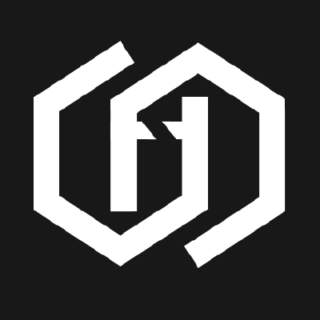

# Generated Diagrams for python projects

  

 

All of these onboarding diagrams were generated using [CodeBoarding.org](https://codeboarding.org) — a tool designed to help developers to get to know new code-bases through interactive, visual documentation.

We're always looking to improve, so feel free to share your thoughts by opening an issue or sending us an email.

Interested in onboarding diagrams for your own project? Try it out at [CodeBoarding.org/demo](https://codeboarding.org/demo) or open an issue and we will generate one for you!

## Onboarding Documentation

<table>
  <tr>
    <td>🐍 <a href="airflow/on_boarding.md">airflow</a></td>
    <td>🌟 <a href="awesome-python/on_boarding.md">awesome-python</a></td>
    <td>🧪 <a href="behave/on_boarding.md">behave</a></td>
  </tr>
  <tr>
    <td>🗣️ <a href="BERTopic/on_boarding.md">BERTopic</a></td>
    <td>☁️ <a href="boto3/on_boarding.md">boto3</a></td>
    <td>🌐 <a href="browser-use/on_boarding.md">browser-use</a></td>
  </tr>
  <tr>
    <td>🎯 <a href="celery/on_boarding.md">celery</a></td>
    <td>👩‍🏫 <a href="codeforlife-portal/on_boarding.md">codeforlife-portal</a></td>
    <td>🧬 <a href="codon/on_boarding.md">codon</a></td>
  </tr>
  <tr>
    <td>🔍 <a href="credential-digger/on_boarding.md">credential-digger</a></td>
    <td>🖥️ <a href="cuda-python/on_boarding.md">cuda-python</a></td>
    <td>⚡ <a href="dask/on_boarding.md">dask</a></td>
  </tr>
  <tr>
    <td>📷 <a href="Deep-Live-Cam/on_boarding.md">Deep-Live-Cam</a></td>
    <td>🧪 <a href="deepchem/on_boarding.md">deepchem</a></td>
    <td>🌐 <a href="django/on_boarding.md">django</a></td>
  </tr>
  <tr>
    <td>🔗 <a href="django-rest-framework/on_boarding.md">django-rest-framework</a></td>
    <td>📄 <a href="docling/on_boarding.md">docling</a></td>
    <td>🧭 <a href="explorer/on_boarding.md">explorer</a></td>
  </tr>
  <tr>
    <td>📦 <a href="facebook-python-business-sdk/on_boarding.md">facebook-python-business-sdk</a></td>
    <td>⚡ <a href="fastapi/on_boarding.md">fastapi</a></td>
    <td>🍶 <a href="flask/on_boarding.md">flask</a></td>
  </tr>
  <tr>
    <td>🔀 <a href="flow_matching/on_boarding.md">flow_matching</a></td>
    <td>👾 <a href="garak/on_boarding.md">garak</a></td>
    <td>🧬 <a href="gpf/on_boarding.md">gpf</a></td>
  </tr>
  <tr>
    <td>🧬 <a href="gpf_old/on_boarding.md">gpf_old</a></td>
    <td>🧬 <a href="gpf_small/on_boarding.md">gpf_small</a></td>
    <td>🕸️ <a href="graphrag/on_boarding.md">graphrag</a></td>
  </tr>
  <tr>
    <td>👋 <a href="Hello-Python/on_boarding.md">Hello-Python</a></td>
    <td>👨‍💻 <a href="honcho/on_boarding.md">honcho</a></td>
    <td>🛡️ <a href="invariant/on_boarding.md">invariant</a></td>
  </tr>
  <tr>
    <td>🛡️ <a href="invariant-gateway/on_boarding.md">invariant-gateway</a></td>
    <td>🛡️ <a href="invariant-sdk/on_boarding.md">invariant-sdk</a></td>
    <td>📋 <a href="jira/on_boarding.md">jira</a></td>
  </tr>
  <tr>
    <td>📱 <a href="kivy/on_boarding.md">kivy</a></td>
    <td>🖼️ <a href="kornia/on_boarding.md">kornia</a></td>
    <td>🔗 <a href="langchain/on_boarding.md">langchain</a></td>
  </tr>
  <tr>
    <td>🔄 <a href="langflow/on_boarding.md">langflow</a></td>
    <td>📈 <a href="langgraph/on_boarding.md">langgraph</a></td>
    <td>📝 <a href="markitdown/on_boarding.md">markitdown</a></td>
  </tr>
  <tr>
    <td>🔎 <a href="mcp-scan/on_boarding.md">mcp-scan</a></td>
    <td>💳 <a href="paysafe_sdk_python/on_boarding.md">paysafe_sdk_python</a></td>
    <td>🔒 <a href="prowler/on_boarding.md">prowler</a></td>
  </tr>
  <tr>
    <td>🌍 <a href="public-apis/on_boarding.md">public-apis</a></td>
    <td>🎮 <a href="pygame/on_boarding.md">pygame</a></td>
    <td>📋 <a href="pygame-menu/on_boarding.md">pygame-menu</a></td>
  </tr>
  <tr>
    <td>🔌 <a href="pyserial/on_boarding.md">pyserial</a></td>
    <td>🕹️ <a href="pyunity/on_boarding.md">pyunity</a></td>
    <td>🔥 <a href="pytorch/on_boarding.md">pytorch</a></td>
  </tr>
  <tr>
    <td>🔥 <a href="pytorch-tutorial/on_boarding.md">pytorch-tutorial</a></td>
    <td>🖼️ <a href="Real-ESRGAN/on_boarding.md">Real-ESRGAN</a></td>
    <td>🗣️ <a href="Real-Time-Voice-Cloning/on_boarding.md">Real-Time-Voice-Cloning</a></td>
  </tr>
  <tr>
    <td>⏰ <a href="redbeat/on_boarding.md">redbeat</a></td>
    <td>🌈 <a href="rich/on_boarding.md">rich</a></td>
    <td>📡 <a href="scapy/on_boarding.md">scapy</a></td>
  </tr>
  <tr>
    <td>📊 <a href="scikit-learn/on_boarding.md">scikit-learn</a></td>
    <td>🛒 <a href="shopify_django_app/on_boarding.md">shopify_django_app</a></td>
    <td>🧩 <a href="Sudoku/on_boarding.md">Sudoku</a></td>
  </tr>
  <tr>
    <td>🧪 <a href="SWEBench/on_boarding.md">SWEBench</a></td>
    <td>🛠️ <a href="system-design-primer/on_boarding.md">system-design-primer</a></td>
    <td>🍵 <a href="theine/on_boarding.md">theine</a></td>
  </tr>
  <tr>
    <td>🌪️ <a href="tornado/on_boarding.md">tornado</a></td>
    <td>💧 <a href="VertFlow/on_boarding.md">VertFlow</a></td>
    <td>🛡️ <a href="WhatWaf/on_boarding.md">WhatWaf</a></td>
  </tr>
  <tr>
    <td>🦓 <a href="WildGS-SLAM/on_boarding.md">WildGS-SLAM</a></td>
    <td>🧑‍🔬 <a href="zenml/on_boarding.md">zenml</a></td>
    <td>🐍 <a href="Python/on_boarding.md">Python</a></td>
  </tr>
</table>
