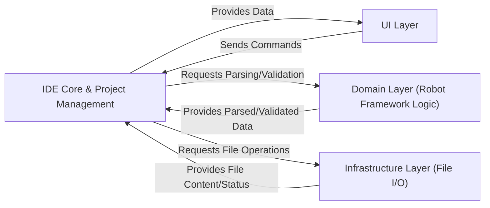

## Details

One paragraph explaining the functionality which is represented by this graph. What the main flow is and what is its purpose.

### IDE Core & Project Management [[Expand]](./IDE_Core_Project_Management.md)
This central component orchestrates the RIDE application's lifecycle, manages global preferences, and maintains the in-memory representation of Robot Framework projects. It is responsible for loading, saving, and managing the hierarchical structure of test suites, test cases, and keywords, thereby ensuring the overall application state is consistently managed. It acts as the core application layer, coordinating interactions between the user interface, the domain-specific Robot Framework logic, and underlying infrastructure services.

**Related Classes/Methods**:

- `robotide.application.application`
- `robotide.controller.project`

### UI Layer
This layer is responsible for presenting the Robot Framework project data to the user and capturing user interactions. It provides the graphical interface for editing test suites, test cases, and keywords, and displays application status and feedback. It sends user commands to the IDE Core & Project Management and receives data updates for display.

**Related Classes/Methods**:

- <a href="https://github.com/HelioGuilherme66/RIDE/blob/develop/src/robotide/ui/mainframe.py#L83-L729" target="_blank" rel="noopener noreferrer">`robotide.ui.mainframe.RideFrame` (83:729)</a>

### Domain Layer (Robot Framework Logic)
This component encapsulates the core business logic related to Robot Framework. It is responsible for parsing Robot Framework test data, validating its structure and syntax, and providing structured data representations of Robot Framework elements. It interacts with the IDE Core & Project Management to receive requests for parsing/validation and provides the processed data back.

**Related Classes/Methods**:

- <a href="https://github.com/HelioGuilherme66/RIDE/blob/develop/src/robotide/lib/robot/parsing/model.py#L328-L368" target="_blank" rel="noopener noreferrer">`robotide.lib.robot.parsing.model.TestCaseFile` (328:368)</a>

### Infrastructure Layer (File I/O)
This layer handles all persistent storage operations, primarily file input/output. It provides services for reading and writing Robot Framework project files (e.g., .robot, .resource, .txt files) to the file system. It abstracts the underlying file system details from the core application logic and provides file content and status to the IDE Core & Project Management.

**Related Classes/Methods**:

- `robotide.controller.filecontrollers`
- <a href="https://github.com/HelioGuilherme66/RIDE/blob/develop/src/robotide/controller/filecontrollers.py#L735-L840" target="_blank" rel="noopener noreferrer">`robotide.controller.filecontrollers.TestCaseFileController` (735:840)</a>

### [FAQ](https://github.com/CodeBoarding/GeneratedOnBoardings/tree/main?tab=readme-ov-file#faq)