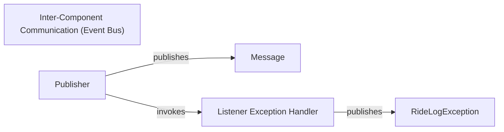

## Details

One paragraph explaining the functionality which is represented by this graph. What the main flow is and what is its purpose.

### Inter-Component Communication (Event Bus) [[Expand]](./Inter_Component_Communication_Event_Bus_.md)
An essential infrastructure component that facilitates decoupled communication between all other components within the IDE using a publish-subscribe mechanism (based on pypubsub). This promotes modularity, extensibility, and reduces direct dependencies across the application's various parts, such as the UI, application logic, and domain layer. It acts as the central nervous system for event propagation throughout the application.

**Related Classes/Methods**:

- `robotide.publish.publisher`
- `robotide.publish.messages`

### Publisher
The central entity responsible for managing subscriptions and dispatching messages to registered listeners. It acts as the core message broker, ensuring that messages are delivered to all interested parties without direct knowledge of the subscribers. This component is crucial for maintaining the publish-subscribe pattern.

**Related Classes/Methods**:

- `robotide.publish._Publisher`

### Message
Abstract and concrete classes that define the data structures and content for inter-component communication. Each message type encapsulates specific information relevant to an event or data change, allowing components to communicate structured data in a standardized format. These are fundamental for defining the communication contract.

**Related Classes/Methods**:

- `robotide.publish.RideMessage`

### Listener Exception Handler
A critical component that ensures the robustness and stability of the event bus by gracefully handling exceptions that occur during the processing of messages by registered listeners. It prevents a single faulty listener from disrupting the entire communication flow, thereby enhancing the overall reliability of the event bus. When an exception occurs, it publishes a `RideLogException` message to notify the system of the error.

**Related Classes/Methods**:

- <a href="https://github.com/HelioGuilherme66/RIDE/blob/develop/src/robotide/publish/publisher.py#L78-L88" target="_blank" rel="noopener noreferrer">`robotide.publish.publisher:ListenerExceptionHandler` (78:88)</a>

### RideLogException
A specific message type published by the Listener Exception Handler to notify the system of errors.

**Related Classes/Methods**:

- `robotide.publish.RideLogException`

### [FAQ](https://github.com/CodeBoarding/GeneratedOnBoardings/tree/main?tab=readme-ov-file#faq)