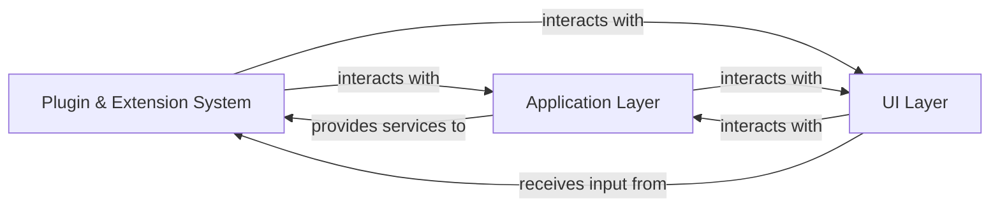

## Details

One paragraph explaining the functionality which is represented by this graph. What the main flow is and what is its purpose.

### Plugin & Extension System [[Expand]](./Plugin_Extension_System.md)
This component establishes the core extensibility mechanism for RIDE. It is responsible for defining the programmatic interface (API) that external plugins must adhere to, managing the discovery of available plugins, orchestrating their loading into the application's runtime, and ensuring their seamless integration with RIDE's core functionalities. This system allows for dynamic addition of custom features and integrations without altering the main codebase, significantly enhancing the IDE's adaptability and future-proofing.

**Related Classes/Methods**:

- `robotide.pluginapi.plugin`
- `robotide.application.pluginloader`

### Application Layer
This layer encapsulates the core business logic and functionalities of the RIDE IDE. It is responsible for managing project data, executing test cases, handling file operations, and coordinating interactions between various internal modules. The Application Layer provides the foundational services that plugins extend and interact with, ensuring that custom functionalities are integrated into the IDE's operational flow.

**Related Classes/Methods**: _None_

### UI Layer
This layer is responsible for presenting the RIDE IDE's graphical user interface to the user and handling user interactions. It manages windows, menus, toolbars, and various visual components. The UI Layer translates user input into actions for the Application Layer and displays the results back to the user. Plugins often extend this layer to add new menu items, panels, or custom widgets, providing a seamless user experience for extended functionalities.

**Related Classes/Methods**: _None_

### [FAQ](https://github.com/CodeBoarding/GeneratedOnBoardings/tree/main?tab=readme-ov-file#faq)