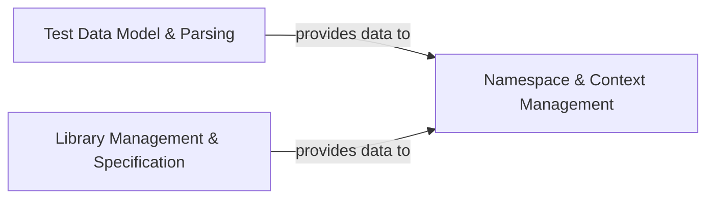

## Details

The `Robot Framework Domain` subsystem is the core of the RIDE IDE, encapsulating all the business logic related to understanding, managing, and interacting with Robot Framework test assets. It adheres to the Domain Layer pattern, separating the core logic from the UI and application orchestration.

### Test Data Model & Parsing
This component is responsible for parsing Robot Framework test data files (e.g., `.robot`, `.resource`) into an internal, structured model. It represents test suites, test cases, keywords, variables, and settings in a programmatic way, allowing the IDE to manipulate and analyze the test project. This is fundamental as an IDE requires an in-memory representation of the code it's editing to provide features like syntax highlighting, auto-completion, and refactoring. It serves as the "Model" for the Robot Framework data within the IDE.

**Related Classes/Methods**:

- `src/robotide/lib/robot/parsing/model.py`

### Namespace & Context Management
This component manages the runtime context and semantic understanding of Robot Framework projects within RIDE. It is responsible for resolving variables, providing access to all available keywords (both user-defined from parsed files and library keywords), and maintaining the overall scope and visibility of test assets. It acts as the central registry for all discoverable elements within the project. This component is essential for features like auto-completion, "find usages," and variable inspection, as it provides the semantic understanding of the Robot Framework project's elements.

**Related Classes/Methods**:

- `src/robotide/namespace/namespace.py`

### Library Management & Specification
This component handles the discovery, loading, and management of Robot Framework libraries (both standard and custom). It is responsible for extracting keyword specifications (arguments, documentation) from these libraries, enabling RIDE to provide accurate content assistance and validation. This component is crucial for an IDE that interacts with an external framework, allowing RIDE to understand the capabilities of the underlying Robot Framework libraries without actually running tests, thereby enabling intelligent assistance for users.

**Related Classes/Methods**:

- `src/robotide/spec/librarymanager.py`

### [FAQ](https://github.com/CodeBoarding/GeneratedOnBoardings/tree/main?tab=readme-ov-file#faq)