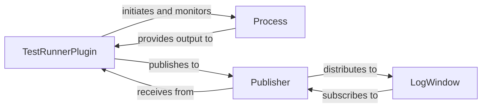

## Details

One paragraph explaining the functionality which is represented by this graph. What the main flow is and what is its purpose.

### TestRunnerPlugin
This component serves as the primary orchestrator for initiating and managing Robot Framework test runs. It integrates with RIDE's plugin system, handles user commands to start tests, and coordinates the execution of the Robot Framework process. It processes the raw output from the test run and publishes structured test events and log messages for other components.

**Related Classes/Methods**:

- `src/robotide/contrib/testrunner/testrunnerplugin.py`

### Process
This low-level utility component is responsible for spawning, managing, and monitoring the external Robot Framework process. It captures the standard output and error streams from the running process, making this raw data available for further processing by the TestRunnerPlugin.

**Related Classes/Methods**:

- `src/robotide/run/process.py`

### LogWindow
This is a user interface component responsible for visually presenting real-time test execution logs, progress updates, and the final test results to the user. It acts as a subscriber to various log and event messages published during the test run, dynamically updating its display.

**Related Classes/Methods**:

- `src/robotide/log/logwindow.py`

### Publisher
A central communication component that implements an event-driven architecture within the subsystem. It is responsible for publishing and distributing messages and events (e.g., test start, test end, log messages) to various subscribers throughout the system, ensuring loose coupling between components.

**Related Classes/Methods**:

- `src/robotide/publish/publisher.py`

### [FAQ](https://github.com/CodeBoarding/GeneratedOnBoardings/tree/main?tab=readme-ov-file#faq)