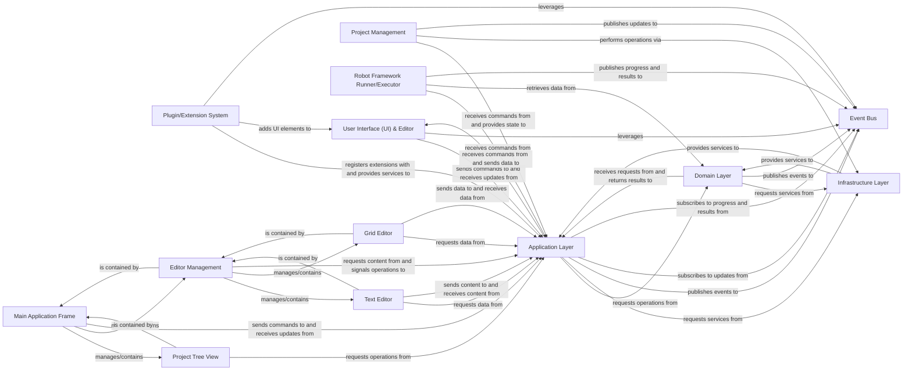

## Details

Abstract Components Overview: This document outlines the key architectural components of the Robot Framework IDE, their responsibilities, and their interrelationships. The architecture is designed to be modular, extensible, and maintainable, following layered principles to ensure clear separation of concerns. The component relationships have been revised to align with standard layered architectural principles. Specifically: 1. Direct interactions where the User Interface (UI) & Editor received data directly from the Domain Layer have been removed. UI components now primarily interact with the Application Layer, which then orchestrates data retrieval from the Domain Layer. 2. Direct updates/data transfers from backend components (Project Management, Robot Framework Runner/Executor) to the User Interface (UI) & Editor have been re-routed. These backend components now publish updates and results to the Event Bus. The Application Layer subscribes to these events and then sends the necessary updates to the User Interface (UI) & Editor, maintaining the Application Layer's role as an orchestrator.

### User Interface (UI) & Editor [[Expand]](./User_Interface_UI_Editor.md)
Responsible for all visual aspects of the IDE and handling user interactions. This includes the main application frame, the project tree view, the notebook for open files, and specialized editors.

**Related Classes/Methods**: _None_

### Application Layer
Acts as the orchestrator, handling user commands, managing application state, and coordinating interactions between the UI, Domain, and Infrastructure layers. It includes high-level project and file handling logic.

**Related Classes/Methods**: _None_

### Domain Layer
Encapsulates all the business logic related to Robot Framework. This includes parsing Robot Framework files, managing test suites, test cases, keywords, variables, and interacting with the Robot Framework engine.

**Related Classes/Methods**: _None_

### Infrastructure Layer
Provides common services and utilities, such as file I/O operations, configuration management, logging, and potentially integration points with external tools or the operating system.

**Related Classes/Methods**: _None_

### Plugin/Extension System [[Expand]](./Plugin_Extension_System.md)
A well-defined API and mechanism for third-party or internal extensions to integrate seamlessly with the IDE, adding new functionalities without modifying the core application.

**Related Classes/Methods**: _None_

### Event Bus
A central communication hub implementing an Event-Driven Architecture, facilitating loose coupling between components by allowing them to publish and subscribe to events without direct dependencies.

**Related Classes/Methods**: _None_

### Project Management [[Expand]](./Project_Management.md)
Manages the lifecycle of Robot Framework projects, including creating new projects, opening existing ones, handling file system operations within a project context, and maintaining project-specific settings.

**Related Classes/Methods**: _None_

### Robot Framework Runner/Executor
Responsible for invoking the actual Robot Framework engine to execute test suites or individual test cases, capturing execution results, and providing feedback to the IDE.

**Related Classes/Methods**: _None_

### Main Application Frame
The top-level window of the IDE, serving as the primary container for all other UI elements. It manages the overall layout, menu bar, toolbars, and status bar, orchestrating the display and interaction of the entire application's visual interface.

**Related Classes/Methods**:

- `robotide.ui.mainframe`

### Project Tree View
Displays the hierarchical structure of the Robot Framework project, including files, folders, and test suites. It allows users to navigate the project, select items, and trigger actions like opening files or running tests.

**Related Classes/Methods**:

- `robotide.ui.mainframe`

### Editor Management
Responsible for orchestrating the various specialized editors within the IDE. It manages the notebook-style interface for open files, handles tab switching, and coordinates the lifecycle (opening, closing, saving) of individual editor instances.

**Related Classes/Methods**:

- `robotide.editor.editors`

### Text Editor
Provides a rich text-based interface specifically tailored for editing Robot Framework test data. It includes features such as syntax highlighting, content assist (autocompletion), and basic text manipulation capabilities, enhancing the user's coding experience.

**Related Classes/Methods**:

- `robotide.editor.texteditor`

### Grid Editor
(Inferred from "grid-based" editor in the project description). Offers a tabular, structured interface for editing Robot Framework test data, particularly useful for managing keywords, arguments, or variable tables in a more visual and organized manner.

**Related Classes/Methods**:

- `robotide.editor.editors`

### [FAQ](https://github.com/CodeBoarding/GeneratedOnBoardings/tree/main?tab=readme-ov-file#faq)