```mermaid
graph LR
    IDE_Core_Project_Management["IDE Core & Project Management"]
    User_Interface_UI_Editor["User Interface (UI) & Editor"]
    Robot_Framework_Domain["Robot Framework Domain"]
    Test_Execution_Reporting["Test Execution & Reporting"]
    Plugin_Extension_System["Plugin & Extension System"]
    Inter_Component_Communication_Event_Bus_["Inter-Component Communication (Event Bus)"]
    IDE_Core_Project_Management -- "orchestrates and provides data to" --> User_Interface_UI_Editor
    IDE_Core_Project_Management -- "manages" --> Robot_Framework_Domain
    IDE_Core_Project_Management -- "initiates" --> Test_Execution_Reporting
    IDE_Core_Project_Management -- "integrates" --> Plugin_Extension_System
    User_Interface_UI_Editor -- "sends commands to" --> IDE_Core_Project_Management
    User_Interface_UI_Editor -- "displays results from" --> Test_Execution_Reporting
    User_Interface_UI_Editor -- "utilizes services from" --> Robot_Framework_Domain
    Robot_Framework_Domain -- "provides core logic to" --> IDE_Core_Project_Management
    Robot_Framework_Domain -- "provides services to" --> User_Interface_UI_Editor
    Test_Execution_Reporting -- "receives commands from" --> IDE_Core_Project_Management
    Test_Execution_Reporting -- "utilizes logic from" --> Robot_Framework_Domain
    Test_Execution_Reporting -- "reports results to" --> User_Interface_UI_Editor
    Plugin_Extension_System -- "extends functionality of" --> IDE_Core_Project_Management
    Plugin_Extension_System -- "extends functionality of" --> User_Interface_UI_Editor
    Plugin_Extension_System -- "extends functionality of" --> Test_Execution_Reporting
    IDE_Core_Project_Management -- "communicates via" --> Inter_Component_Communication_Event_Bus_
    User_Interface_UI_Editor -- "communicates via" --> Inter_Component_Communication_Event_Bus_
    Robot_Framework_Domain -- "communicates via" --> Inter_Component_Communication_Event_Bus_
    Test_Execution_Reporting -- "communicates via" --> Inter_Component_Communication_Event_Bus_
    Plugin_Extension_System -- "communicates via" --> Inter_Component_Communication_Event_Bus_
    click IDE_Core_Project_Management href "https://github.com/CodeBoarding/GeneratedOnBoardings/blob/main/RIDE/IDE_Core_Project_Management.md" "Details"
    click User_Interface_UI_Editor href "https://github.com/CodeBoarding/GeneratedOnBoardings/blob/main/RIDE/User_Interface_UI_Editor.md" "Details"
    click Robot_Framework_Domain href "https://github.com/CodeBoarding/GeneratedOnBoardings/blob/main/RIDE/Robot_Framework_Domain.md" "Details"
    click Test_Execution_Reporting href "https://github.com/CodeBoarding/GeneratedOnBoardings/blob/main/RIDE/Test_Execution_Reporting.md" "Details"
    click Plugin_Extension_System href "https://github.com/CodeBoarding/GeneratedOnBoardings/blob/main/RIDE/Plugin_Extension_System.md" "Details"
    click Inter_Component_Communication_Event_Bus_ href "https://github.com/CodeBoarding/GeneratedOnBoardings/blob/main/RIDE/Inter_Component_Communication_Event_Bus_.md" "Details"
```

## Details

One paragraph explaining the functionality which is represented by this graph. What the main flow is and what is its purpose.

### IDE Core & Project Management [[Expand]](./IDE_Core_Project_Management.md)
This central component orchestrates the RIDE application's lifecycle, manages global preferences, and maintains the in-memory representation of Robot Framework projects, including test suites, test cases, and keywords. It is responsible for project loading, saving, and overall application state management.

**Related Classes/Methods**:

- `src/robotide/application/application.py`
- `src/robotide/controller/project.py`

### User Interface (UI) & Editor [[Expand]](./User_Interface_UI_Editor.md)
Responsible for all visual aspects of the IDE and handling user interactions. This includes the main application frame, the project tree view, the notebook for open files, and specialized editors (text-based and grid-based) for Robot Framework test data, providing features like syntax highlighting and content assist.

**Related Classes/Methods**:

- `src/robotide/ui/mainframe.py`
- `src/robotide/editor/editors.py`
- `src/robotide/editor/texteditor.py`

### Robot Framework Domain [[Expand]](./Robot_Framework_Domain.md)
Encapsulates the fundamental logic related to Robot Framework itself. This includes parsing test data, managing the internal model of test assets, resolving variables, and providing RIDE-specific services such as library management, keyword discovery, and finding usages within the project.

**Related Classes/Methods**:

- `src/robotide/lib/robot/parsing/model.py`
- `src/robotide/namespace/namespace.py`
- `src/robotide/spec/librarymanager.py`

### Test Execution & Reporting [[Expand]](./Test_Execution_Reporting.md)
Manages the execution of Robot Framework tests. This component initiates test runs, controls the test process, captures real-time logs, and displays the final test results within the IDE's user interface.

**Related Classes/Methods**:

- `src/robotide/contrib/testrunner/testrunnerplugin.py`
- `src/robotide/log/logwindow.py`
- `src/robotide/run/process.py`

### Plugin & Extension System [[Expand]](./Plugin_Extension_System.md)
Provides the architectural foundation for extending RIDE's functionality. It defines the API for plugins, handles their discovery, loading, and seamless integration into the core application, enabling custom features and integrations without modifying the main codebase.

**Related Classes/Methods**:

- `src/robotide/pluginapi/plugin.py`
- `src/robotide/application/pluginloader.py`

### Inter-Component Communication (Event Bus) [[Expand]](./Inter_Component_Communication_Event_Bus_.md)
An infrastructure component that facilitates decoupled communication between all other components using a publish-subscribe mechanism (based on pypubsub), thereby promoting modularity and extensibility across the application.

**Related Classes/Methods**:

- `src/robotide/publish/publisher.py`
- `src/robotide/publish/messages.py`

### [FAQ](https://github.com/CodeBoarding/GeneratedOnBoardings/tree/main?tab=readme-ov-file#faq)